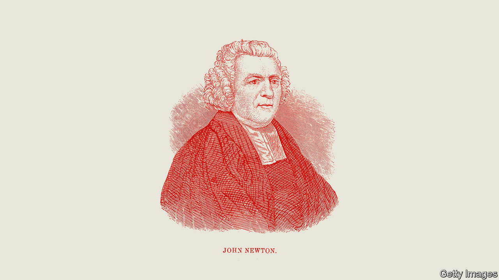

###### A hymn for all seasons

# “Amazing Grace” is a 200-year-old song with a surprising history 

##### It is sung an estimated 10m times each year 

 

> Dec 14th 2023 

By James Walvin.

In 2015  gave the eulogy at a funeral service in Charleston, South Carolina, for a black pastor and eight black parishioners who were shot dead at their Bible-study class by a white supremacist. The president’s speech reflected on the  and God’s grace, suggesting that, amid the horror and the anger, forgiveness might one day be possible. As he finished, Mr Obama began to sing “Amazing Grace”. The congregation, many of them weeping, joined in. No one needed a hymn book.

If you were to put together a soundtrack of America, “Amazing Grace” would be on it. Singers including , , , and Diana Ross have recorded their own interpretations. It was performed at the funeral of and the inauguration of Bill Clinton. By one estimate, it is sung in public more than 10m times every year.

A short but fascinating book by James Walvin, a professor at the University of York and an expert on slavery, offers a cultural history of the song. Its origins explain its power. The author—the “wretch” of the first verse—was John Newton, an Englishman and former slave trader. “Surely no one could be a greater libertine in principle or practice, more abandoned or more daring than I,” he later wrote of his early life.

In 1748 Newton was caught in a brutal storm off the coast of Ireland. Sure he would die, he called out to God for help and underwent a religious conversion. “I was a new man,” he wrote. 

In time, Newton left the . He was ordained as an Anglican vicar and became a central voice in the abolition movement. William Wilberforce, Britain’s leading anti-slavery campaigner, often sought his advice. In 1772 Newton wrote the hymn as a cry of thanks for his own redemption from darkness. 

“Amazing Grace” has inspired many white believers, particularly during the Second Great Awakening that reinvigorated American Christianity in the early 19th century. But it has long been closely associated with African-American churches. The hymn crossed the Atlantic soon after it was written. Its “dangers, toils and snares” resonated deeply with American slaves, Mr Walvin writes, as did its promises of better things to come: “It was as if John Newton had been writing with the enslaved in mind.” In 1835 the current tune was added, composed by William Walker, an American Baptist musician. 

Perhaps most memorably, “Amazing Grace” became one of the anthems of the civil-rights movement in the mid-20th century. Mahalia Jackson, a gospel singer, would croon it over the phone to  when he was exhausted after a long day of marching. Mr Walvin calls it a “perfect antidote to the turbulence gripping American life” at that time. 

Campaigners in Virginia in 1963 had a saying: “When in doubt, pray and sing.” So they did, marching peacefully towards a line of armed police. As they walked, they sang “Amazing Grace”. The police line broke, and they passed through. ■


