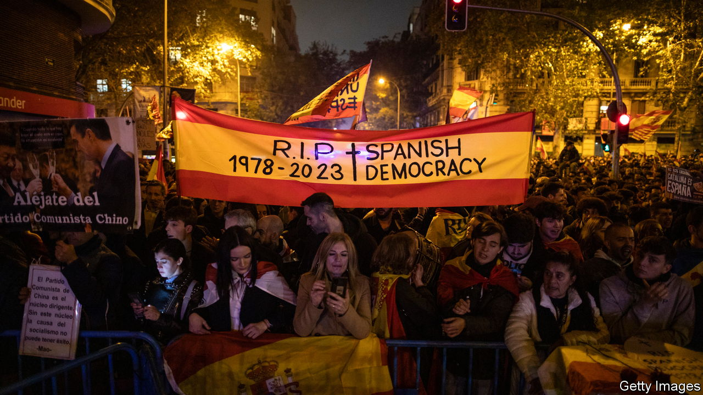

###### Unfair play

# Spain’s institutions are groaning under partisan pressure 

##### The left, the right and separatist movements all play a role 

 

> Dec 14th 2023 

IN A WELL governed country, who runs the statistical agency or the courts is not a partisan issue. But in an increasingly embittered Spain, the basic functions of government, and especially trust in the judiciary, are being poisoned by politics. Things are not as bad as in Poland under its just-departed populist government, but they are moving in the wrong direction.

Pedro Sánchez’s Socialist party came second in July’s elections, but brought together a rag-bag of parties to support his return as prime minister. Chief among the favours offered was an amnesty to the supporters of an illegal independence referendum held in Catalonia in 2017. The amnesty bill will be challenged in the Constitutional Tribunal when it passes. But Mr Sánchez has tilted that court to a sympathetic majority by appointing two left-leaning judges; its head is a former chief prosecutor under a previous Socialist government. 

Most observers expect the court to approve the amnesty (though parts could be struck down). Worse, for critics, is an agreement between the Socialists and Junts per Catalunya, one of the separatist parties, to set up parliamentary commissions to investigate “lawfare”, by which they mean the use of criminal prosecution for political ends. For Junts, it is self-evident that separatist politicians have been targets of such harassment. 

To many this looks like undermining the separation of powers, with lawmakers nobbling judges and tossing out prosecutions they dislike. Speaking to foreign correspondents on December 5th, Mr Sánchez waved away that notion, saying the lawfare commission’s findings “would of course not be binding”. He also argued that the prime example of lawfare is the “kidnapping” of the General Council of the Judiciary, which appoints many top judges, by the centre-right opposition People’s Party (PP). After Mr Sánchez took power in 2018, the PP opportunistically called for changes in how judges are nominated, and has refused to renew the council’s mandate, which expired five years ago.

But Mr Sánchez has repaid his opponents in the same coin. Not only is the constitutional court’s head an ally, but so is the country’s top prosecutor. The prime minister has put Socialist faithful in non-political jobs at the Centre for Sociological Research (which conducts opinion polling, among other duties), the National Statistical Institute and the EFE state news agency. One minister, Félix Bolaños, a kind of fixer for Mr Sánchez, has been named justice minister as well as minister for the presidency (the prime minister’s right-hand man) and minister for relations with parliament—a one-man symbol of the erosion of the separation of powers.

Victor Lapuente, a political scientist at Gothenburg University and a columnist for , a newspaper, says that Mr Sánchez should hold back from actions that, while legal, infuriate many voters and undermine trust in the system. In turn, his opponents have undercut their case with inflammatory language. The leader of Vox, a party well to the right of the PP, said recently that the people “will want to string Sánchez up by his feet”, a fate that befell Benito Mussolini upon his execution in 1945. 

“None of the rhetoric coming from the PP or Vox is useful,” says Camino Mortera-Martínez, a critic of the amnesty and of Mr Sánchez’s undermining of the separation of powers. An expert on the rule of law at the Centre for European Reform, a think-tank in Brussels, she says that Spain is “by no means” the sort of pariah that Poland became as it defied the EU. But some of Mr Sánchez’s steps remind her of the early days of Polish backsliding. Polarisation has driven both parties to seek advantage wherever they can. As they do, Spaniards’ trust in their democracy suffers. ■

