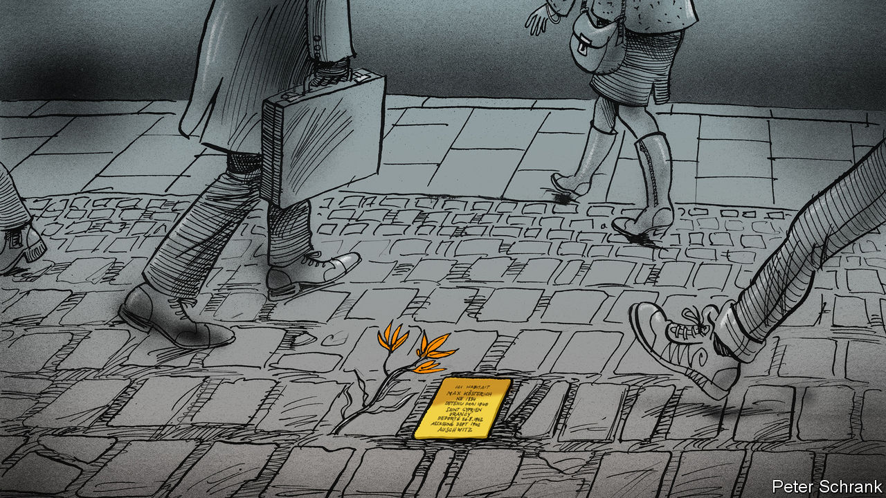

###### Charlemagne

# Stolpersteine grieve for victims of the Nazis, one at a time 

##### Gunter Demnig’s paving stones spark countless acts of remembrance 

 

> Dec 14th 2023 

Max Kösterich lived for a time at 204 Chaussée de Waterloo, an elegant apartment block on a hilly thoroughfare in Brussels. A married father of four sons, he probably arrived in the Belgian capital from Frankfurt in 1934, aged 50. What Kösterich did for a living is lost to time, though a previous stint working in the Dutch East Indies suggests a well-off trader of some sort. Why the family moved is also not known, but might be guessed at. For if history remembers Kösterich at all, it is as a statistic: one of 6m Jews murdered by the Nazis. Three of his sons died with him at Auschwitz. Only the second one, Manfred, survived. In 1938 an opportunity came up for just one brother to emigrate to Australia, an escape from the impending horror. It was Manfred who drew the winning straw. Those not so lucky were rounded up, landing in French camps before being loaded onto eastbound trains. 

Last month the Kösterich family returned from Australia to the Chaussée de Waterloo. Manfred died in 1984, unable or unwilling to share with his loved ones much about the circumstances of his emigration. His son Joe Kosterich (the umlaut on the “o” was lost in the move down under), a medical doctor from Perth in his early 60s, had made the journey with his wife Cathy and their grown children. Number 204 is a little faded these days, its entrance flanked by a dingy bar and a dental practice. One drizzly Saturday morning in November the Kosterich family looked on as a small slab of pavement in front of the building’s threshold was excised. In its place, a brass plaque the size of a cobblestone was cemented in. “Here Lived Max Kösterich. Born 1884”, it starts, before noting his grim fate. As trams rolled by and city life went on, a few short speeches were attempted to a dozen well-wishers. “My grandfather until today was just another number,” said Joe, unable to hold back a tear. Cathy laid down a few flowers by the plaque: a kangaroo paw and some eucalyptus, an Australian wink to the new life the tides of history had foisted upon the Kösterich/Kosterich clan.

The man on his knees expertly laying the brass that morning was Gunter Demnig. Since 1996, the German artist has chipped away at pavements in around 30 countries in Europe, filling them with what he calls Stolpersteine, or “stumbling stones”. Earlier this year the 76-year-old laid the 100,000th memorial. Each plaque cites just one victim and is placed at their last freely chosen abode; when entire families were killed a sort of family tree of Stolpersteine is recreated, with parents placed above their children. Most are Jews, but there are stones for Roma, deserters, Jehovah’s Witnesses, homosexuals, mentally or physically disabled people and various others deemed “undesirable” by Nazis. (A few are dedicated to survivors who managed to escape.) The memorials are discreet yet impossible not to stumble upon, at least metaphorically. One house in Brussels has 16 in front of its threshold. Berlin alone has more than 10,000 Stolpersteine.

The Holocaust is richly remembered in cities across Europe; a giant memorial in the German capital, opened in 2005, is a staple of the tourist circuit. But to honour the victims collectively is not the same as remembering each for who they were. “Six million Jews is abstract, it is a number,” says Mr Demnig. “You cannot imagine a number.” A plaque evokes a person, a story, perhaps some descendants in faraway lands. What started off as a one-off project of a few dozen stones snowballed as demand for the decentralised memorial scheme kept coming. A Jewish custom beseeching the living to remember the dead helped spur requests across Germany and, from 2006, the rest of Europe. At first the stones were laid without much in the way of permission. Now local authorities are generally happy to help.

Sporting a wide-brimmed fedora, a red bandanna around his neck and a denim shirt, Europe’s rememberer-in-chief is no establishment figure. Mr Demnig is from the 1968 generation, the first to have only heard about the war rather than lived through it. In his student days protesters sought to understand better what the Nazis—and Germany—had wrought. There was something provocative in remembering, like a rebuke to those who had hoped it would all be forgotten. Kids started to ask their parents questions that few relished answering. Such as, in Mr Demnig’s case, how to explain the picture he had found in his family’s attic of his own father in uniform, manning an anti-aircraft gun.

Casting the first stone

These days Mr Demnig has complemented his artistic talent with expertise in logistics and civil engineering. In the back of the Peugeot van that he drives alone across Europe for over 200 days a year are the various angle grinders, chisels and shovels needed to prise open pavements, though mostly the holes are dug in advance these days. After making the first 7,000 stones himself, Mr Demnig roped in help. Now a small team and a non-profit foundation assist with manufacturing the Stolpersteine and taking appeals for new ones. Many requesters are descendants of the victims; the family’s assent is always sought anyway. Sometimes the initiative comes from neighbours, or students. Mr Demnig insists on laying the first stone in a new town himself, after which community groups can take over, sparing the ageing German’s knees. 

The elegance of the Stolpersteine has caught the public imagination; around 700 a month are installed these days. Their glistening patina, regularly cleaned by volunteers, is art in itself: each plaque is handcrafted, better to contrast with the machine-like efficiency of the Nazis. But, Mr Demnig says, the process of a community looking for new ways never to forget is a form of art, too. 

The ceremony in Brussels lasted only a few minutes. When it was over, Mr Demnig drove off: there was a stone to lay by the Belgian coast that afternoon, then another dozen in the Netherlands over the following week. After the speeches, the crowd on the Chaussée de Waterloo dispersed. The flowers from Australia were soon swept away by the rain. The stone remains. ■


