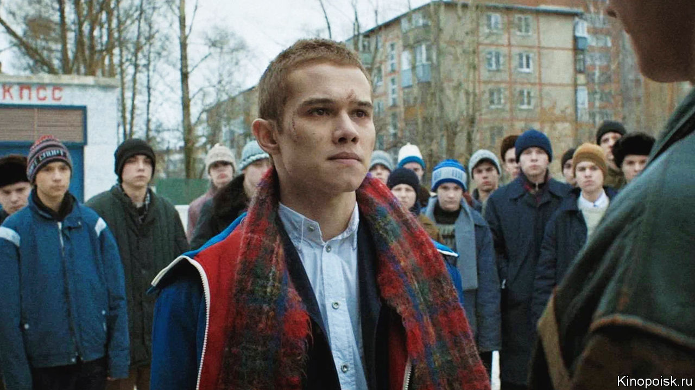

###### Gangsters of glasnost

# The crime drama Russia and Ukraine want to ban 

##### A show featuring young gangsters in the late Soviet era is too big a hit 

 

> Dec 14th 2023 

Ukrainians and Russians agree on very little lately, but a Russian TV series has created an unlikely connection. In both countries, audiences are lapping it up and bureaucrats want to ban it. “Slovo Patsana”or “A Fella’s Word”, is set in the criminal underworld of -era Tatarstan. By the late 1980s, the Russian republic’s street gangs were infamous. Young kids “divided up the tarmac” of Kazan, the regional capital, under the eyes of older criminals. Those who joined the gangs were called , and had protection of sorts. Those who did not, the , were targets of often extreme violence. 

Zhora Kryzhovnikov’s eight-part series is an unsentimental take on late Soviet decay, cynicism and sadism. Its high production values and unflinching drama made it a hit almost as soon as it aired in November. In Russia its title was the single most-searched term on search engines; in Ukraine it was not far behind. The title music, which goes unidentified in the credits because the musicians are anti-war, tops charts in both countries. 

Ukrainian officials worry that the series serves as Russian propaganda: it is financed by a state agency tasked with providing “patriotic content”. On December 7th, Ukraine’s culture ministry warned citizens not to watch an unnamed “Russian-made series” that “propagates violence”. The state film agency meanwhile declared that public showing of the series was illegal. This had little impact on streaming, which mostly uses pirate platforms beyond the reach of regulators. 

If “Slovo Patsana” is Kremlin propaganda, Russia’s government seems not to know it. Russian officials rail against the series for romanticising violence and alternative authorities. Rustam Minnakhanov, the head of Tatarstan, promised to ask the Kremlin to block it. His human-rights ombudsman wondered whether it was the work of foreign agents. Senators in Moscow have called for the show to be pulled from streaming platforms. 

The series’ grimmer episodes, full of severed ears, rape and murder, make it clear it does not glorify violence. Commissioned before Russia invaded Ukraine, it is a sober examination of history. But it offers allegories to the present too, says Alexander Rodniansky, a Ukrainian-Russian film producer: the helplessness of citizens in impossible circumstances. “The problem for the Ukrainian state is that series such as these normalise Russians, it shows them as living people.” ■

