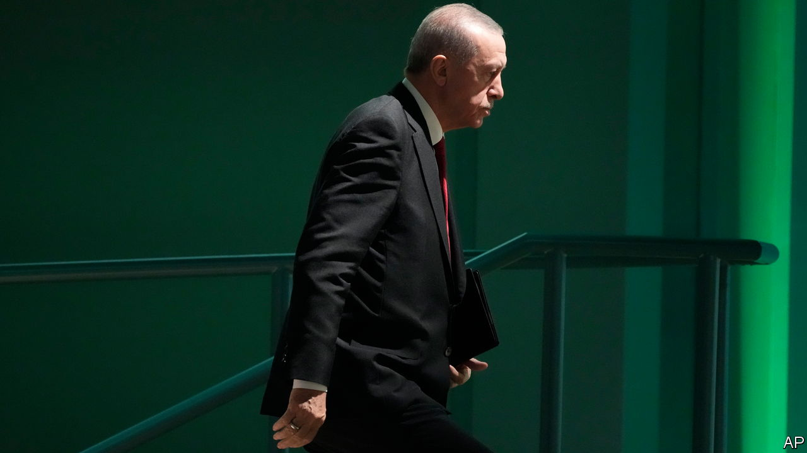

###### Return to sanity

# Turkey’s economy has improved, but its foreign policy is still messy 

##### President Erdogan’s post-election turnaround only goes so far 

 

> Dec 11th 2023 

FOR MOST countries, a 10% drop in the currency’s dollar value in just over five months would be cause for alarm. For Turkey, it is a respite. After years of  lending and spending, the country’s new economic team, appointed after President Recep Tayyip Erdogan’s  in May, is putting the house in order. The , which previously stoked inflation with cheap money, has raised interest rates by a whopping 31.5 percentage points since June. Economic growth has dipped as a result, but the inflation forecast has improved. Prices in November were 62% higher than a year earlier, but the monthly inflation rate has been falling, from a white-hot 9% in July and August to somewhat over 3% in recent months. The Turkish lira, which lost nearly 30% against the dollar in the first half of the year, continues to depreciate, but much more slowly. 

 


Things have also improved in other areas. Turkey’s new interior minister, Ali Yerlikaya, has launched a belated crackdown on organised crime. The evening news regularly features footage of police commandos smashing in doors and pinning down suspected drug barons, arms dealers and human traffickers, many of them foreigners. Awkwardly, this has exposed Turkey’s role as a magnet for crime syndicates from the Balkans to South America. 

Turkish democracy shows no sign of improvement. Many of Mr Erdogan’s political opponents still languish in prison, particularly Kurds, journalists and civil-society activists. But the economic reforms have won cautious plaudits abroad. So have improved relations with Greece, highlighted by Mr Erdogan’s visit to Athens on December 7th. In a report in late November, the European Commission and the bloc’s foreign-policy chief recommended opening talks with Turkey on an upgraded customs union, to replace the one established in 1995. (There are strings attached: for one thing, Turkey must first get serious about resuming peace negotiations with Cyprus, which it partially occupies.) EU leaders will discuss this during a two-day summit starting on December 14th. 

But the reformist current faces three big impediments: Mr Erdogan’s strongman instincts, his pact with Turkey’s nationalists, and his government’s relationships with Russia and Hamas. 

, which had improved this summer after Turkey pledged to drop its veto of , are frosty again. Mr Erdogan initially held up Sweden’s membership to press the country to go after Kurdish residents whom Turkey considers terrorists. He is now doing so to get an ironclad guarantee from America to sell Turkey 40 new F-16 fighter jets. On December 6th Mr Erdogan suggested that Turkey’s parliament and America’s Congress should move in tandem, with one assembly ratifying Sweden’s NATO membership while the other signs off on the $20bn F-16 deal. The Americans seem uninterested.

Mr Erdogan and his Justice and Development (AK) party may eventually realise they have nothing to gain by keeping Sweden on ice, and put accession to a vote, possibly before Christmas. But they may also decide to keep moving the goalposts, further eroding Turkey’s standing in NATO and with America. 

A vote in parliament on Sweden’s membership could expose cracks in Turkey’s governing coalition. Mr Erdogan can count on his own party to vote as instructed. But he has no such control over his main ally, the far-right Nationalist Movement Party (MHP), which opposes ratification. On December 8th Devlet Bahceli, the MHP’s leader, announced that his party would back Sweden’s accession only once the Palestinians have a state and Binyamin Netanyahu, the Israeli prime minister, is on trial in The Hague. That may be a while. 

Tensions between AK and the MHP have already begun to come to the surface. Insiders say the government’s war on organised crime has ruffled feathers in the MHP, which has links to some notorious mob bosses. Mr Erdogan does not want a public spat over Sweden, with municipal elections coming next spring.

The bloodshed in the Middle East may poison Turkey’s relations with the West even further. Many Turks are seething over America’s support for Israel’s bombing of Gaza. In much of Europe and America, meanwhile, Turkey’s government has come under fire for its links to Hamas. Brian Nelson, a senior American treasury official who visited Istanbul last month, said he was “profoundly concerned” about the group’s ability to  in Turkey. Mr Erdogan stands by Hamas, which he calls a “liberation group” rather than a terrorist organisation. On December 6th he warned Israel would “pay a very heavy price” should it try to assassinate Hamas members based in Turkey. A few months ago a visit by Mr Erdogan to the White House seemed to be in the cards, but his embrace of Hamas has nixed that. 

The EU and America are also increasingly worried about Turkey’s business dealings with Russia. Western officials have pleaded with Turkey to stop turning a blind eye to companies selling Russia “dual-use” goods, which can be used to produce weapons. Exports of such products, mostly through intermediaries in the Caucasus and central Asia, surged to $158m in the first nine months of 2023, compared to an average of $28m before Russia’s invasion of Ukraine.

Turkey’s economy is not yet out of the woods, but it is on the right track. After a long hiatus, foreign portfolio investors are starting to trickle back. But long-term investors will not return as long as Mr Erdogan courts new problems with the West. Politics in Turkey need to follow the economy’s lead. ■

