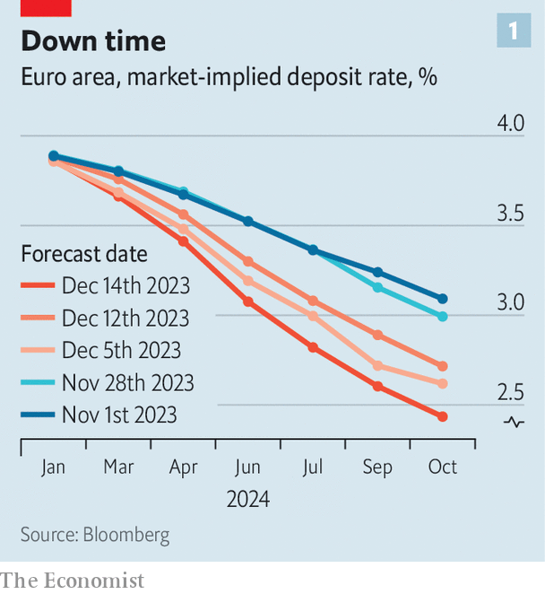

###### Recession response

# Europe’s economy is in a bad way. Policymakers need to react 

##### Wage growth now appears to be fizzling out 

 

> Dec 12th 2023 

European stocks and bonds have had a lot to deal with in recent years, not least war, an  and . Now things are looking up. Germany’s DAX index of shares has added 14% since the start of November. Yields on French ten-year government bonds have dropped from 3.5% in October to 2.6%. Even Italian yields have fallen below 4%, from 5% in mid-October. Investors are upbeat in part because inflation is falling faster than expected. Yet their mood also reflects a grimmer reality: the economy is so weak that surely interest-rate cuts are not far away. 

 


Will policymakers follow through? In November inflation stood at 2.4%, within a whisker of the European Central Bank’s target of 2%. On December 13th America’s Federal Reserve sent out doveish signals. Markets are now pricing in at least three ecb cuts by June, with about six in total by October, to bring down the main rate to about 2.5% (see chart 1). “The most recent inflation number has made a further rate increase rather unlikely,” admitted Isabel Schnabel, a hawkish ecb board member, recently. At the same time, though, there have been no hints of cuts, and economists expect fewer than markets. Certainly nobody was expecting one at the meeting on December 14th, which was due to take place just after had gone to press. Since Europe’s economy is weakening fast, officials risk being slow to react.

There are two reasons for concern. The first is wage growth. Initially, inflation was driven by rising energy prices and snarled supply chains, which pushed up the price of goods. Since pay deals are often agreed for a number of years in Europe’s unionised labour market, wages and prices of services took longer to respond. By the third quarter of 2023 German real wages had fallen to roughly their level in 2015. Now they are recovering lost ground. Similarly, Dutch collectively bargained wages grew by 7% in October and November, compared with a year earlier, even as inflation hovered around zero. Overall wage growth in euro-zone countries is about 5%.

 


If such wage growth continues, inflation might tick up in 2024—the ECB’s great fear. Yet there are signs that pay increases have already started to come down. Indeed, a hiring platform, tracks job advertisements. It finds that pay growth in listings has slowed (see chart 2), suggesting that wages will soon follow. Moreover, wage growth does not always lead to inflation. Corporate profits, which saw a bump in 2022 when demand was high and wages were low, might take a hit. There is some indication that margins are shrinking. 

The second reason for concern is the health of the overall economy. It has struggled with weak international demand, including from China, and high energy prices. Now surveys suggest that both manufacturing and services are contracting gently. A consumption boom in parts of Europe is already fading: monetary policy itself is weighing on bigger debt-financed purchases and mortgage-holders are scaling back to meet larger monthly payments. 

Declining market interest rates ought to help ease financial conditions for both consumers and investors, and therefore reduce the need for the ecb’s policymakers to move quickly. However, there is a catch. As Davide Oneglia of TS Lombard, a research firm, points out, these lower market interest rates mostly reflect falling inflation, and so do not produce lower real rates. As a result, they are unlikely to do all that much to stimulate demand.

There is one more reason for central bankers to get a move on. Interest-rate changes affect the economy with a substantial delay. It takes time for higher rates to alter investment and spending decisions, and subsequently to produce lower demand. The full brunt of changes in rates usually takes a year or more to be felt, which means that many of the ecb’s rate rises are still to feed through. Policymakers have probably tightened too much. 

This dynamic has a flipside: rate cuts in the next few months would not affect the economy until the end of 2024, by when few expect inflation still to be a problem and many expect the economy still to be struggling. The ECB’s policymakers will want to be close to the bloc’s “neutral” interest rate, which is somewhere between 1.5 and 2%, reckons Mr Oneglia, lest they continue to push down demand. Starting early would mean that the central bank would be able to avoid having to cut too aggressively during the summer of 2024. 

January’s inflation data could be volatile, in part because government-assistance schemes introduced during the energy crisis are being phased out. If price rises accelerate once again, the ECB would probably become even more cautious. Wage data is published with a long lag in Europe, and officials are often reluctant to rely on real-time indicators, such as the data published by Indeed. That is why economists do not expect rate cuts until June, much later than suggested by current market pricing. The ECB was too slow to react to rising inflation. Now it runs the risk of being too slow on the way down as well. ■


