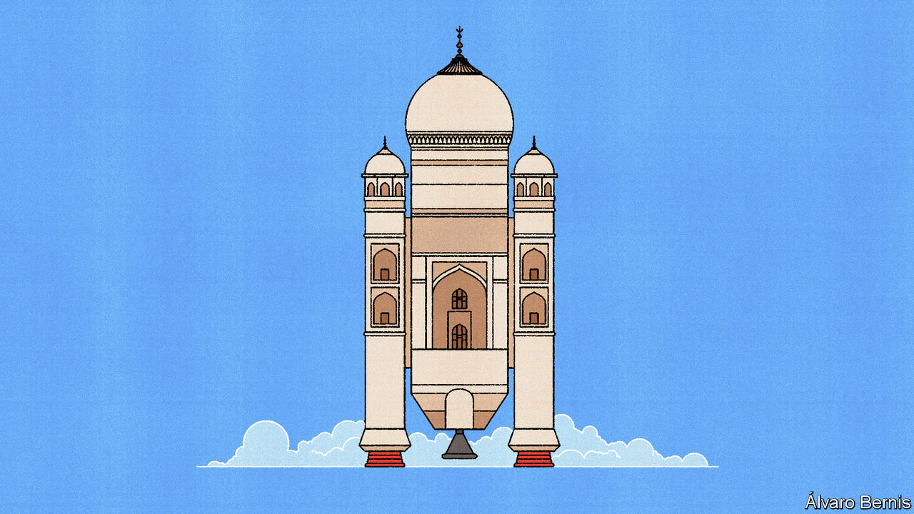

###### Free exchange

# How to put boosters under India’s economy 

##### With the right policies, growth could be astonishing 

 

> Dec 14th 2023 

Land in any Indian city, such as Bangalore or Hyderabad, and you will be struck by its heady optimism. India’s economy may be in the early stage of a historic boom. Recently released figures show that economic growth roared to an annualised pace of 7.6% in the third quarter of 2023. In the past few weeks four international forecasters have raised their growth projections for the year, from an average of 5.9% to one of 6.5%. The National Stock Exchange of India is now neck-and-neck with Hong Kong’s stock exchange for the title of the world’s seventh-largest bourse. 

Pause for breath, though, and India’s performance looks a little less impressive. GDP growth has been slightly slower under Narendra Modi, India’s prime minister, who was elected in 2014, than in the decade before. Labour-force participation is a paltry 40-50%, and only 10-24% for women. Subsidies are distorting the economy. A semiconductor plant in Gujarat will create 5,000 jobs directly and 15,000 indirectly. But a state handout covered 70% of its $2.7bn cost. Assuming rather generously that the factory would not have been built without government support, each job cost $100,000—nearly 40 times India’s average income per person. 

Grappling with the tension between India’s enormous potential and an often messy reality is the task of a new book by Raghuram Rajan, a former governor of the Reserve Bank of India, and Rohit Lamba of Pennsylvania State University. The pair sketch out a vision that amounts to an entirely new model of development for India—one that they argue is better suited to its strengths than its current model. Three lessons stand out from their work.

The first is that India should stop fetishising manufacturing—an obsession born of East Asia’s growth miracle. In the 1960s India’s income per person was on a par with that of China and South Korea. By 1990 South Korea had taken off, while India remained level with China. Today China is three times richer and South Korea is seven times richer, adjusted for purchasing power. The growth of India’s rivals was driven by low-skilled manufacturing, which received plenty of state support. Globalisation created a vast market, leading to previously unheard of double-digit growth rates. Once workers and companies got good at the easy stuff, they began to tackle more complex tasks with their newfound skills. Why shouldn’t India follow its rivals’ example?

As Messrs Rajan and Lamba explain, the problem is that East Asia has made manufacturing so competitive there is little profit left to be captured. Moreover, automation has reduced the number of available jobs—and manufacturing is no longer where value is to be found. Apple is worth $3trn because it designs, brands and distributes its products. By comparison, Foxconn, which actually makes Apple’s iPhones, is worth a mere $50bn.

The second lesson concerns the export of services, which some in India’s government think is a fresh way to tap into global demand. Modern technology, especially the internet, has made services far more tradable. Remote work has accelerated this trend. Meanwhile, governments around the world are desperate to shore up domestic industries. Partly as a result, global trade in goods has declined over the past decade. Yet trade in services has continued to grow. It is hard to argue against seeking a slice of the cushiest part of the global value chain, especially when the line between services and manufacturing is blurring. Some 40% of the value-added in a Chevrolet Volt, for instance, comes from its software.

In places, India is finding success. Its famed IT service sector has moved from mostly providing back-office work to more complex front-office fare. According to one estimate, 20% of the global chip-design workforce can already be found in the country. But profound reforms will be required if India is to succeed more broadly. Spending on education as a share of GDP is 3-4%—middling relative to others of similar income. The bigger problem is that India appears to get little bang for its buck. By the latter half of high school, around half of students have dropped out. Bosses report that many of those who graduate are still not ready for work. Getting a new business off the ground is such a nightmare that many startups incorporate in Singapore. Labour laws make workers difficult to sack once they have been employed for more than a year, which incentivises the use of intermittent contracts. France and Italy have global brands, point out Messrs Rajan and Lamba. India does not. It is these sorts of problems that help explain why.

The last big item on the authors’ wishlist is liberalism—of both the economic and political varieties. Politicians should start, they write, by jettisoning protectionism. From 1991, when India opened up to global markets, to 2014, when Mr Modi took power, average tariff levels fell from 125% to 13%. They have since risen to 18%, raising the cost of intermediate inputs for producers. India has refused to join regional free-trade agreements, which inhibits the ability of its exporters to reach customers abroad. And Mr Modi’s authoritarian tendencies make it difficult for business leaders to criticise the government when a change of tack is required.

Hear the roar

Messrs Rajan and Lamba paint a lovely picture of what could be. A better governed, more open India would be wonderful. But whether their ambitions are politically feasible is another question. For example, better public services probably mean devolving power from the central and state governments to localities. And who wants to give up power? Certainly not Mr Modi; probably not his rivals. Moreover, a country can endure quite a lot of illiberalism before growth starts to falter. Until recently, China was humming along just fine. The Asian tigers only became more politically free when they were rich. India’s economy is already growing at north of 6% a year with a policy mix that is far from the perfect. 

In a strange way, though, this ought to provide Indian reformers with encouragement. Even if only half of what would be ideal is feasible, India’s boom may only just be getting started. ■


