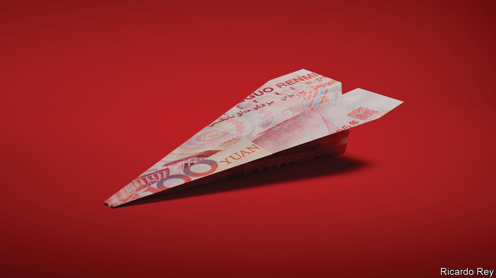
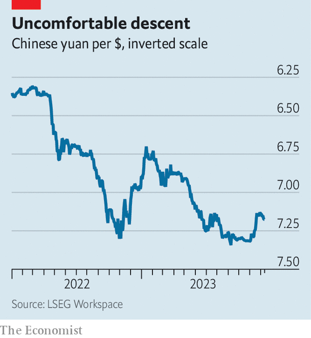
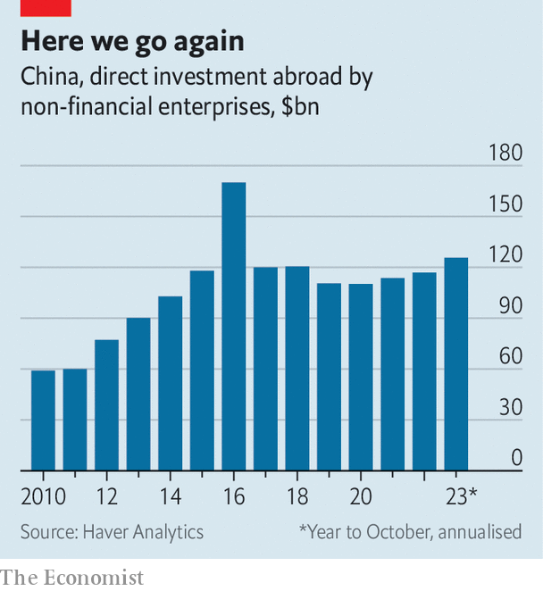

###### Financial flows

# How to sneak billions of dollars out of China 

##### A new era of capital flight has begun 

 

> Dec 14th 2023 

It has been a terrible year to be bullish on China. The CSI 300 index of Chinese stocks has dropped by 13% so far in 2023, to below the level reached during the last of the country’s severe covid-19 lockdowns. Difficulties in the property market are prompting corporate defaults. The lacklustre outlook for economic growth, combined with the need to manage capricious autocratic leadership at home and uncertain relations with big trading partners, makes for a miserable financial climate.

This is also a recipe for enormous capital outflows. Foreign investors, who once had boundless enthusiasm for China, are rushing for the exits. So are numerous wealthy Chinese individuals. According to the Institute of International Finance, a think-tank, there have been cross-border outflows from the country’s stocks and bonds for five consecutive quarters, the longest streak on record. Firms are getting itchy feet, too. In the third quarter of this year the net flow of foreign direct investment in China turned negative for the first time since the data began to be collected a quarter of a century ago. In part, this reflects investment by domestic manufacturers in overseas operations, which can lower labour costs and help skirt American tariffs. The size of the  is up for debate, but some believe up to $500bn-worth is disguised in China’s murky balance-of-payments data.

The last surge of capital out of China came in 2015-16. It was set off by a currency devaluation, which was itself sparked by a stockmarket collapse. By one estimate, as much as $1trn escaped the country in 2015 alone. Back then, many countries welcomed Chinese capital with open arms. Now they are suspicious. New destinations for Chinese funds—both legitimate and illicit—are therefore being found.

Dodging China’s capital controls is the first task for fretful investors. Some transfers are piecemeal: mainland residents can buy tradable insurance policies in Hong Kong, though they may legally spend only $5,000 at a time. In the first nine months of the year, sales of insurance to mainland visitors hit HK$47bn ($6bn), some 30% more than in the same period in 2019. Other avenues are being closed off. In October China banned domestic brokers from facilitating overseas investment by local residents. For business owners, misinvoicing trade shipments, by overstating the value of goods being transacted, is one way to get money out of the country. 

Many places are less inviting to Chinese investors than during the last era of capital flight. Dozens of American state legislatures have passed bills blocking foreign citizens residing overseas from buying land and property. Chinese buyers spent $13.6bn on American property in the year to March, less than half the amount spent during the same period in 2016-17. In Canada, another once popular market, non-residents are now banned from buying real estate altogether. Golden visas in Europe, which offer residency rights in exchange for investment, are falling out of favour: schemes in Ireland, the Netherlands and Portugal are being tightened or abolished. Although Hong Kong remains a gateway through which Chinese capital can reach the rest of the world, its appeal as a bolthole for rich families aiming to shield their assets from the Chinese state has dimmed since the territory’s political crackdown.

 


It is in this context that Singapore has taken on an increasingly important role. Its success in attracting Chinese cash owes a lot to its relative proximity, low taxes and large Mandarin-speaking population. Direct investment from Hong Kong and the Chinese mainland has risen by 59% since 2021, reaching 19.3bn Singapore dollars ($14.4bn) last year. Suspicious gaps in the trade data between the two countries suggest greater unrecorded capital flight, too, note analysts at Goldman Sachs, a bank.

The number of family offices in Singapore rose from 400 in 2020 to 1,100 by the end of 2022, a trend driven by Chinese demand. There is little transparency about what assets ultra-rich investors hold through such vehicles, but Singapore’s modest capital markets suggest that most money will eventually be invested abroad. Nevertheless, Chinese inflows have buoyed Singapore’s banks, helping to lift profits at institutions like DBS and Overseas Chinese Banking Corporation. Other neutral locations are also benefiting from Chinese cash. Although golden visas are in decline elsewhere, issuance in Dubai rose by 52% in the first six months of 2023, compared with the same period in 2022, with lots of recipients thought to be Chinese. 

 


Neutral countries are not the only beneficiaries. Inquiries about Japanese properties from clients in China and Hong Kong have roughly tripled in the past year, says Glass Wu of Japan Hana, an estate agency. The trend has been accelerated by a weak Japanese yen, which has fallen by a fifth in the past three years against the Chinese yuan. Around 70% of the buyers make viewings via video call, says Ms Wu, and buy without first visiting the property. Australia has also seen a surge in overseas demand for property, mostly from potential owner-occupiers, rather than investors as in previous waves, says Peter Li of Plus Agency, a local realtor. Data from Juwai IQI, a property firm, seem to confirm the trend. Since 2020 the median price of homes around the world receiving inquiries from Chinese buyers has risen from $296,000 to $728,000. Rather than buying smaller properties to let, buyers are opting for spacious ones in which they will actually live. 

Chinese capital can cause problems. It has put pressure on Singapore’s housing market, which is dominated by state provision and contains fewer than half a million private units. In April the state introduced an eye-watering 60% tax on all property purchases by foreigners to try to cool things down. The city’s financial secrecy may also invite the wrong kinds of activity. In August police raids resulted in the seizure of assets including cars, jewellery and luxury property, together worth around $2bn, and the arrests of ten foreigners. The group had all been born in China, but most had acquired other citizenships through international investment schemes. In October the Singaporean government noted that at least one of the accused may have had links to a family office. Other countries in the region, such as Cambodia and Thailand, are wary of hosting elite Chinese citizens who may bring politics with them.

Although outflows from China are not yet on the vast scale of those seen during the panic of 2015-16, they might prove more enduring. Back then, a government-engineered credit boom in the property industry helped revive the economy’s animal spirits. This time around, the Chinese government wants to allow the industry to cool. Without a sudden, unexpected recovery in the fortunes of the Chinese economy, the stream of capital looking for an exit is unlikely to slow. Investors and companies will continue to seek a wide variety of foreign assets—the ones, at least, they are still allowed to buy—prompting joy and headaches wherever they land. ■


