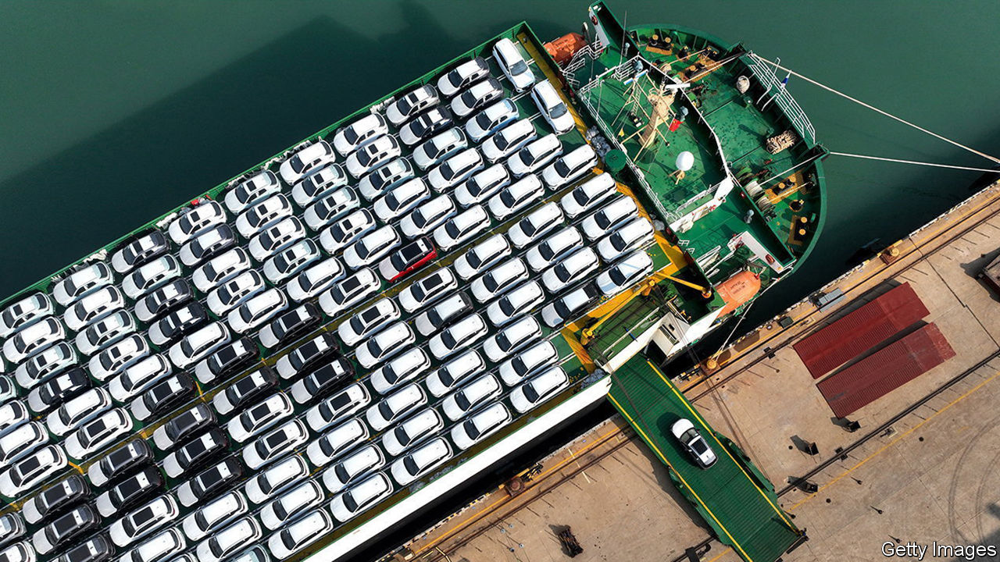
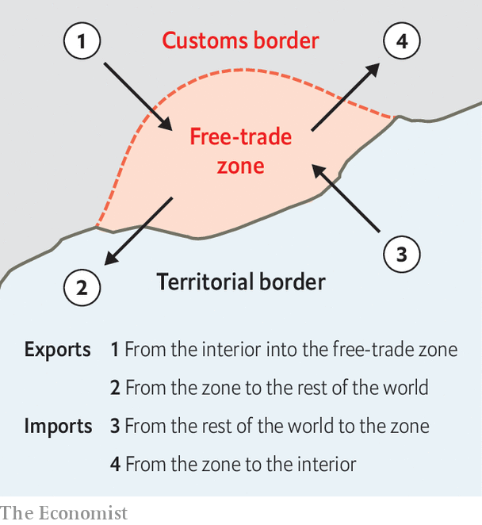

###### A surplus of anomalies

# Is China understating its own export success? 

##### The $230bn puzzle at the heart of the country’s trade figures 

 

> Dec 14th 2023 

China’s current-account surplus was once one of the most controversial statistics in economics. The figure, which peaked at almost 10% of gdp in 2007, measures the gap between China’s earning and its spending, driven largely by its trade surplus and the income it receives from its foreign assets. For much of the past two decades, China’s surpluses have left it open to the charge of mercantilism—of stealing jobs by unfairly boosting its exports. Some trading partners now worry about a similar shock if the country’s output of electric vehicles grows too quickly.

But China’s current-account surplus is now modest: $312bn or 1.5% of GDP over the past year, according to the country’s State Administration of Foreign Exchange (SAFE). That is below the 3% threshold that America’s Treasury deems excessive.

Is the figure reliable? Some, such as Brad Setser of the Council on Foreign Relations and Matthew Klein, a financial commentator, believe that the official numbers are dramatically understated. China’s true surplus, Mr Klein reckons, is now “about as large as it has ever been, relative to the size of the world economy”. They offer two arguments. First, China may be understating income from its foreign assets. Second, it may be understating exports.

According to SAFE, the income China earns on its stock of foreign assets plunged from mid-2021 to mid-2022. This seems odd given rising global interest rates. Mr Setser’s alternative estimate, based on assumptions about China’s assets, would add about $200bn to the surplus.

China’s goods surplus also appears smaller in SAFE’s figures than it does in China’s own customs data. The gap was $230bn over the past year. “That is real money, even for China,” says Mr Setser.

China might take some comfort from a bigger surplus. But it has an unsettling implication. What is happening to the additional dollars China is earning? Since they are not showing up on the books of China’s central bank or its state-owned banks, they must be offset by a hidden capital outflow. Such outflows typically end up in a residual category of the ledger. Mr Setser believes this residual should be about 2% of GDP, not the official figure of near zero. 

 


SAFE has a different explanation. It attributes the export gap largely to China’s free-trade zones and similar enclaves. These lie inside China’s territory but outside its official tariff border (see diagram). Goods leaving these enclaves for the rest of the world are counted as exports by customs but not by SAFE. Adam Wolfe of Absolute Strategy Research points out that these zones account for a growing share of China’s exports. That may explain why the gap has emerged only in the past two years. 

Mr Setser is unconvinced. If China’s free-trade zones have enjoyed a dramatic export boom, it should produce ripples elsewhere. Wages earned by workers, for example, should appear as increased remittances. In fact, they have risen only a little. And as Mr Wolfe points out, even if the official current-account surplus is correctly calculated, it may be of little comfort to China’s trading partners. After all, if the country’s domestic demand remains weak, goods made in its free-trade zones may flood foreign markets. The rest of the world will count them, and experience them, as Chinese imports, even if SAFE does not count them as Chinese exports. ■


