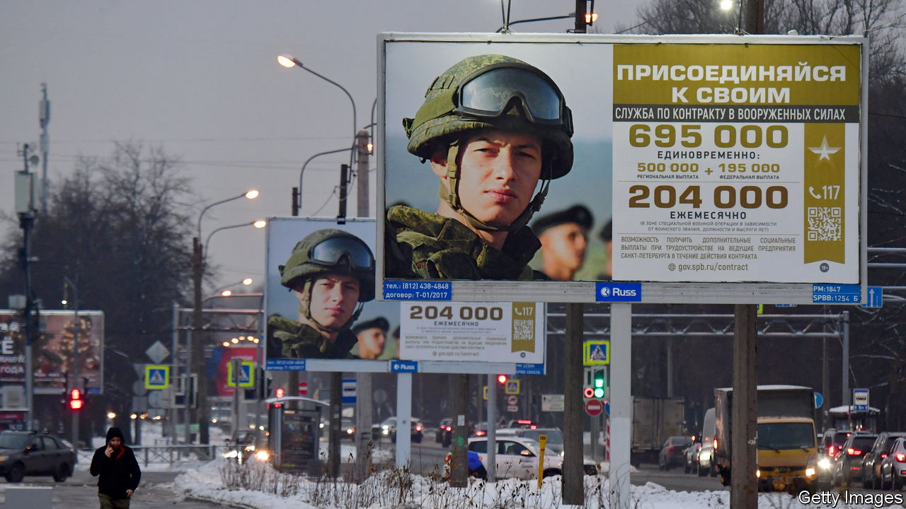
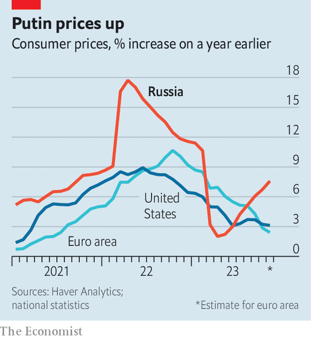

###### Sticking to his guns

# Vladimir Putin is running Russia’s economy dangerously hot 

##### Extravagant war spending is fuelling inflation 

 

> Dec 10th 2023 

The history of Russian inflation is long and painful. After revolution in 1917 the country dealt with years of soaring prices; it then faced sustained price pressure under Josef Stalin’s early rule. The end of the Soviet Union, the global financial crisis of 2007-09 and then Vladimir Putin’s first invasion of Ukraine in 2014 also brought trouble. Fast-forward to the present, as the war in Ukraine nears its second anniversary, and Russian prices are again accelerating—even as inflation eases elsewhere.


Russia’s inflation was 7.5%, year on year in November, up from 6.7% the month before. The central bank dealt with a spike soon after the invasion of Ukraine in 2022. But now officials worry they are losing control. At the bank’s latest meeting they raised interest rates by two percentage points, twice what had been expected. At its next one on December 15th a similar rise is on the cards. Most observers nonetheless expect inflation to continue rising. 

Price rises in 2022 were caused by a weaker rouble. After Mr Putin began his war the currency fell by 25% against the dollar, raising import costs. This time currency moves are playing a small role. In recent months the rouble has actually appreciated, in part because officials introduced capital controls. Inflation in non-food consumer goods, many of which are imported, is in line with the pre-war average. 

 


Look closer at Mr Putin’s , however, and it becomes clear that it is overheating. Inflation in the services sector is exceptionally high. The cost of a night at Moscow’s Ritz-Carlton, now called the Carlton after its Western backers pulled out, has risen from around $225 before the invasion to $500. Such examples suggest that the cause of inflation is home-grown. 

In 2024 defence spending , to 6% of GDP—its highest since the collapse of the Soviet Union. Mindful of a forthcoming election, the government is also boosting welfare payments. Some families of soldiers killed in action are receiving payouts equivalent to three decades of average pay. Figures from Russia’s finance ministry suggest that fiscal stimulus this year is worth about 5% of GDP, a bigger boost than that implemented during the covid-19 pandemic. 

As a result, the growth rate is rising. Real-time data from Goldman Sachs, a bank, point to solid performance. JPMorgan Chase, another bank, has lifted its GDP forecast for 2023, from a 1% fall expected at the start of the year, to an increase of 1.8% in June and more recently to 3.3%. Predictions of an economic collapse—made almost uniformly by Western economists and politicians at the start of the war in Ukraine—have proved thumpingly wrong. 

The problem is that the Russian economy cannot take such growth. Since the start of 2022 its supply side has shrunk. Workers, often highly educated, have fled the country. Foreign investors have withdrawn around $250bn-worth of direct investment, nearly half the pre-war stock. 

Red-hot demand is running up against this reduced supply, resulting in higher prices for raw materials, capital and labour. Unemployment, at less than 3%, is at its lowest on record, which is emboldening workers to ask for much higher wages. Nominal pay is growing by about 15% year on year. Companies are then passing on these higher costs to customers.

Higher interest rates might eventually take a bite out of such demand, stopping inflation from rising more. An oil-price recovery and extra capital controls could boost the rouble, cutting the cost of imports. Yet all this is working against an immovable force: Mr Putin’s desire for . With plenty of financial firepower, he has the potential to spend even bigger in future, portending faster inflation still. As on so many previous occasions, in Russia there are more important things than economic stability. ■


