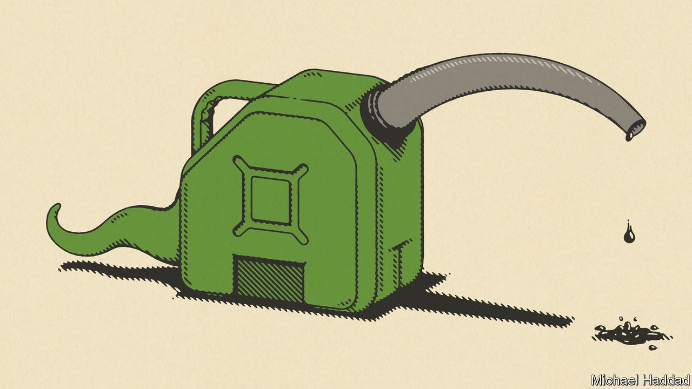
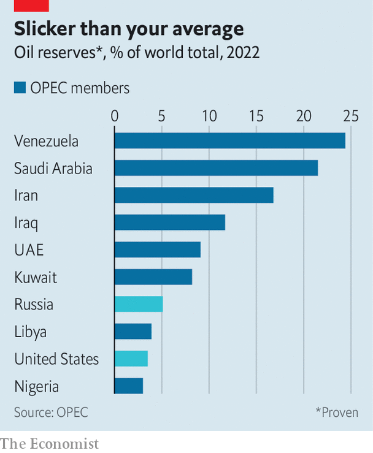
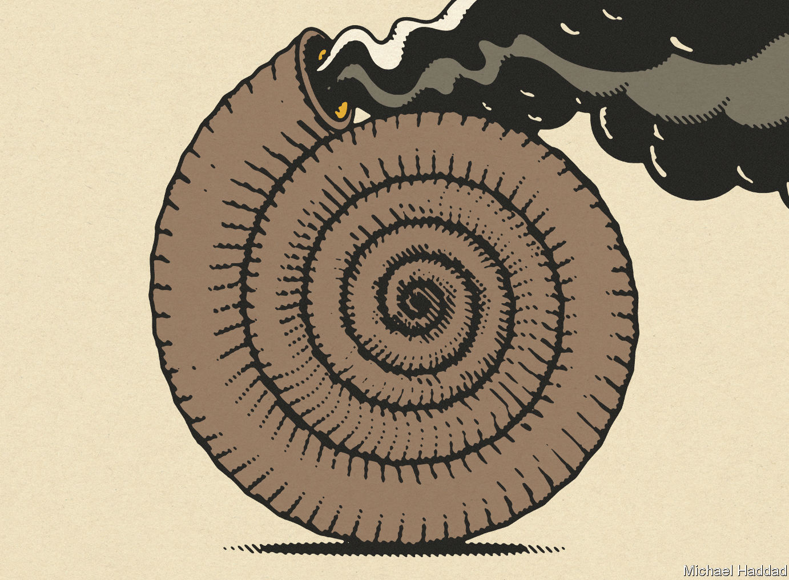

###### COP28 concludes

# Climate talks at last lead to a deal on cutting fossil-fuel use 

##### The historic agreement emerged only through bitter compromise 

 

> Dec 13th 2023 

MOST EVENINGS at , the latest instalment of the annual United Nations climate conference, delegates were treated to a dazzling light show. It transformed the central dome of the venue, Expo City in , into a teeming coral reef. Priority was given to prettiness over precision. Turtles swam cosily with similar-sized humpback whales. A change in soundtrack saw them suddenly turned into dancing, blood-red squid.

In the end the conference delivered the same combination of deliberate choreography and otherworldly fantasy. For the first time in more than three decades of international climate diplomacy, all parties explicitly agreed to move away from using fossil fuels in energy systems. These systems generate vast wealth, but also the bulk of the world’s emissions. On December 13th the meeting’s president, Sultan al-Jaber, chief executive of the Abu Dhabi National Oil Company, announced that the agreement would be passed without objections. The plenary rose in applause. Outside, the desert sun beat down on a planet that is already around 1.2°C warmer than in pre-industrial times. The world’s largest gas-fired power plant, just a stone’s throw away, ran on regardless. 

Nevertheless, it was a rare success for multilateralism, given the 198 delegations involved. The conference took place against the backdrop of wars in Ukraine and the Gaza strip, both of which have worsened divisions between the rich and poor worlds. An agreement before the summit between America and China laid the groundwork for its success. The pair promised to triple the deployment of renewable energy by 2030—a declaration originally made by the G20—which ultimately inspired a clause in COP28’s final agreement. Similarly a cross-cutting coalition of countries from the EU, Latin America and the Alliance of Small Island States (AOSIS) repeatedly pushed for more progress on reducing fossil-fuel use. 

The final text is a product of bitter compromises between the desire to limit the planet’s warming and the economic interests aligned with fossil fuels. It calls on parties to transition “away from fossil fuels in energy systems” and to accelerate action “in this critical decade, so as to achieve net zero by 2050”. Although many of the deal’s provisions leave much room for interpretation, the agreement forged in Dubai could serve to indicate the direction of travel. But like all UN climate deals, there is no enforcement mechanism within the latest one. Government actions alone will give it teeth. 

COP28 marked a critical moment in the UN climate calendar. The Paris agreement, signed in 2015, decreed that this year’s meeting would be the first “global stocktake”: an inventory of progress on cutting emissions thus far and feedback on how efforts could improve. The verdict that countries remain well off-track was not a surprise. The text states that greenhouse-gas emissions need to be cut by 43% by 2030 and 60% by 2035, relative to 2019 levels, if limiting global warming to 1.5°C by the end of the century is to be considered plausible. It noted with alarm that even if every aspect of countries’ current plans were met, emissions reductions in 2030 looked closer to a dismal 5% (putting the world on track for a rise of 2.1°C-2.8°C even in the best-case scenario). More urgent reduction is possible; the cuts of 7% year on year needed to hit the target are not.

 


The exact implications of the deal will be fiercely contested. Language calling for a phase-out or phase-down of fossil fuels was removed. It was a “red line” for some oil-producers. Petrostates fret over what climate action could mean for their vast reserves (see chart). On the other side, a major objection from AOSIS was the text’s “litany of loopholes”. These included its focus on energy systems, which excludes fossil fuels used in other sectors such as the production of plastics or in fertilisers for agriculture. Another concerned “abatement” technologies, such as the carbon capture and storage systems (CCS) meant to divert the carbon dioxide produced by power plants rather than see it emitted into the atmosphere. Many observers fear CCS will be used by fossil-fuel producers in lieu of shifting away from coal and oil. Vague references to the acceptability of undefined “transitional fuels”, presumably natural gas, drew criticism too. 

Other complaints focused on the weakness of the language used, as countries were “[called] on” to act, and on the various conditions that could allow some to delay peaking their carbon emissions. Special terms may be necessary for many poor countries, but can offer others excuses to delay action. And noting that countries must behave “in line” with science will probably not be enough to keep governments on track. 

That a climate deal is tackling fossil fuels directly is mostly the result of changes to their perceived importance in America and China. That is partly a reflection of facts on the ground: America’s domestic consumption of oil and natural gas is forecast shortly to either fall or plateau by the Energy Information Administration, its own official forecaster. (That will, however, free up more for America to export as the world’s biggest oil producer.) Meanwhile record sales of solar panels and electric vehicles offer the possibility of prosperity without pollution. China is also changing its approach. Some analysts think emissions in the country have already peaked as expanding renewable and nuclear capacity meets increases in demand. Transport is being electrified, too. But it is difficult to decipher the trends precisely. The country is also building more coal plants in pursuit of energy security. This is not the same China as it was a decade ago, says Li Shuo of the Asia Society Policy Institute, which analyses such matters. 

 


Yet the Dubai deal also shows that the world still has not figured out how to tackle the many problems that climate change poses simultaneously. The major achievement of COP27, held in Sharm El Sheikh in 2022, was an agreement that the rich countries most responsible for rising temperatures should pay poor ones for some of the “loss and damage” they suffer. The price of that advance was meagre action on fossil fuels. The same trade-off played out again in 2023, but in reverse: better language on fossil fuels, little real progress on the needs of the poorest. The formal establishment of the loss and damage fund agreed to the year before—on COP28’s first day—was much celebrated. The glitz faded when it emerged that much of the $700m put in it was already promised to other projects.

Diplomats will struggle to duck such arguments next year when the conference travels to Baku, in Azerbaijan. Between 2020 and 2025 rich countries promised to deliver $100bn a year to poor countries in climate finance. A follow-on deal will need to be agreed upon as related discussions in Dubai mostly focused on procedure, not substance. Some progress was made outside the UN negotiating rooms. Mr al-Jaber boasted that $83bn in climate finance had been offered up during the conference, including $30bn for a new private investment fund from the United Arab Emirates. Development banks, such as the World Bank, announced an increase in funding and new clauses in debt contracts that would allow countries to defer payment after natural disasters. 

Not so slick

Other challenges loom. The world may soon have to contend with an America that is not willing to negotiate with either China or the UN on climate change. President Donald Trump withdrew from the Paris climate agreement as soon as he was able, in 2020, arguing that climate change was a Chinese invention to hamper American competitiveness. Mr Trump is currently the frontrunner for the Republican nomination for president. A victory for him at the polls in November could lead to another four years of slow climate diplomacy.

For all the concerns and complaints, most delegates appeared to leave the jamboree in Dubai with a sense of achievement; many smiled and stopped to snap photographs. Mr al-Jaber declared the agreement “historic”. Others proclaimed it as “the beginning of the end of the fossil-fuel era”. Both might prove to be true; neither is in any way guaranteed. For all they are resisted by oil producers, the UN climate treaties are normally toothless and always imperfect. This one is no exception, with every stride made the result of giving up some ground elsewhere. It must be seen as an aid for convincing governments and businesses that oil, gas and coal are no longer the solid investments they once were, and that they would be better directing their money towards cleaner sources of energy. Otherwise it will be little more than a pleasing display of light. ■

