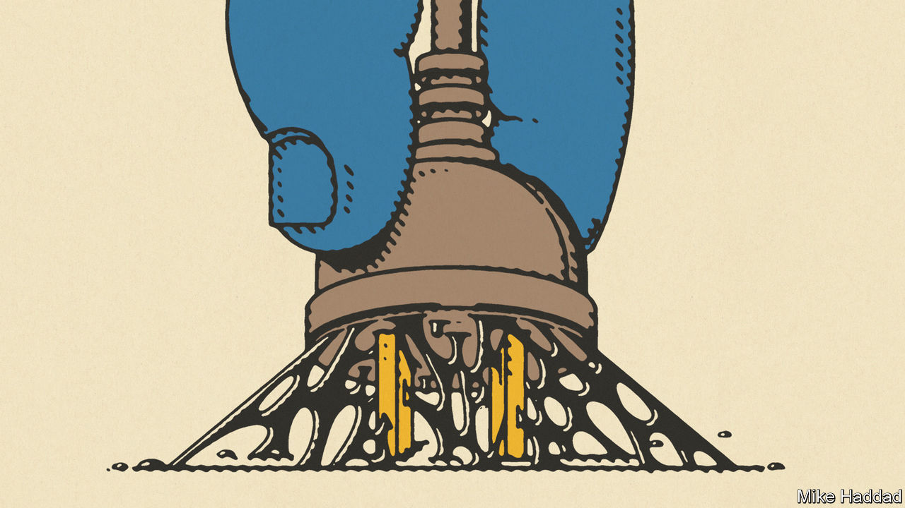

###### Green shoots

# In a first, COP28 targets the root cause of climate change 

##### Now to turn diplomacy into action 

 

> Dec 13th 2023 

As activists and diplomats first assembled in Dubai for cop28, the un’s climate summit, a fortnight ago, the chances of significant progress seemed slim. War had returned to the Middle East and the geopolitical order was fragmenting. The choice of the summit’s host country—the United Arab Emirates, one of the world’s leading petrostates—and its chairman, , the head of its national oil company, threatened to turn the event into a giant exercise in greenwashing.

Instead, cop28 defied the pessimists. For the first time the world has agreed to move away from the coal, oil and natural gas that are the principal causes of global warming. The 198 parties to the un Framework Convention on Climate Change agreed on a text that called for a transition away from fossil fuels “in energy systems, in a just, orderly and equitable manner”.

Some will be disappointed at the compromises made. The Europeans had hoped to agree to “phase out” fossil fuels entirely, to which fossil-fuel producers refused to sign up.  say their voices were not heard. The deal states that only “unabated” coal power will be phased down, leaving the option of the dirtiest fuel continuing to be burnt as long as its emissions are captured at source. Nonetheless, the document is an important, and realistic, step forward. 

The call to phase out fossil fuels was both politically naive and economically unfeasible. COP operates by consensus, meaning that the big petrostates had a veto on any deal. Moreover, fossil fuels are likely to remain part of the energy mix for decades to come. Even optimistic forecasts suggest a substantial role for oil and gas, balanced by technologies that remove their greenhouse-gas emissions, in scenarios for the world to achieve net zero by 2050. Although clean energy has made vast strides, it is unlikely to displace fossil fuels fully by then.

Climate diplomacy also proved to be more potent than the pessimists had expected. Mr al-Jaber proved keener to ensure a negotiating success for his country than to distort the process to favour its economic interests. An early pledge from 50 oil companies, including Mr al-Jaber’s firm, to , a potent greenhouse gas, suggests that there were some benefits to an oilman running the show. 

An agreement between America and China ahead of the summit helped lay the groundwork. It meant that the two largest polluters and geopolitical rivals together pressed for restoring some language on fossil fuels into the deal, which helped steer recalcitrant petrostates towards agreement. Even the choice of the venue for next year’s summit—Baku—was a symbol of harmony. Armenia lent its support for Azerbaijan’s bid as the two warring neighbours inch towards peace. 

Yet a global agreement is only one small step. A far bigger and harder one will be to translate words on a page into action in the real world. The deal sends a signal to oil companies, especially in rich countries, that they may find it harder to do business, for example because of legal challenges to exploration licences. But reducing reliance on fossil fuels will ultimately depend on making them uncompetitive. A combination of carbon prices and well-targeted subsidies for clean technologies can do so in the rich world. 

Poorer countries will need help. The summit largely sidestepped this thorny issue. Developing countries with fossil-fuel reserves argued that it was unfair to expect them to forgo one of their few revenue streams without being given aid to do so. According to the Energy Transition Commission, a think-tank, getting rid of coal power early will require the rich world to make available around $25bn-50bn a year in grants and other concessional finance to poor countries over the rest of this decade, to retire coal assets early. 

This provides the backdrop for a fierce battle. Projects in poor countries are much costlier than those in rich ones, because the private sector demands a premium to compensate for the associated risk. But rich countries will try to limit their financial obligations to the developing world. Bridging the gap, far more than diplomatic backslapping in Dubai, will determine whether the beginning of the end for the fossil-fuel era has come. ■


