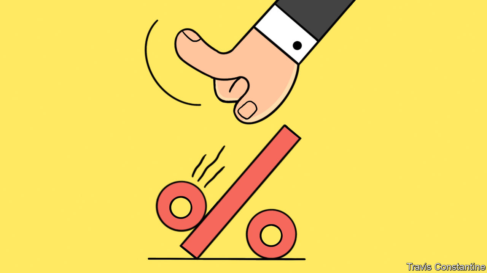
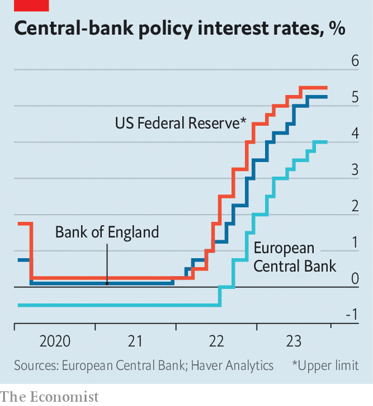

###### The Powell pivot

# The Fed gives in to the clamour for looser money 

##### Its doveish policymaking looks premature—and leaves Europe’s central banks in an awkward spot 

 

> Dec 13th 2023 

For most of 2023 big central banks have shrugged off investors’ bets that interest-rate cuts were imminent. That all changed on December 13th, when the Federal Reserve signalled that it expected to cut rates by three-quarters of a percentage point in 2024, coming close to endorsing markets’ doveish views and causing a frenzy of buying on a delighted Wall Street. At the start of the month Jerome Powell, the Fed’s chairman, had said that it was premature to discuss the . Now he says loosening is under discussion for the first time since  surged after the covid-19 pandemic.

Could the pivot set off a global move towards monetary easing? As we went to press the Bank of England and the European Central Bank were due to announce their monetary-policy decisions, having, like Mr Powell before this week, recently pushed back against the idea that rate cuts were imminent. The irony is that a turn towards looser money looks far more appropriate in Europe than it does in America, where Mr Powell is gambling that recent good news on inflation will keep rolling in. 

The main factor behind the pivot is that inflation has fallen fast. America will probably log underlying price growth of less than 3.5% for 2023 as a whole, on the Fed’s preferred measure, compared with 5.1% in 2022. Having started the year predicting a recession, many economists now reckon that a “soft landing” for America is nigh.

 


Yet inflation is not at the Fed’s 2% target yet, and there is a significant danger that it will soon stop falling. The labour market continues to look too hot. Although the number of job vacancies has fallen, employers created 199,000 jobs in November, more than double the long-term growth in the labour force, helping push the unemployment rate down to 3.7%. Wages continue to grow at a rate that is too fast to be consistent with inflation of 2%, even after accounting for productivity growth. Consumers are spending plentifully. Output is 7.4% above its pre-pandemic level—and, astonishingly, less than 2% shy of its 2015-19 trend. The economy does not much look like it needs a helping hand from the Fed.

By contrast the euro zone would benefit from a monetary-policy pivot. Inflation in the bloc has fallen even further: core consumer prices, which exclude food, energy, alcohol and tobacco, have grown at an annual pace of just 0.7% over the past three months. 

And, unlike America’s, the euro-zone economy looks soggy; surveys suggest that both the manufacturing and services sectors are shrinking. Output is languishing 5.3% below its pre-pandemic trend. It is harder to tell the condition of the , owing to the long lag with which wage figures are reported. But there are clear early signs of softening, which will probably look like a slump when the data appear.

The transatlantic divergence in inflationary pressures is explained in part by fiscal policy. America enacted stimulus worth 26% of GDP during the pandemic; its consumers are still spending down the cash they accumulated from handouts and staying at home. The federal government continues to add heat to the economy. Its underlying deficit reached 7.5% of GDP during the 2023 fiscal year.

Europe’s big economies, by contrast, handed out only about half as much stimulus as a share of GDP during the pandemic and in 2023 the members of the European Union will run a combined deficit worth about 3.5% of GDP. Whereas rampant spending at home has driven American inflation, Europe’s has to a greater degree flowed from supply disruptions, including its energy crisis. European inflation is only likely to prove sticky to the extent new supply shocks strike. (Britain is a hybrid case in which both stimulus and supply shocks were large.) 

Pivotal moment

The ECB would therefore do well to loosen policy significantly in 2024. To keep rates high would be to repeat its hawkish missteps of 2008 and 2011, during which it raised rates and aggravated the effects of the global financial crisis. America’s different circumstances mean the Fed is not at risk of making such an error. But Mr Powell’s pivot leaves it in danger of making an equal and opposite mistake. ■

