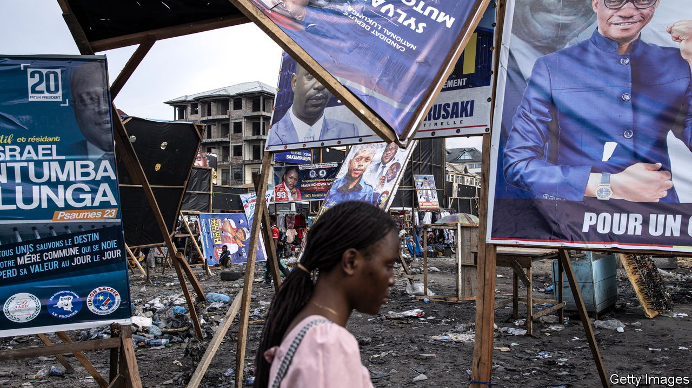
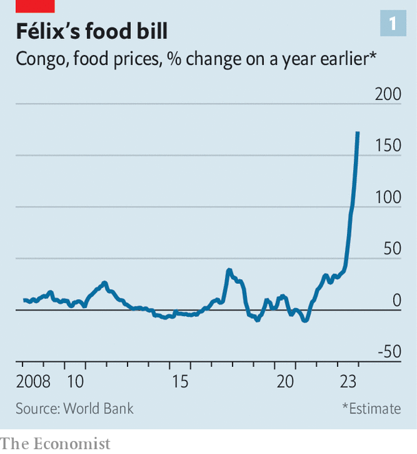
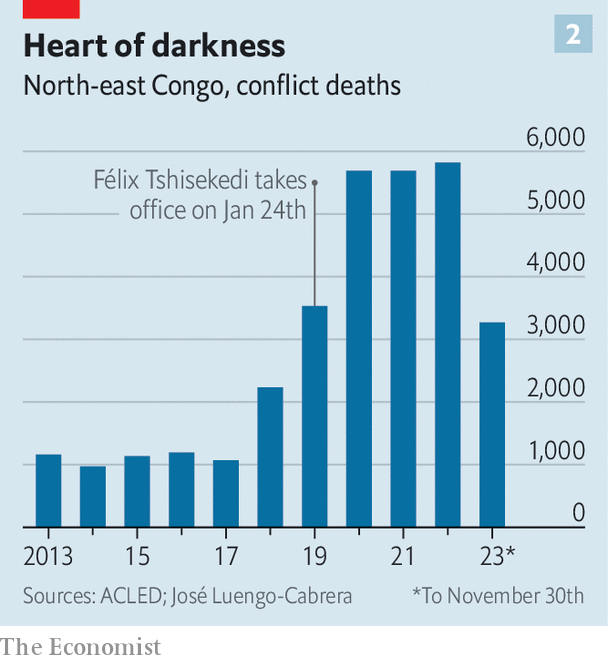

###### Cobalt and chaos

# Congo’s crucial election may be heading for disaster 

##### The risk of fraud, or a delay, is high 

 

> Dec 14th 2023 

Finding examples of government success in the Democratic Republic of Congo (DRC) is not easy. The campaign team of Félix Tshisekedi, who is running to be re-elected president in a vote scheduled for December 20th, set itself the task of showing reporters something impressive near Lubumbashi, Congo’s second-biggest city. The journalist-jammed bus made wrong turns, repeatedly asked villagers for directions and twice nearly became mired in mud. Eventually it found a few half-built classrooms and an unfinished clinic. Yet locals are delighted. Mr Tshisekedi “does beautiful things!” beams Nadia, a young mother. After years of neglect by politicians some Congolese are understandably pleased with any sign of progress. 

Congo should have achieved much more. It stretches from Africa’s west coast to its centre and has a youthful population of 100m. It has large amounts of the minerals needed for the transition to green energy, producing 70% of the world’s cobalt. Yet after brutish rule by Belgium’s king, a chaotic passage to independence in 1960 and a long dictatorship, it is one of the weakest states in the world. Many major cities are not connected to each other by all-weather roads. Some 60% of Congolese live on less than $2.15 a day, an international standard of extreme poverty. The state has no control of large chunks of territory. Corrupt politicians, other African countries and rebel groups plunder its minerals. 

A war has ravaged much of the east for almost three decades. It has recently worsened. m23, an armed group, has been fighting towards Goma, the biggest eastern city. Some 450,000 people were displaced in the six weeks to the end of November, bringing the total to nearly 7m, a number exceeded only in Sudan. It could get worse. M23 is backed by neighbouring Rwanda, whose army also appears to be fighting in Congo. (Rwanda denies this.) In November Avril Haines, America’s intelligence chief, met the presidents of both countries to try to avert an open cross-border war. At a rally near the Rwandan border this month Mr Tshisekedi raised the tension, saying to a cheering crowd that Rwanda’s president, Paul Kagame, was acting like Hitler and “will end up like Hitler”. 

This month’s elections, for offices from president to municipal councillor, are an opportunity and a danger. They give Congolese a chance to choose leaders who could reduce poverty and make progress towards peace. Yet they will be a shambles, and could be stolen outright. Voters seem to have been cheated in the last election, in 2018. According to leaked official data, Martin Fayulu, a former ExxonMobil executive, won 59% of the vote, compared with 19% for Mr Tshisekedi. Yet, allegedly after a backroom deal with the outgoing president, Joseph Kabila, Mr Tshisekedi was named the winner. (Both deny any deal.) America endorsed the result.

The electoral process is a mirror of Congo’s disarray. The problems begin with the electoral law, under which the candidate who gets more votes than any other in a single round becomes president. With 26 candidates on the ballot, the winner might have a weak popular mandate—and no mandate at all, if the vote is rigged. The war in the east will prevent 1.7m Congolese from voting at all. Opposition candidates have no trust in the new head of the electoral commission (CENI), Denis Kadima. “Nothing is happening correctly, it’s a disaster,” says Moïse Katumbi, an opposition candidate. Six candidates are suing Mr Kadima, alleging “intentional irregularities”. 

Among them are voter identity cards that are so badly printed that the person’s name and photo rub off. Eric Nsenga, of the Protestant and Catholic churches’ election-observation mission, estimates that 70% of cards are illegible. Mr Kadima says that he will announce measures to allow people with smudged cards to vote. But that may heighten fears of rigging.

Opposition candidates do not trust the electoral rolls. Unlike in the last election, when an independent institution vetted them, CENI has this time appointed auditors, who did the job in six days. That is not enough time, says the observation mission of the Carter Centre, an American NGO. Mr Kadima points out that an external audit is not legally required. The EU drastically scaled back its electoral-observation mission in late November because the government would not let it import equipment such as satellite phones. There will be domestic observers, but Mr Kadima encourages mistrust in them. Many “have already chosen their side”, he claims.

Even now the vote may be delayed. The papers for reporting the results from each polling station to CENI arrived in Kinshasa only on December 9th. In nearly roadless Congo it may be impossible to deliver them to 75,000 stations in 11 days. Technically and logistically this election is Congo’s worst ever, says Mr Nsenga. 

Yet Western diplomats are strangely upbeat. One talks of Congo’s “vibrant” democracy, while conceding that the election is likely to be “messy and highly flawed”. The diplomat suggests that “by and large” people may still be able to “express their will”. As in 2018, much of the West may endorse a questionable result. Such an outcome could trigger violence or, some fear, a coup. “We don’t want to be like Gabon,” a nearby country where soldiers seized power in August after a dodgy election, warns Mr Katumbi. Tensions are rising. On December 12th live rounds were fired and several people were injured as he spoke at a rally.

 


Mr Tshisekedi might well win without chicanery. His campaign poster, unlike those of his opponents, is ubiquitous. He has not, as he promised, made Congo the “Germany of Africa” or brought peace to the east. But he can point to an economy that has grown at rates of between 6% and 9% over the past three years, thanks to rising mineral prices. Mr Tshisekedi decreed that primary education and care for childbirth should be free. “People do not want to hear good news about DRC,” complains Nicolas Kazadi, the finance minister.

That is no doubt because few Congolese feel its effects. The number of people living on less than $2.15 a day is higher than when Mr Tshisekedi took office. Life in Lubumbashi is easily summed up, says John, a 28-year-old university graduate who sells phone credits for a living: “.” The franc has slumped. When Mr Tshisekedi attends football matches the crowds chant “the dollar is too high!” in Lingala, a local language. Food inflation has rocketed to 173% (see chart 1). 

Parents have stopped paying teachers, but some teachers grouse that the government has not made up the difference. Class sizes are so big that few children learn much. (Mr Kazadi says these are isolated problems.) Corruption “is worse” than it was, says Willy Mulamba, the chairman of the banking association. Worst of all, death and displacement in the east have sharply increased since Mr Tshisekedi took office (see chart 2). 

 


Although polls are unreliable, his strongest challenger appears to be Mr Katumbi, who might be an improvement. A businessman who owns sub-Saharan Africa’s best football club, Mr Katumbi had a reputation as a good manager when he was governor of Katanga province in the south-east from 2007 to 2015. Questions have been raised about the sources of his wealth. Yet, though he was a legal target of Mr Kabila’s regime, prosecutors did not pin corruption charges on him. Asked about rumours of corruption, Mr Katumbi sends an aide to fetch a huge poster of him in a hard hat at a mine in 1997. “I didn’t go [into politics] with empty pockets,” he says. 

Mr Katumbi’s chances would improve if the opposition united around him. Four presidential candidates have endorsed him, but that may not be enough. He must contend with Mr Fayulu, who continues to denounce corruption and the political system. Mr Fayulu looks tired, but he could siphon support away from Mr Katumbi, whom he despises. “For me Katumbi is really nothing,” he says. The outcome of the election, if it goes ahead on December 20th, is impossible to predict. It could, depressingly, be more of the same. ■

