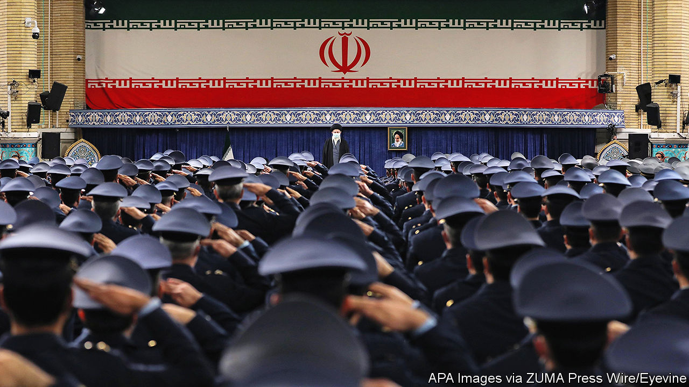
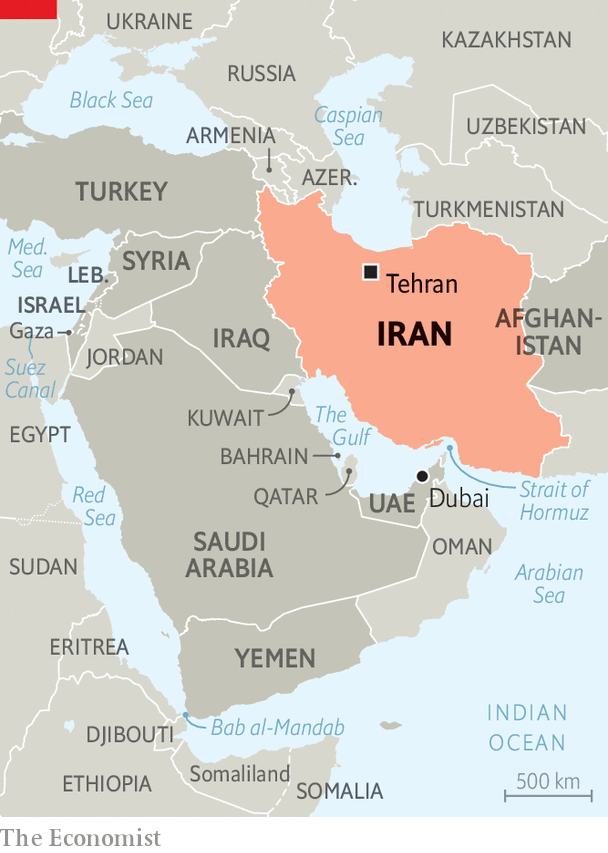

###### Taming Tehran

# Iran rethinks its role as a regional troublemaker 

##### The Islamic Republic is preoccupied with its transition to a new generation of leaders 

 

> Dec 14th 2023 

ON THE FACE of it, the war in Gaza has been good for Iran’s clerical regime. First, its ally, Hamas, proved itself horrifyingly more effective than most observers had assumed in its attack on Israel on October 7th. Since then the other members of the “axis of resistance” have demonstrated Iran’s reach, striking Israeli and American targets from Iraq, Lebanon, Syria and Yemen. The Houthis, Iran’s proxies in Yemen, have attacked oil tankers in the Red Sea and fired missiles with a range of 800km, allowing Iran to threaten trade through the Suez canal, much as it already dominates passage to the Persian Gulf. “They’re showing the world needs Iran if it wants to keep the Middle East stable,” says a former UN diplomat in Tehran. In Washington, DC Republican politicians present the regional menace posed by Iran as proof of President Joe Biden’s geopolitical incompetence. 

Iran’s muscle-flexing comes after a year in which the ayatollahs have regained their grip over the country’s citizens. In late 2022 widespread demonstrations, triggered by the death in custody of a woman who wore her hijab improperly, appeared to be close to toppling the regime. In the end it was the protests, not clerical rule, that died out. Iran’s diplomatic and economic isolation is also easing. It has positioned itself as a crucial supplier of weapons to Russia. Oil exports, especially to China, are booming. In March China brokered a deal to restore diplomatic relations between Iran and Saudi Arabia. In August Iran was invited to join BRICS, the bloc of big emerging economies. And in September America agreed to unfreeze $6bn of Iranian assets as part of a prisoner exchange. 

But Iran is less confident than it appears. It has restrained attacks by its proxies. It signals support for Hamas, but does not go far enough to invite furious retribution from Israel and America, whose navy is now near its shores. That caution, in turn, reflects weakness in Iran’s economy and simmering discontent among ordinary Iranians. Above all, Iran is on the verge of a change in leadership, owing to the age (84) and infirmity of its “supreme leader”, Ayatollah Ali Khamenei. The regime’s focus is increasingly on securing its hold on power, not fomenting chaos abroad. 

The clearest sign of this is that, having nurtured a network of regional troublemakers for decades, Iran suddenly seems reluctant to let them make too much trouble. Hamas’s appeal to “brothers in the Islamic Resistance in Lebanon, Iran, Yemen, Iraq and Syria” to “merge with the people of Palestine…to unite and expel this occupation from our sacred lands” has been largely ignored. Hizbullah, a Lebanese militia allied with Iran, has been cautious, contenting itself with skirmishes and sporadic missile attacks across Israel’s northern border. A long-awaited address in November by its leader, Hassan Nasrallah, amounted to 80 minutes of excuses. As Yoav Gallant, Israel’s defence minister, put it, “no one has come to [Hamas’s] aid—neither the Iranians nor Hizbullah.” 

Iranian officials still trot out their formula for resolving the Israeli-Palestinian conflict: a referendum of the “original inhabitants” of Palestine (not including Jews), which would vote to wipe Israel off the map. But in recent weeks Iran’s clerics have also signalled moderation. A manifesto by religious scholars published in mid-October condemned the killing of civilians by Hamas as well as Israel. Recognition of Israel is the Palestinians’ “own business, of course”, says Mr Khamenei’s foreign-policy adviser, Kamal Kharazzi. “We are not going to declare opposition to others.” At the UN General Assembly on October 27th Iran voted in favour of a two-state solution, which would entail recognition of Israel, a break with a long-held policy of opposition. Mr Khamenei shocked hardliners recently by saying that Iran did not believe that “Jews or Zionists should be thrown into the sea.” “We’re not radicals,” insists an Iranian diplomat. 

Or perhaps they would rather not sound like radicals. Iran clearly does not want to be blamed for Hamas’s rampage. In his first comment on the attack Mr Khamenei denied Iran’s involvement three times within 90 seconds—as if pronouncing a three-fold Islamic divorce, noted an Iranian wag. “The resistance groups in the region do not take orders” from Iran, insists Nasser Kanani, the foreign ministry spokesman.

If what he means is that they are free agents, that is nonsense. Abdolreza Shahlaei, a commander of the Yemen division of the Islamic Revolutionary Guard Corps (IRGC), the regime’s elite military force, directs the Houthis from the mountains of Yemen, according to Israeli intelligence. Since October 7th Ismail Qaani, the commander of the IRGC’s foreign arm, the Quds Force, has opened “a joint operations room” close to Syria’s front line with Israel and launched combat drones from Syria deep into Israel. 

Iran may not have ordered the attack on October 7th, but the IRGC clearly helped Hamas acquire the capabilities needed to mount it. The jamming and drone attacks against Israel’s defences all showed its logistical support. “It’s the work of a state,” says an Iranian political-risk analyst. 

The question is not so much whether Iran was involved but why it is now so anxious to avert escalation. Some observers consider its quiescence to be purely tactical—a way to stave off attack. A more interesting possibility is that the country is making a strategic shift. While Hamas is causing havoc in the region, the attention of Iran’s leaders is turning to its troubled domestic affairs. Mr Khamenei will not be in charge much longer. Many Iranians expect a succession crisis that could destabilise the regime. “To smooth the succession they need a better economy and less catastrophic foreign policy,” says Yaser Mirdamadi, an Iranian religious scholar in exile. 

Neither foreign adventurism nor domestic strife will help with that. Relief from Iran’s economic woes might. That is what prompted Mr Khamenei, in the six months before October 7th, to cut by two-thirds production of uranium enriched to 60% u-235, to stop harassing American shipping in the Strait of Hormuz and to discourage proxy attacks on American targets. America, in turn, has turned a blind eye to trade in Iranian oil, which it subjects to sanctions. Oil exports soared fourfold, from 300,000 barrels a day (b/d) in 2022 to more than 1.2m b/d today. When Iran held back its proxies after Hamas’s attack, Mr Biden quietly rewarded the regime by allowing Iraq to begin transferring $10bn it owed to Iran for outstanding energy bills. 

Domestic woes

All this should help the economy. Iran’s oil and non-oil revenues are at their highest since President Donald Trump re-imposed sanctions in 2018, when he pulled out of a deal to lift them in exchange for Iran’s agreement not to build nuclear weapons. Sales to China alone have increased from 200,000 b/d in 2020 to more than 1.2m in recent months. Oil revenues have risen from $25.5bn in 2021 to $42.6bn 2022. Iran’s budget projects that they will reach $71bn in 2024.

 


Much more has to happen for Iran’s citizens to feel the benefit. Although Iran’s exports have soared, American sanctions still make it hard for Iran to repatriate the proceeds. Traders dealing in oil from the “pistachio country” arrive with duffle bags full of cash in Dubai. Some is sent to Iran overland via Iraqi Kurdistan or Afghanistan or is laundered through informal currency exchanges and cryptocurrency transactions in Dubai. Near al-Hamriya port there is a strip of massage parlours, which, since they sell their services for cash, probably help launder it. Even so, “a lot of the earnings stay here,” says a Western diplomat in Dubai, with a nod at the skyscrapers stretching to the horizon. The city bustles with new Iranian art houses and clubs.

Iran cannot afford that. Even were all the proceeds to head home, Iran would still run a large budget deficit. The country needs to export 1.5m b/d at a price per barrel of $85 to balance its budget. But oil currently trades for less, and Iran has to offer buyers a hefty discount to the market price. 

At home, the IRGC and their cronies capture much of the oil revenue, creating a two-tier economy. The , children of the elite, flaunt their Lamborghinis in northern Tehran and head to London or Dubai to shop and party. Finding it difficult to get visas for America but no less attracted to it than pre-revolutionary elites, thousands fly to Canada. Toronto has so many Iranians they dub it Tehranto.

Life is harder for most Iranians. Inflation has accelerated, outpacing wage growth. Food prices are up by 40% year on year; the price of meat has risen at double that rate. The poverty rate has increased from 19% to 30% in a decade, according to official figures. More than 26m people, 30% of the population, live on less than $7 a day, an official poverty line. University lecturers moonlight as taxi-drivers. There are reports of Iranians selling body parts to Turkey and the United Arab Emirates. Those who have money stash it abroad.

These woes would test able politicians. Unfortunately, the government, led by President Ebrahim Raisi, is widely regarded as the Islamic Republic’s most inept yet, as well as its most hardline. Most of his ministers are either IRGC veterans or graduates of Imam Sadiq, a seminary-cum-university in the capital with an ideological bent. They are ill-equipped. For the last six months they have imported petrol at market prices to make up a shortfall in local production. Even so they continue to subsidise it to keep the price to motorists at two cents a litre, for fear of the unrest that might follow a price hike. Earlier governments raided public pension funds. To deal with the resulting deficit, parliament last month decided that workers would have to stay in their jobs for an extra five years, prompting protests by pensioners.

Iran has much to offer foreign investors, but American sanctions, protectionism and mismanagement chase almost everyone away. China has signed copious memoranda of understanding, but is waiting for sanctions to be lifted to implement them. Saudi investment is conditional on a halt to Iranian support for its proxies. Russia is the latest hope. In exchange for Iranian weapons, especially drones, for Russia’s invasion of Ukraine, Iranians say, Russia will invest in its oilfields and a north-south rail link to the Indian Ocean. To date, though, the two countries’ biggest joint venture has been busting Western sanctions through middlemen in Dubai.

Environmental miseries compound economic ones. Last summer, temperatures in the south neared 60°C (140°F). Drought has nearly emptied reservoirs. Desertification is destroying the bread-basket, sending hundreds of thousands to the cities. But those, too, are experiencing blackouts and water cuts, prompting more protests. By 2050 water shortages could force 70% of Iranians out of the country, a presidential adviser has warned. 

These stresses make the coming transition to a new leader even more fraught than it would otherwise be. In an attempt to consolidate the system, Mr Khamenei has purged it of doubters. Elections for the Assembly of Experts, which chooses the supreme leader, and to the parliament are both due in March. But what was once a fairly competitive process increasingly resembles the staged showpieces of other Middle Eastern autocracies. Reformers and pragmatists have been purged from parliament. Power is more concentrated and, without a popular base, brittle. “We’ve shifted from being a form of a democracy to dictatorship,” says an Iranian analyst who is often in Tehran.

What’s next?

To date, Mr Khamenei has refused to nominate a deputy, who would be viewed as a likely successor. Mr Raisi is a contender to take over (Mr Khamenei was president before he became supreme leader). But Mr Raisi is dogged by his record of economic incompetence. Hassan Rouhani, his predecessor, had a better run, but Iran’s hardliners mistrust him. Mr Khamenei may be grooming Mojtaba, his second son, but the heirs of a revolution that toppled one dynasty are reluctant to create another. Mr Khamenei’s death or retirement may be followed by violent jostling for power within the elite.

Initially, it seemed, the Gaza war might stretch Iran’s domestic tensions to breaking point. Hard-up Iranians fumed at the flow of money to foreign militias. “We’re their proxy,” griped a university lecturer, who fears that Palestinian extremists could drag Iran into the fray. Some Iranians even embraced the regime’s nemeses. Baristas in cafés pinned stars of David to their aprons. When a regime loyalist waved a Palestinian flag at a football stadium in Tehran, fans roared to shove it up his backside. Capturing the mood, an Iranian cartoonist depicted an ayatollah laying down an Israeli flag for crowds to stamp on; they just tiptoe around. 

For now, the regime is seeking to placate its citizens without formally surrendering to them. Theocracy’s enforcers are still active. Women in chadors and revolutionary-green sashes monitor commuters’ adherence to the dress code at metro-station entrances. University lecturers face expulsion for allowing women without headscarves into their halls. Cafés flouting the code are fined and shut down. But the authorities cannot close all cafés. In many, hardly a woman wears the headscarf. The Guardian Council, an assembly of clerics and notables that vets legislation, ruled in October against a chastity law passed by hardliners in parliament on the grounds that enforcement would be un-Islamic. Without admitting it, the regime is bowing to popular pressure, just as it has before when it relented on banning Beethoven, suppressing celebration of pre-Islamic festivals and prohibiting satellite dishes. 

The emerging elite may be instinctively more liberal than their elders. Many of the ideologues’ children are as attracted to Western freedoms as other young Iranians. “They see life in Dubai or Turkey and are not going to obey the Islamic rules the regime dictated in the past,” says an analyst in Tehran. Some observers suggest that Mojtaba Khamenei, if he succeeds his father, might emulate aspects of the rule of Muhammad bin Salman, the modernising authoritarian who governs Saudi Arabia. Iran might become more autocratic, but freer of religious strictures. Others see the IRGC as a likelier engine of change. According to the constitution, Mr Khamanei’s successor must be a qualified cleric. But if the clerics could not agree on one, some IRGC generals might dictate the choice.

Over time, some analysts hope, the regional restraint the country has shown since October 7th might become the norm. Iran might begin to prefer maintenance of the status quo to revolutionary chaos. Its regional satellites already have dominant roles in Iran, Lebanon, Syria and Yemen; it might seek to consolidate rather than expand further. Some Israeli security analysts wonder whether, having restrained Hizbullah, Iran could be persuaded to relocate the movement’s militants to the other side of the Litani river, 18 miles (29km) north of the Israeli border. A two-state settlement between Israel and the Palestinians could enable Iran to dial down its conflict with Israel. Iranians know that America is not likely to revive the moribund nuclear deal and lift sanctions in an election year. But while elusive, a comprehensive bargain with America in the medium term is conceivable. 

Despite popular anger, the regime has little organised internal opposition. The opposition in exile is in disarray. Its most popular television channel, Manoto, recently announced its closure. Advocates of regime change have postponed their hopes until after America’s election, which some wistfully hope will bring back Mr Trump and his policy of maximum pressure. But the regime, which turns 45 next year, has proven its resilience. What the aftermath of Hamas’s attack has revealed is that it may no longer be willing to live as dangerously as its proxies. ■

