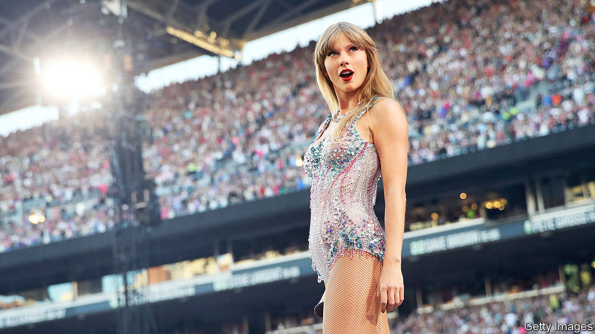
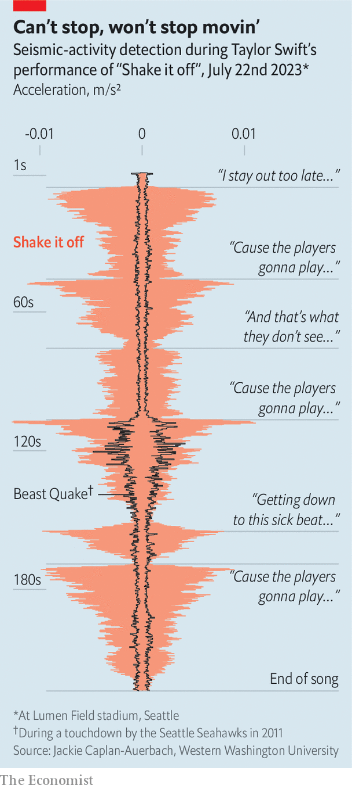

###### Seismology (Taylor’s version)

# The excitement of 70,000 Swifties can shake the Earth 

##### As recorded by the Pacific Northwest Seismic Network 

 

> Dec 13th 2023 

“Shake, shake, shake, shake,” Taylor Swift sings from the stage of Lumen Field in Seattle at 10.35 in the evening on July 22nd. The fans respond, enthusiastically; the stadium duly shakes; a nearby seismometer takes note. To pop aficionados “Shake it off” is an empowering up-tempo anthem played at 160 beats per minute. To the Pacific Northwest Seismic Network, which is designed to monitor earthquakes, it is a 2.6 hertz signal in which the amplitude of the acceleration was as large as one centimetre per second, per second. 

The well-situated seismometer first came to public attention in January 2011, when it recorded the response of fans of the Seattle Seahawks, an American football team, to a magnificent touchdown by Marshawn Lynch, a running back known as “Beast Mode”. The “Beast Quake” went down in local sporting history. When Ms Swift came to town for two nights of her Eras tour, Jacqueline Caplan-Auerbach, a geology professor at Western Washington University, used the opportunity to learn more about how events in the stadium shake its surroundings. On December 11th she presented some of her conclusions at the American Geophysical Union’s autumn meeting in San Francisco.

 


In 1985 Bruce Springsteen and the E Street Band set the Nya Ullevi Stadium in Gothenburg shaking violently enough to alarm some of the audience, and doing enough damage to the structure for further concerts there to be banned. This, later analysis found, was not down to the intensity with which Mighty Max Weinberg was pounding his drums, though it is an intensity to be reckoned with. The audience on the pitch was moving at a frequency that resonated with the clay beneath the stadium and parts of the building. 

Dr Caplan-Auerbach wanted to see whether such resonant amplification might also be at play elsewhere, and to distinguish between the effect of the music itself and the audience’s response. Her concert-night data showed two distinct sets of signals, one in higher frequencies (30-80Hz), one in lower frequencies (1-8Hz). The higher-frequency signals were present during the sound check, when the band were on stage but the stadium empty, and absent during the concerts’ “surprise songs”, played without the band by Ms Swift alone. The lower frequencies were absent when the audience had yet to arrive. Clearly those higher frequencies were from the music itself.

The lower frequency signals changed from song to song in line with the tempo of the music; they were clearly driven by the audience’s response rather than a general resonance on the part of the building itself. Harmonics above the main signal seem to be down to what is known in signal analysis as the Dirac comb effect, in which repetitive signals at one frequency create harmonics at multiples of that frequency. Jordi Díaz and colleagues had suggested as much in their seismic analysis of another Springsteen concert, this one at Camp Nou, in Barcelona, in 2016. But Dr Caplan-Auerbach also suggests that they might in some cases reflect fans differing in their interpretations of the rhythms.

The effects of the songs and Ms Swift’s performance, as captured on time-stamped pictures of the event taken by fans like Dr Caplan-Auerbach’s teenage neighbour (cited in her presentation as a co-author), proved highly replicable, though the first-night crowd was a tad more energetic (perhaps they were the more committed set of fans). On both occasions that “Love Story’s” final crescendo reached its peak with the line “Pulled out a ring and said ‘Marry me Juliet’” the oscillations came to a climax as the singer’s left arm rose in triumph. 

Overall, the signal was considerably stronger than the original Beast Quake, presumably because the Swifties are co-ordinated by the beat in a way that football fans are not. But differences in audience demographics, and tastes, may provide further insights. In August 2024 veteran heavy-metal band Metallica will play the Lumen Field. The seismometer will be waiting to see what a bit of headbanging adds to the mix. ■


