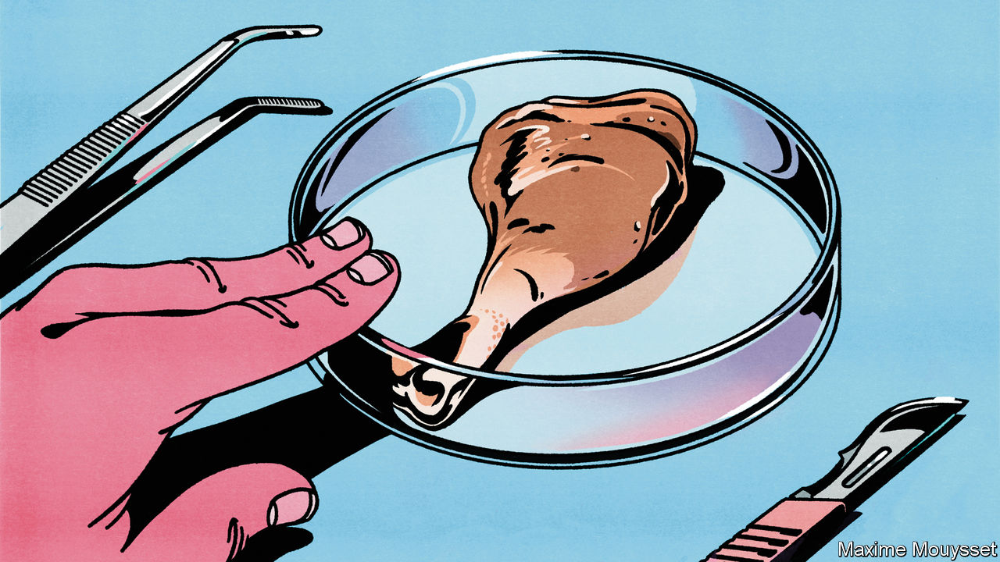

###### The chicken of tomorrow

# Will lab-grown meat ever make it onto supermarket shelves? 

##### The meat of the future remains too expensive in the present 

 

> Dec 12th 2023 

THE FIRST mouthful of “cultivated” meat is both remarkable and dull. In a homely kitchen at the California headquarters of Eat Just, a startup, a playing-card-sized slice of meat has been glazed and grilled. It is served with a sweet-potato puree, maitake mushrooms and some pickled peppers. The meal is remarkable because the meat was , rather than on an animal. It is mundane because the texture, taste, look and smell of the meat is almost identical to that of chicken. And that, of course, is the point. 

The cultivated-meat business hopes that this experience will become more common. In June Eat Just and Upside Foods, another California startup, became the first two companies to win regulatory approval to sell cultivated meat in America. Eat Just also sells cultivated meat in in  which in 2020 became the first country to permit the sale of the stuff. A herd of rivals is stampeding after them. All told, around 160 firms are trying to bring cultivated meats to market. 

But doing so will be challenging. In America diners without the benefit of a press card can find cultivated meat in just two restaurants, one in San Francisco and one in Washington, DC. A few years ago the industry was bullish. In 2021 McKinsey guessed it might grow to $25bn worldwide by the end of the decade. That hope is fading, amid stubbornly high costs and troubles with scaling production. Most companies are now more focused on hybrid meats, which combine cultivated animal protein with that derived from soya or wheat. That sort of hybrid dinner is what your correspondent sampled with Eat Just. 

On paper, cultivated meat looks attractive. The UN reckons meat and dairy production already accounts for 12% of humanity’s greenhouse-gas emissions. Demand is soaring among the growing middle classes of Africa and Asia. Advocates of lab-grown meat argue that it could help meet that demand without the world busting its carbon budget.

In rich countries, by contrast, plenty of people say they want to reduce their consumption, either for ethical reasons or environmental ones. (Two-fifths of Americans claim to restrict their meat consumption on environmental grounds.) Lab-grown meat may, for some consumers, be less ethically worrisome than eating animals. And the early success of plant-based meat alternatives gave investors hope. Beyond Meat, one such firm, went public in 2019, and saw its value zoom to $14bn.

Enthusiasts for vat-grown meat have dreamed up all sorts of potential applications beyond chicken. Earlier this year, Vow Food, an Australian startup, created a “mammoth meatball”, mixing ancient DNA recovered from frozen mammoth remains with that of modern-day elephants. Wanda Fish Technologies, an Israeli firm, is working on cultivated bluefin tuna. A startup co-founded by Mark Post of Maastricht University, who served up a  in 2013, is trying to produce vat-made leather. 

Broadly speaking, there are two ways to make cultivated meat. Both start with cells taken from livestock or poultry animals. One option is to put the cells in a stainless-steel tank, called a “bioreactor”, that is filled with a nutrient-rich liquid that is often, but not always, derived from cow embryos. The cells multiply, and after a month or so a meaty slurry can be harvested and turned into minced-meat products such as chicken nuggets. The alternative is to place the cells on a scaffold. That encourages them to grow into a certain shape, and is used to create more fibrous meat, such as steaks. 

How the sausage is made

The details vary between firms. Some, such as Eat Just and Upside Foods, start with cells from a chicken embryo. The advantage is that embryonic cells can grow in the suspension indefinitely. But they need to be encouraged to follow the desired development path, such as forming muscle cells. This is done either by genetic engineering or by adding proteins called “growth factors” to the nutrient solution. SciFi Foods, by contrast, uses cells harvested from adult cow muscle. Muscle cells stop growing after several dozen generations. On the other hand, they may need fewer growth factors than embryonic ones, and for some they give a flavour closer to that of animal meat. 

Every firm faces the same two big challenges. The first is demand. Although cultivated meat is far from supermarket shelves, its alt-protein cousin, plant-based meat, is going through a rough patch. According to Circana, a research firm, sales of alternative meats in America peaked in 2021 at $483m. In the 12 months to November of this year they were down to $338m. Sales are still growing in Europe, albeit more slowly than before. As momentum has dwindled, so has investors’ opinion of the plant-based superstars. Beyond Meat’s value has plummeted to just over $600m. 

Some of this is to do with taste. Data from the Good Food Institute (GFI), an alternative-protein think-tank, suggest that about half of the people who tried plant-based meat just once do not like it. That will give cultivated-meat makers hope, as their product ought to taste much more like the real thing. 

The second problem is cost, which may be harder to fix. The GFI calculates that plant-based meats cost around double what a cut of farm-grown meat goes for. Cultivated meat is more expensive still. But progress is being made. In the early days, most firms used growth solution with ultra-pure, pharmaceutical-grade ingredients. Switching to agricultural-grade ingredients can cut those costs by up to 90%, says Elliot Swartz, an analyst at the GFI, though he thinks cultivated meat would still be around five times pricier than the farm-grown sort.

Amy Chen, chief operating officer at Upside Foods, says her firm has found cells that do not need external growth factors, which helps cut costs. The aptly named Gustavo Burger, the boss of Believer Meat, an Israeli company, claims to have lowered the cost of growth solution to below $1 per litre, far lower than other firms pay. (Believer Meat recycles much of its solution.) 

Meat-makers hope that costs can be cut further by a new supply chain that is taking shape. Some of this involves existing companies, such as ADM, an agricultural giant that has started to provide the ingredients for growth solutions. New entrants with tailor-made gear have sprung up too. Multus Biotechnology, a British firm, likewise sells solution ingredients. NewDay Farms, a Chinese outfit, produces the scaffolds that help shape the cells when they grow.

There are questions about how climate-friendly cultivated meat really is. A study published earlier this year by researchers at the University of California, Davis, found that, in some circumstances, cultivated meat could be more polluting than the conventional stuff. Industry advocates have retorted that the assumptions made around the type of growth-solution used are inaccurate. In particular, they say that the study assumes the use of resource-intensive pharmaceutical grade ingredients, which the industry is moving away from.

But even fans of cultivated meat acknowledge that the technology will use a lot of energy. Another study published in January by researchers at CE Delft, a consultancy, and the GFI found that per kilogram of meat produced, tank-grown meat is likely to use much more energy than farm-grown protein. This is largely because the bioreactor needs a lot of power to control its temperature. As a result, cultivated meat will only cut the carbon footprint of the meat industry if renewable energy is used in the production process. And even then, according to the study, it will only do so for pork and beef.

Whether all this effort can make lab-grown meat attractive and cheap enough to appeal to consumers remains to be seen. In the meantime, many companies have decided to pursue a hybrid strategy, mixing (relatively) cheap plant protein with their cultivated animal cells. Some firms, such as Mission Barns, another California-based firm, add just a small amount of animal-fat cells to plant-based protein to improve the taste of, say, a sausage. For others, such as Eat Just, the proportion of cultivated meat will be much higher. “It took me a while to get comfortable with [moving to the hybrid approach]. Because it feels a bit like we’re compromising,” admits Josh Tetrik, Eat Just’s boss. ■


