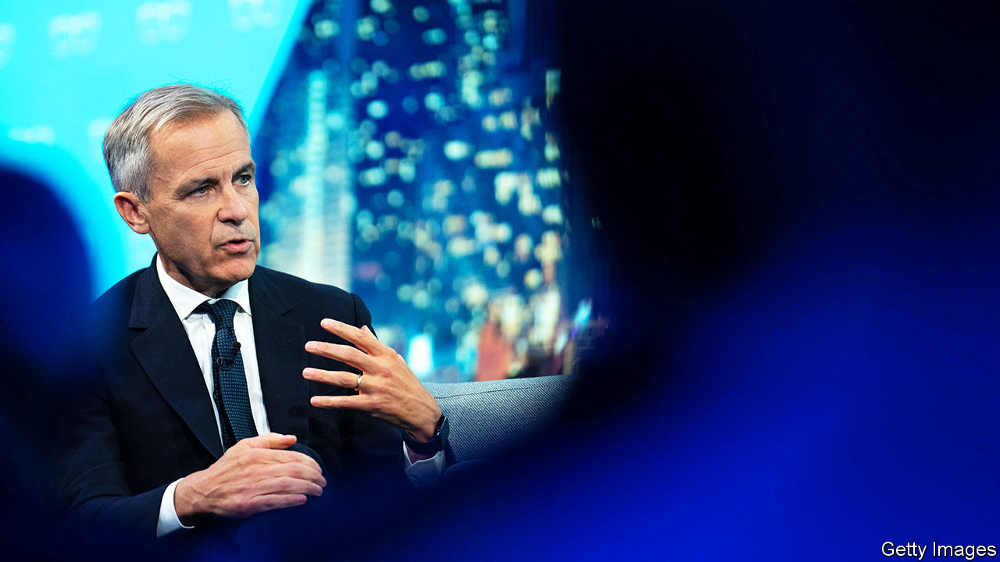
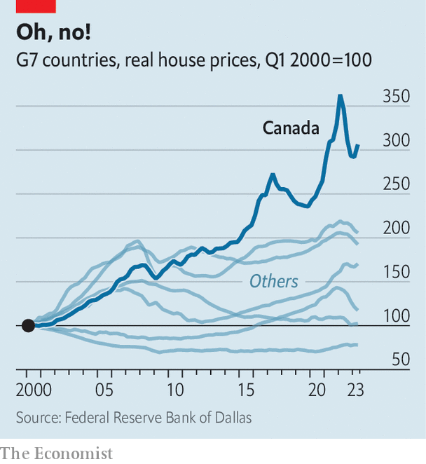

###### Will he, won’t he?

# Could Mark Carney lead Canada? 

##### The former central-bank governor is coy, but clearly has political ambitions 

 

> Dec 12th 2023 

The eyes of every diner seem to follow Mark Carney, the dapper two-time former central-bank governor, as he bounds into a busy Sri Lankan restaurant in Ottawa, the capital of Canada. He sits down at the table with a smile, which vanishes when he realises he will be asked what he calls “that awful question”: will he run to be the country’s next prime minister? 

Canada must hold a general election within the next two years. , the prime minister since 2015, is unpopular and leads a minority government. A recent poll by Ipsos suggested that fully 72% of Canadians feel that Mr Trudeau should step down as the leader of the Liberal Party before the vote. Mr Carney is among a handful of potential candidates to replace him, including Chrystia Freeland, the current finance minister, and Mélanie Joly, the minister of foreign affairs. Ms Freeland leads the polls as Mr Trudeau’s replacement, with 25% of those asked saying they have a positive opinion of her, compared with 18% for Ms Joly and 16% for Mr Carney (most answer that they “do not know”).

Mr Carney has not yet explicitly stated his intention to throw his hat in the ring. When speaking with  he says, evasively: “If you can avoid going into politics it’s better not to go into politics.” 

Even so, it is clear that he harbours ambitions. Mr Carney’s close advisers, as well as one of Mr Trudeau’s counsellors, say the two men have spoken several times since 2019, in order to try to get him to join the prime minister’s team. Those advising Mr Carney say that if Mr Trudeau offers him a parliamentary seat close to his home in Ottawa, as well as a meaningful role in cabinet, he will make the leap from the private sector. They also believe that he would make a bid for party leadership, should Mr Trudeau step down before the election. 

But does the former bank boss have what it takes? Mr Carney is in many ways a textbook instance of the metropolitan liberal elite. He was educated at Harvard and Oxford, then worked for Goldman Sachs, a bank. In 2004 he moved to Canada’s finance department, to work for Stephen Harper, the Conservative prime minister. In 2008 he became governor of the Bank of Canada just after the global financial crisis struck. Mr Carney was the public face of a decision to cut interest rates by 0.5 percentage points one month into his appointment. Canada came out of the recession faster than other G7 economies.

In 2013 he became the first non-Briton to head the Bank of England since it was founded in 1694. He was pummelled by conservatives for his blunt warnings about Brexit and climate change (though Michael Gove, when Britain’s justice minister, lauded him for preparing well for the former). He ended that role in 2020, and now spends half of his time working pro bono as the UN special envoy for . The other half is spent as chairman of Bloomberg LP, a media company, and as head of impact investing at Brookfield Asset Management, a fund. 

Although he has never been elected to anything, Mr Carney does not lack self-belief. And he has big ambitions for his country: “We can be leaders…or we can be followers. The nature of this country in the past has been to be a leader. We should be again.” He wants Canada to be “an energy superpower”, along with building up AI prowess and building houses “at a totally different scale”. He is a “big believer” in the power of public policy going hand-in-hand with free markets. When asked which political leaders he admires, he includes Mr Harper in a short list, and jokes: “Clearly he had good judgment in selecting me.” He is also a fan of Pope Francis and Emmanuel Macron, the president of France. 

 


Should he come to power, one of the biggest issues he will have to deal with is economic: the unaffordability of  Since 2000 real house prices in Canada have grown faster than in any other G7 country (see chart). “People are worried about falling behind as opposed to getting ahead,” he says. Over the past decade, and under Mr Trudeau’s watch, the widely quoted benchmark price of a house in Canada has doubled, to C$760,000 ($560,000). 

Mr Carney is critical of Mr Trudeau’s decision in October to water down Canada’s modest carbon tax. He thinks far more could be done to tackle climate change. Just as Canada has successfully exploited its , he wants it to take the lead developing green technologies such as carbon capture and storage, hydrogen and nuclear reactors. More generally, Mr Carney is among many who acknowledge that, globally,  has taken a battering. The world is at a “moment...where the accepted forces and policies that have been in place virtually all my adult life are changing”. That is true in Canada, too. 

, the leader of the Conservative Party, has blamed Mr Carney for Canada’s housing woes (because the bank governor loosened monetary policy in 2008). The pugilistic Mr Poilievre seems keen to go head-to-head with Mr Carney, who he says is “the incoming leader of the Liberal party”. Would Mr Carney’s technocratic, globe-trotting persona appeal to ordinary Canadians? Possibly not. But his response to Mr Poilievre’s populist brand of politics is unapologetic: “This is not a time for novices.” ■

