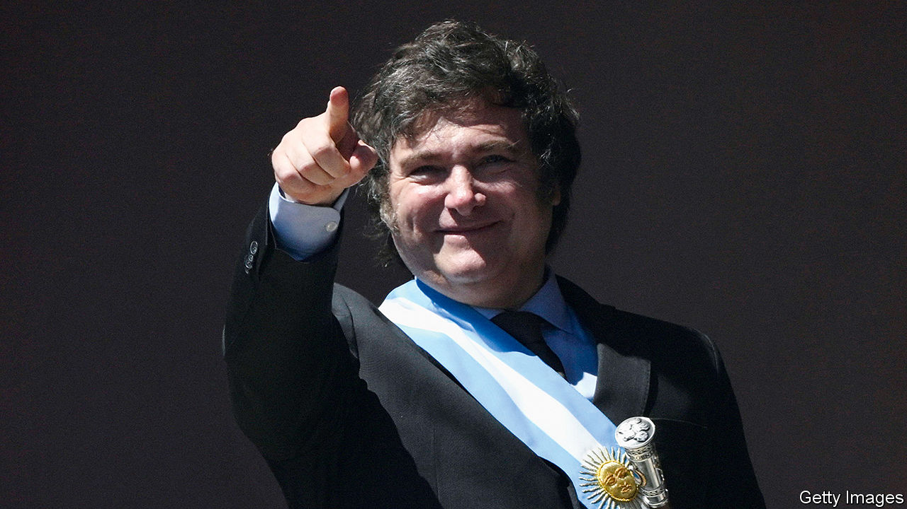
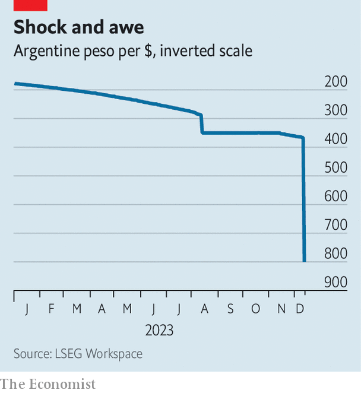

###### The whirr of the chainsaw

# Javier Milei implements shock therapy in Argentina 

##### His government plans to cut spending by 3% of GDP. Will society tolerate it? 

 

> Dec 13th 2023 

When Javier Milei was sworn in as  on December 10th he told the assembled crowd: “There is no alternative to austerity.” Instead of rosy promises, he warned that tough times lay ahead. Announcing  upon taking office is usually political suicide in Argentina. Yet Mr Milei’s sombre message was received with cheers. Fans raised chainsaws into the air, in reference to his promise to cut down the size of the state.

The inaugural address set the tone for the shock therapy to follow. On December 12th Luis Caputo, the new economy minister, unveiled a series of radical economic reforms. He announced a devaluation of the peso by over 50% (see chart), and promised to slash electricity and transport subsidies, halve the number of government ministries from 18 to nine, suspend public works and reduce federal transfers to Argentina’s 23 provinces. The government reckons these cuts amount to almost 3% of GDP. 

 


Alongside this, however, the administration will increase taxes on imported goods from 7.5% to 17.5%, and extend a tax of 15% on all exports (an existing tax of 30% on soyabean exports will be maintained). Child benefits will double, as will the value of a government food card for the country’s poorest. The idea is to cut spending while temporarily increasing taxes to raise revenue, in order to lower the annual deficit from over 5% of GDP today to zero by the end of 2024. “We have come to solve the addiction to fiscal deficits,” said Mr Caputo, noting that Argentina has been in the red for 113 of the past 123 years. The IMF, which is owed $43bn by Argentina, applauded the “bold initial actions” and promised to work “expeditiously” with the new government in the coming months. In a statement the fund admitted that the deal it signed in March 2022 with Argentina’s government to restructure its loan had suffered “serious policy setbacks”. 

Mauro Roca, the managing director of TCW Group, an asset-management company, says investors are pleased with Mr Milei’s pragmatic turn. The new president rose to fame promising to dollarise the economy and shut down the central bank. Yet since being elected in mid-November, he has put plans for dollarisation on hold and sidelined loyalists. Instead, he has stuffed his cabinet with technocrats from the main centre-right coalition, Together for Change, which held the presidency from 2015 to 2019. 

Things may get worse before they get better. In the short term, these measures will lower growth. Given that a cheaper peso, new taxes and fewer subsidies will make living more expensive, there is a chance that prices could rise even higher. Martín Rapetti, a consultant, believes monthly inflation will at least double to around 20% and remain high for several months. But that is far from certain. Mr Milei’s emphasis on fiscal discipline may reassure markets that Argentina is not headed for disaster—if they choose to believe him. That would quickly pull inflation down, rather than push it up. 

The confidence of the market “will depend on the degree of social conflict”, says Mr Rapetti. Since Argentina’s return to democracy in 1983, all but one non-Peronist president has been booted out of office by protests against economic reforms. Social organisations were quick to respond to Mr Caputo’s announcement. Demonstrations have been called for December 20th. 

Mr Milei may also face pushback from his base and from Congress. On the campaign trail he promised to cut taxes and said spending cuts would be paid for by the “caste”, a term he uses to refer to corrupt politicians. Yet taxes will now increase significantly, at least temporarily, and austerity will affect far more than just public workers. His coalition has only 10% of seats in the Senate, and 15% in the lower house. On average since 1983, presidents have commanded the support of 45% of Congress, according to Ana Iparraguirre, a political consultant. 

Mr Milei is using his political capital now to pass tough reforms in the hope that the economy will begin to recover by mid-2024. The question is how long the pain will last. ■

