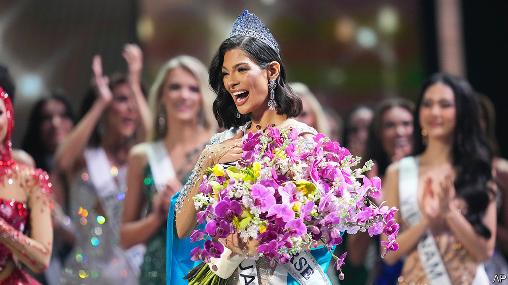

###### Dissing Miss Universe

# Nicaragua’s dictator goes after Miss Universe 

##### Pageant participants are the latest victims of Daniel Ortega’s authoritarian regime 

 

> Dec 10th 2023 

Few people would perceive a 23-year-old bikini and ball-gown model as a political menace. Yet the crowning of Sheynnis Palacios, a Nicaraguan beauty queen, as Miss Universe in November ruffled the feathers of the country’s dictatorial duumvirate. On December 1st Nicaraguan police accused Karen Celebertti, the organiser of the local franchise of Miss Universe, of having incited and financed terrorist actions and of having conspired in a foreign-backed plot to overthrow the government (she, of course, denies such absurd allegations). Ms Celebertti was barred from returning to Nicaragua after the competition, which was held in El Salvador. Her husband and son have since been arrested. 

Ms Palacios’s victory sparked a rare wave of euphoria in her home country. Nicaraguans poured into the streets, honking car-horns and waving the national flag. The spontaneous joy unnerved president Daniel Ortega and his vice-president and wife, Rosario Murillo. Both are former Marxist-Leninist guerrillas who helped overthrow a family-run dictatorship in 1979. Mr Ortega was in power for a decade before losing an election in 1990. He was re-elected in 2006 and has since installed his own family dictatorship. All bar one of the ruling couple’s nine children are presidential advisers or control state-owned petrol-distribution companies and media channels. (The exception accused Mr Ortega of sexual abuse and lives in exile. Mr Ortega denies all charges.) 

The celebrations of Ms Palacios’s triumph provoked a queasy déjà vu for the ruling family. The last time so many Nicaraguans took to the streets was for pro-democracy marches in 2018. After those protests police killed at least 350 people and imprisoned many more. All leading opposition candidates in a presidential election in 2021 were jailed, and have since  and stripped of their citizenship. Charities were barred as foreign agents. The independent press and many universities were shut down. Not even the Roman Catholic church has been spared. In February a popular bishop was sentenced to over 26 years in jail.

Those who wave the blue and white national flag instead of the ruling party’s red and black banner risk being arrested. Some 600,000 Nicaraguans—about a tenth of the population—have emigrated since 2018, and over a fifth of respondents in a recent poll by Gallup said it was “very likely” that they would emigrate to the United States or Costa Rica within the next year. 

Against this backdrop, many Nicaraguans interpreted Ms Palacios’s sartorial choice for the pageant’s finale as a message of support for the pro-democracy cause. She wore a silvery-white gown and a sky-blue cape, a reference both to the national flag and the persecuted church, in its likeness to the Virgin Mary. The regime reacted coldly. An official communiqué, without the signatures of the ruling couple, praised her coronation as a moment of “legitimate joy and pride”. 

But behind the scenes local media reported that the Ortegas initially tried to prevent Ms Palacios from returning to Nicaragua after the competition, seemingly in order to prevent her from becoming a national hero. (She now lives in New York, as part of her agreement with Miss Universe.) 

Indeed, even before her triumph an anchor on state-run television dismissed her as “Miss Buñuelos”, a reference to the fried manioc and syrup doughballs that Ms Palacios grew up selling on the street. Police forced artists who were making a mural in her honour to paint it over. 

The regime was particularly angered by photos circulating in Nicaragua that showed Ms Palacios at the protests in 2018. When opposition media in exile praised Ms Palacios, Ms Murillo, who is also the government spokesperson, warned of “crude and evil terrorist communications” that were promoting “a return—of course impossible—to the nefarious, selfish and criminal practices” of 2018. The police charged Ms Celebertti, who also participated in the demonstrations in 2018, of “turning the contests into political traps, financed by foreign agents”. 

The Nicaraguan regime’s reaction stands in contrast to that of Nayib Bukele of El Salvador, which hosted the competition. The budding dictator embraced the spectacle to distract critics from his questionable run for a second term and the widespread violations of human rights associated with his crackdown on gangs, which has involved locking up 70,000 alleged gang members in the past year. He highlighted posts on X, formerly Twitter, by contestants from the beaches lauding the country’s security. “As the president Nayib Bukele said, El Salvador is changing,” wrote last year’s Miss Universe.

Beauty and the beast

Rumours of a personal vendetta abound. On December 11th Ms Celebertti, who is thought to be in Mexico, announced she had retired as the head of the local Miss Universe franchise after 23 years at the helm. The following day Univisión, an American Spanish-language TV channel, reported that the regime had pressured Ms Celebertti to resign in exchange for the release of her husband and son. The channel went on to say that the local franchise could now be run by a daughter-in-law of the Ortegas. (The daughter-in-law would probably be Xiomara Blandino, herself a former Miss Nicaragua.) However, neither of these statements has been verified and none of the parties has commented. 

Controlling the franchise would allow the government to ensure that Nicaragua’s next Miss Universe participant wears symbols of the ruling Sandinista party instead of national ones. Nicaraguan boxing champions have worn outfits decorated with the Sandinista flag at international tournaments. In 2021 the regime decreed it illegal for any Nicaraguan to accept national or international awards unless the recipient is approved by the government. 

Perhaps nobody is more enraged than Ms Murillo. Unlike the first lady’s children, Ms Palacios is self-made. Born in a poor neighbourhood, she helped her grandmother sell  before getting into one of Nicaragua’s top universities. That university was seized by the state in August and closed down. Her humble origins have endeared her to the people. “[Vice-president] Murillo feels threatened because she thinks she is the queen of Nicaragua,” says Silvio Prado, an exiled academic. “And the only queen recognised by the people today is this young woman.” ■

