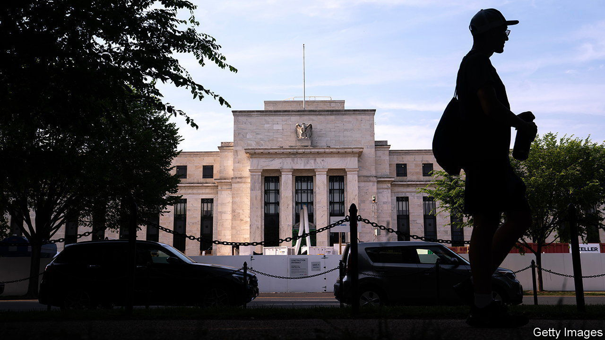
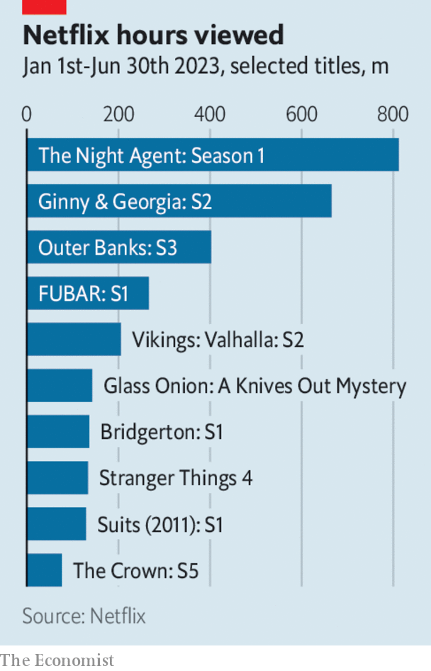

###### The world this week

# Business 

#####  

 

> Dec 14th 2023 

The  left its key interest rate on hold at a range of between 5.25% and 5.5%, but it also published projections that suggested it would cut rates three times in 2024. That delighted investors. Stockmarkets surged, with the Dow Jones industrial average closing at a new all-time high. The Fed’s decision came after data for November showed that America’s annual inflation rate had slowed only slightly to 3.1%, and the core rate, which excludes food and energy, had remained at 4%. 

The  and  followed suit and kept their rates on hold. The ECB gave little away about when it might reduce rates, though it did lower its inflation forecasts. The British central bank scotched hopes that it would loosen policy soon, confirming that rates needed to be kept elevated for an “extended period of time” to curb inflation. 

An Epic battle

A federal jury in San Francisco found that  Play app store was a monopoly, a victory for , the gaming company behind the “Fortnite” series. Epic brought the case, accusing Google of rigging competition in the market for Android apps so that it could charge excessive fees. Epic wanted to use its own payments system that avoided the fees. Epic lost a similar case against Apple in 2021, though that was decided solely by a judge. The matter will probably end up in the Supreme Court. 

 share price plunged by 19% on the day it announced plans to curtail production, including its iron-ore operations in South Africa. The mining company has been hurt by a number of factors, such as higher costs and lower market prices for diamonds. 

There was more consolidation in the energy industry, as  agreed to buy , a privately held shale-oil producer, in a transaction valued at $12bn. Unhindered by institutional shareholders with an eye on ESG targets, CrownRock has happily ramped up production in the Permian basin in recent years. 

 said that Bernard Looney, its former chief executive, would forfeit up to £32.4m ($41m) for “serious misconduct” that led to his resignation in September. The board alleges that Mr Looney misled it about his personal relationships with employees. 

 fell sharply, as markets pondered American oil production, China’s economy and other factors that affect supply and demand. Brent crude traded at six-month lows of a little over $72 a barrel. 

A federal judge in Texas upheld the state’s ban on public-sector employees using  on government-issued devices. The judge found that, although this prevented public universities carrying out research on the Chinese-owned video platform, Texas had an interest in protecting privacy. The ruling is narrower in scope than the recent decision by a judge in Montana to impose an injunction on a total statewide-ban on TikTok there. 

The European Union’s member states and the European Parliament reached a provisional agreement on regulating the use of , the details of which are now being worked out by officials. The deal includes mandates to assess the risks from large language models that power AI tools such as ChatGPT and measures to mitigate them. Emmanuel Macron, the French president, warned that the new act could stifle innovation at European firms.

 stock took a brief dive, when a study found that non-diabetic obese patients who took its fat-loss treatment, Zepbound, regained weight a year after halting injections. The Food and Drug Administration only recently approved the treatment. Eli Lilly is one of the pharmaceutical companies that have seen their fortunes rise on the mania for weight-loss drugs. 

Christmas on 34th Street

 share price surged amid reports that it has received a buy-out offer from a property investor. The retailer’s sales have struggled of late, but the value of its properties in prime locations like midtown Manhattan has stood up well. The news comes shortly after Neiman Marcus was said to have rejected a takeover offer from Saks Fifth Avenue. 

Christmas has been ruined for workers at . Over 1,000 are being laid off, a fifth of the workforce, according to reports. The toymaker, which counts Monopoly, Play-Doh and My Little Pony among its brands as well as the Dungeons &amp; Dragons franchise, has seen sales slide since the pandemic. 

 


 published its first “engagement” report, counted by viewing hours. Hollywood writers and actors had demanded more transparency from streaming services during their recent strike. Between January and June “The Night Agent” was the most popular programme (viewed for 812m hours) followed by season two of “Ginny &amp; Georgia” (665m) and “The Glory” (623m). Only four shows in the top 50, including “Pablo Escobar” (170m) and “New Amsterdam” (153m), were produced before 2020. 

