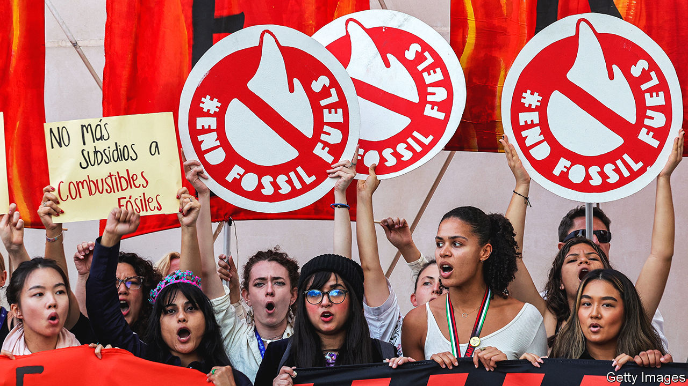
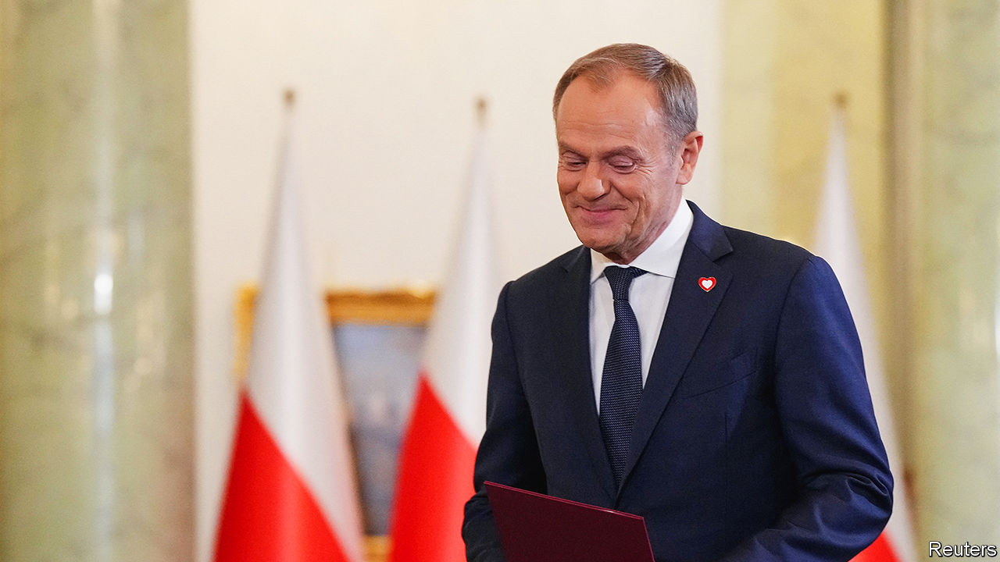

###### The world this week

# Politics 

#####  

 

> Dec 14th 2023 

The UN global summit on  produced an agreement that, for the first time, calls on countries to transition away from fossil fuels. Some delegates attending COP28 had hoped for a more forceful phrasing on phasing them out. Dirty fuels, especially coal, will be used for some time. The words of the text need to be put into action, but still, the industry minister of the United Arab Emirates, which hosted COP28, described it as historic. 

The UAE recently held a mass trial of more than 80 on fabricated charges of supporting terrorism, according to Amnesty International. The government does not allow charges or judgments concerning political prosecutions to be made public or reported on. 

In a rare criticism, Joe Biden described  bombing campaign in  as “indiscriminate” and is pressing its government to scale back its operations. Jake Sullivan, America’s national security adviser, has been dispatched to Israel to discuss a timetable to that end. The UN General Assembly voted for a . Israel’s foreign minister said a ceasefire now would be a “gift” to Hamas, and that the war will continue “with or without international support”. 

Ernest Bai Koroma, a former president of , has been placed under house arrest, according to the opposition. Mr Koroma has been questioned by police about what the government describes as an attempted coup in November that was mounted by his former bodyguards. 

Luis Caputo, the new economy minister in Javier Milei’s cabinet in , announced a sweeping package of measures. The official exchange rate of the peso was devalued by half and public spending was slashed. The IMF, which has supported the beleaguered economy with a $43bn loan, welcomed the shock therapy.

Irfaan Ali, the president of , agreed to meet Nicolás Maduro,  autocratic leader. Earlier this month Venezuela held a dodgy referendum, in which 95% of respondents agreed to annex two-thirds of its neighbour. Mr Ali has repeatedly stated that “Guyana’s land boundary is not up for discussion.”

Efforts by a circle of elites to keep  president-elect Bernardo Arévalo from taking power in January intensified. The attorney-general said the electoral result should be nullified because of fraud (of which there is no evidence). But the electoral tribunal reiterated that the results are “unalterable”. The United States condemned the attempt to undermine Guatemala’s troubled democracy. 

The new American elite

Harvard’s governing body decided that Claudine Gay should remain president of the university, after she came under intense criticism for her ambiguous answers at a congressional hearing into the surge of  on American campuses. But Elizabeth Magill stepped down as president of the University of Pennsylvania. She got in trouble at the same hearing responding to a question about the genocide of Jews. 

The House of Representatives formalised an investigation into Joe Biden that centres on the business dealings of his son, Hunter, who said he would be willing to testify to a public committee. The Republicans have been probing the Bidens for almost a year now. 

In  Olaf Scholz unveiled a deal that seeks to fill a budget shortfall caused by the Constitutional Court striking down the government’s previous spending plan. The chancellor said that the budget, which contains lots of new green levies, would retain money for supporting Ukraine and adhere to the “debt brake”, which limits government debt. 

 has been removed from the penal colony where he had been imprisoned on trumped-up charges of supporting extremism, according to his spokeswoman, and has not been heard from for days. It was expected that Russia’s opposition leader would be placed in an even harsher prison. Meanwhile Vladimir Putin confirmed that he would stand for a fifth term as president in 2024. 

 


Donald Tusk was sworn in as  prime minister, bringing an end to eight years of rule under the populist Law and Justice (PiS) party. Mr Tusk heads a coalition of centrist parties, which together took the most seats at an election in October, though PiS remains the single biggest party in parliament. He was Poland’s prime minister from 2007 to 2014 and then president of the European Council until 2019, and promises to repair ties with the EU and to fully support Ukraine. 

The EU prepared for a summit to discuss extra funding for  and a path to its membership of the bloc, both of which are opposed by Hungary. Volodymyr Zelensky visited Washington to drum up more financial support for Ukraine’s defence against Russia. The Ukrainian president met politicians in Congress in the face of Republican opposition to giving any more money to his country. His pleas fell on deaf ears. 

Rishi Sunak survived a vote on his controversial bill declaring  to be a safe country for asylum-seekers to be sent to. The  prime minister introduced the bill after the Supreme Court ruled against the Rwanda scheme last month. No Conservative MPs voted against the government, though dozens abstained. 

Back in the game

In  a court revoked a conviction for corruption that had been handed down to Nawaz Sharif, a former prime minister, which his supporters claim all but assures that he can run for office again in an election in 2024. Meanwhile, militants linked to the Pakistan Taliban said they carried out an attack on an army base near the Afghan border that killed 23 soldiers. 

Four ministers resigned from the  government amid a fundraising scandal. The biggest beast to fall was Matsuno Hirokazu, the powerful chief cabinet secretary. All four are members of a faction in the Liberal Democratic Party that supported Abe Shinzo before his assassination in 2022 and which is at the centre of allegations about missing party funds. The approval rating of Kishida Fumio, the prime minister, has plummeted since the scandal broke a month ago.

An MP in  was sentenced to six years in prison under the country’s  law. Rukchanok Srinork, from the reformist Move Forward party, was accused of criticising the monarchy on social media, which she denies. She is seeking bail. A 26-year-old man was also sentenced to prison but given bail, for shouting at a royal motorcade. 

