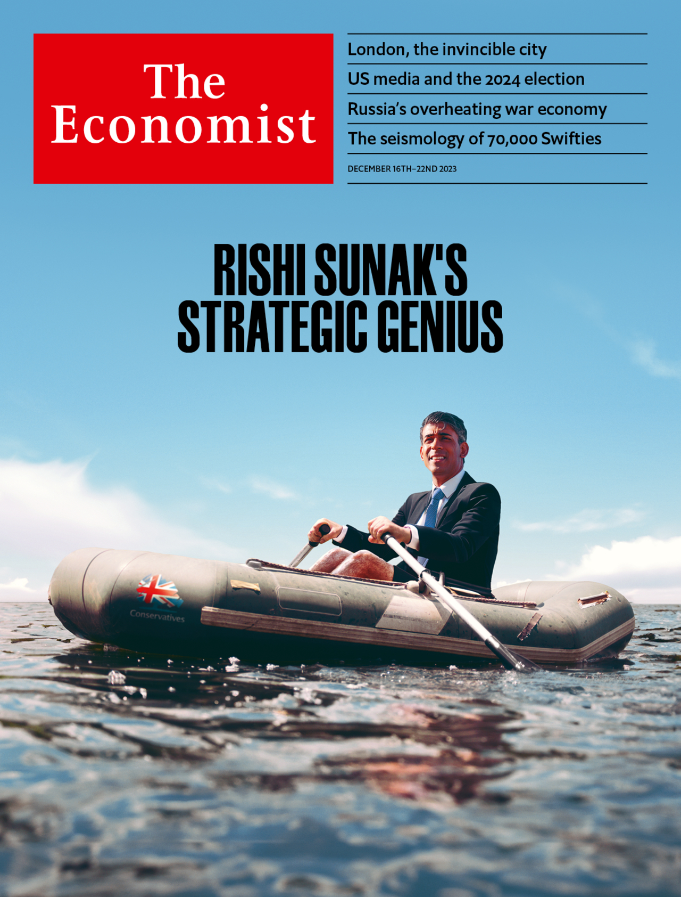

###### The Economist

# This week’s covers 

##### How we saw the world 

> Dec 14th 2023 

THIS WEEK we have, unusually, put our own profession on the cover in most of the world. That is because the discovery and dissemination of information matters a lot to politics. Our analysis found that the language of the mainstream American media has drifted away from the political centre, towards the Democratic Party’s preferred terminology and topics. That could lower the media’s credibility among conservatives. As the country braces for next year’s election, it is worth thinking about the internal forces that deepened this rift. 

 


 


In Europe we argue that in Britain under the Conservative Party the absence of chaos seems like competence and the previously unthinkable seem acceptable. Governments with large majorities should not be unable to pass legislation, yet the fact that a bill to send asylum seekers to Rwanda passed a second reading was greeted with triumph. It is not normal for a British government to suspend human-rights legislation, ignore international law or set Parliament in opposition to the judiciary. Britain needs stability. Neither the prime minister, Rishi Sunak, nor the Tories can provide it.


 

 


 


