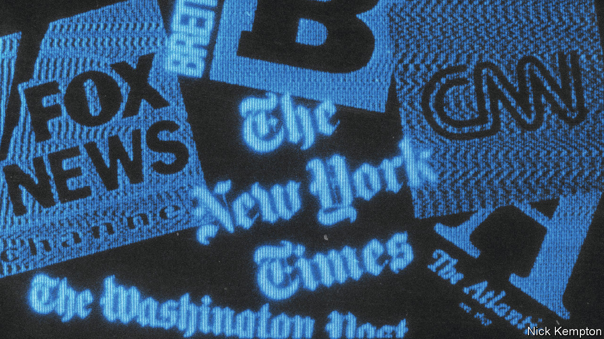
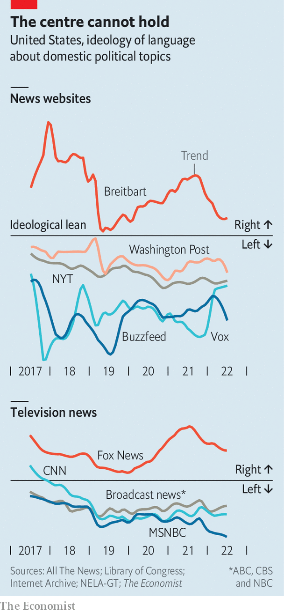
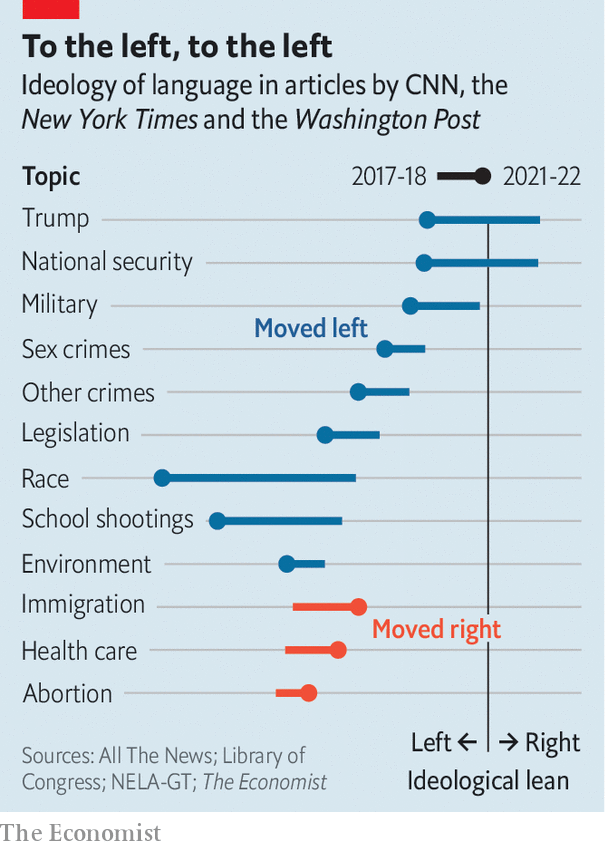

###### Measuring media ideology

# American journalism sounds much more Democratic than Republican 

##### Whether this reflects bias or reality is in the eye of the beholder 

 

> Dec 14th 2023 

Public trust in American media has plummeted since the 1990s. Most of this decline is among conservatives, spurred by Republican charges of liberal bias from avowedly non-partisan outlets. Such claims are hard to assess fairly: stories viewed by one party as following the facts are often seen by the other as ideological.

Most public estimates of news sources’ partisan leanings rely on subjective ratings. Political scientists seeking an objective approach have used the language in politicians’ speeches to set a baseline and compared stories with that. However, most studies in this vein look at the period before 2016; do not discriminate between politics and other topics; and focus on either tv or written journalism, but not both.


 


In an effort to provide a measure of partisan slant that is comprehensive, impartial and up-to-date, we have applied this academic approach to the output in recent years of a wide range of news sources. We find that there is indeed an affinity between the media and the left, because journalists tend to prefer the language used by Democratic lawmakers. Moreover, this disparity has grown since the start of Donald Trump’s presidency. As a result, the number of media sources covering politics in balanced language has dwindled.

The first step in our analysis was compiling a partisan “dictionary”. We took all speeches in Congress in 2009-22 and broke them up into two-word phrases. We then filtered this list to terms used by large shares of one party’s lawmakers, but rarely by the other’s. The result was a collection of 428 phrases that reliably distinguish Democratic and Republican speeches, such as “unborn baby” versus “reproductive care” or “illegal alien” versus “undocumented immigrant”.

Next, we collected 242,000 articles from news websites in 2016-22, and transcripts of 397,000 prime-time tv segments from 2009-22. We calculated an ideological score for each one by comparing the frequencies of terms on our list. For example, a story in which 0.1% of distinct phrases are Republican and 0.05% are Democratic has a conservative slant of 0.05 percentage points, or five per 10,000 phrases.

To avoid counting incidental uses of such phrases in stories unrelated to politics, we also identified the mix of subjects present in each piece, using a machine-learning algorithm that identifies clusters of words that tend to appear together. Finally, we calculated the average partisan leaning of each news source’s coverage, weighting each story by the share of its content about domestic politics.

To test whether this method accurately reflected partisanship, we compared our rankings with estimates from AllSides and Media Bias Fact Check, ratings websites that rely on human coders. Overall, it yielded a close match: conservative outlets like Breitbart and Fox News used disproportionately Republican terms, whereas left-leaning ones such as Vox and Buzzfeed published mainly Democratic ones. (Because our study focused on American media, we did not include . Applied to our own coverage, this approach produces scores very close to the centre.)

However, our method has two advantages. Not only is it free of subjectivity, it also measures ideology in absolute terms, providing answers to questions that mere rankings cannot resolve. Are conservatives right to see the media as a whole, rather than just specific outlets, as hostile terrain? Our results suggest so. Of the 20 most-read news websites with available data, 17 use Democratic-linked terms more than Republican-linked ones. The same is true of America’s six leading news sources on tv, of which Fox is the only one where conservative language predominates.

This Democratic slant has grown over time, driven mainly by changes in once-centrist outlets. In 2017 cnn used more Republican terms than Democratic ones, while msnbc and the evening news on abc, cbs and nbc had only modestly left-leaning scores of around 1.5 phrases per 10,000. By 2022, the broadcast channels and cnn had Democratic leanings of near 2.5, and msnbc had reached 5.5, putting it twice as far from the centre as Fox.

In written journalism the shift has been smaller but in the same direction. In 2017 the ,  and cnn’s website all had mild Democratic leanings: around 1.5. This put them a bit closer to conservative sources like Fox News’s website, whose average Republican slant in 2017-22 was two, than to left-wing sites like Vox, whose average Democratic leaning in those years was seven. By 2022 these sites’ left-of-centre slants had grown to four, three and three, leaving them much closer to lefty alternatives.

In theory, this trend could result from changes either in subject matter—moving from Republicans’ favourite topics, like border security, to those Democrats prefer, such as health care—or in the language used about each topic. The data make clear that most of the shift stems not from what is being talked about, but how.

 


In three “mainstream” websites—the ,  and cnn—coverage moved left from 2017-18 to 2021-22 on 25 of 29 domestic political topics. Articles about race and school shootings were already among the most left-leaning in 2017-2018, but have also seen the largest leftward shifts since then. By contrast, pieces on health care and immigration, which used lots of Democratic terms in 2017-18 thanks to Mr Trump’s unpopular policies, have inched to the right. 

Our analysis has important limits. First, our dataset, compiled from academic sources, contains only a fraction of the media’s full output. It had little content from prominent sources like the , and none from radio or social media.

Second, our scoring method cannot distinguish between media bias and asymmetric polarisation. Is journalism more left-wing, or have Republicans just sailed further from reality than Democrats? Either could raise the share of Democratic language in media—and in the case of stories describing Mr Trump’s false claims of electoral fraud as “the big lie”, for example, both have probably played a part. Yet journalists can still say that one party’s views are closer to the truth than the other’s without relying on partisan language.■


