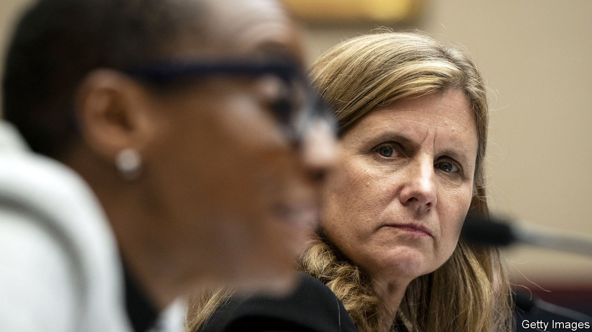

###### University presidents skewered

# American universities face a reckoning over antisemitism 

##### Their treatment of objectionable speech is inconsistent 

 

> Dec 12th 2023 

SOMETIMES YOU get the technicalities right but still flunk the test. So it was at the congressional hearing on campus antisemitism on December 5th. When asked if calling for the genocide of Jews would be punished at their schools, the presidents of Harvard, MIT and the University of Pennsylvania prevaricated. That would depend on context, they said—such as whether the speech crossed into threats directed at individuals. Amid an uproar the president of the University of Pennsylvania, Liz Magill, resigned four days later. On December 12th Harvard’s board said that their school’s president, Claudine Gay, would keep her job. More than 700 faculty had signed a letter calling for her to stay. 

The disastrous hearing has forced a reckoning over how the universities handle antisemitism, while raising questions about the boundary between acceptable protest and impermissible speech. It came amid a spate of antisemitic incidents on campuses in the wake of the war between Israel and Hamas that began on October 7th. Hillel International, a Jewish non-profit organisation, has tallied 38 antisemitic physical assaults at colleges, and 227 cases of vandalism, since the war broke out.

During the five-hour hearing the presidents denounced that worrying uptick and explained how harassment is disciplined. Yet their responses to a grilling about antisemitic speech by Elise Stefanik, a Republican congresswoman, were evasive, legalistic and wholly unsatisfying. Somehow they forgot that congressional hearings are political theatre, not legal depositions. “Over-prepared and over-lawyered”, said Scott Bok, chair of the University of Pennsylvania board, who also resigned.

The presidents accurately described what is permissible under their schools’ speech codes, which closely track the First Amendment. Odious talk is allowed so long as it does not turn into discriminatory harassment or incite violence. Holding a placard with a vile slogan at a protest is different from sending someone threatening texts. Context does indeed matter. 

Much of the blowback stems from the universities’ own lack of credibility when it comes to protecting free speech—the sense that they are all too willing to clamp down on talk deemed racist, sexist or anti-trans. “When they tried to argue a free-speech case no one took them seriously because they’ve treated it with such a double standard,” says Greg Lukianoff of the Foundation for Individual Rights and Expression (FIRE), an advocacy group. Of nearly 250 colleges evaluated by FIRE, Harvard and Pennsylvania rank as the two least hospitable to free speech and open inquiry, based on surveys and instances of lectures cancelled and professors disciplined. 

Inconsistency by administrators takes two forms: silencing speech outright, and failing to punish students who violate school policies by, say, shouting down unpopular speakers or blockading lecture halls. In 2019 Harvard, facing a student revolt, refused to renew the deanship of a law professor who worked on Harvey Weinstein’s legal defence. In 2021 it cancelled a course on police tactics after students petitioned to nix it. That year MIT rescinded a lecture invitation to a geophysicist who had criticised affirmative action. Too often universities try to mollify students rather than have them grapple with ideas they find unsettling, says Edward Hall, a philosophy professor at Harvard. Administrators see an angry or upset student in their office and try to make them feel better. 

Students at elite colleges sit overwhelmingly on the political left. That makes for a censorious climate in which conservative voices are curtailed, even when administrators are not doing it, and people self-censor. Carole Hooven, a scientist who says that sex is binary, left Harvard after being branded a transphobe by students. “I felt as if I had the plague,” she said of her departure. Changing culture is hard: it requires encouraging debate and signalling that people who hold controversial opinions are welcome on campus. “We can’t punish our way out of this,” says Jeannie Suk Gersen of Harvard Law School.

What lessons will university leaders learn from the recent turmoil? Harvard’s board scolded Ms Gay for her initial statement after the Hamas attack. It should have been an “immediate, direct and unequivocal condemnation”, said the board. Yet universities are in this mess partly because they started wading into all sorts of political and social issues. 

Rarely does taking a position satisfy everyone; opining on some topics but not others gets arbitrary. That is why, some 50 years ago, faculty at the University of Chicago advised it to stay neutral and mum on matters that didn’t directly affect it—to be a “home and sponsor of critics…not itself the critic”. Perhaps this latest controversy will see colleges move towards a consistent, content-neutral approach to speech. Yet that is not what donors or politicians are demanding, notes Keith Whittington, a politics professor at Princeton. They are in effect demanding that restrictions on free speech be expanded in the name of safety. Incentives and pressures may well mean more inconsistency. ■


