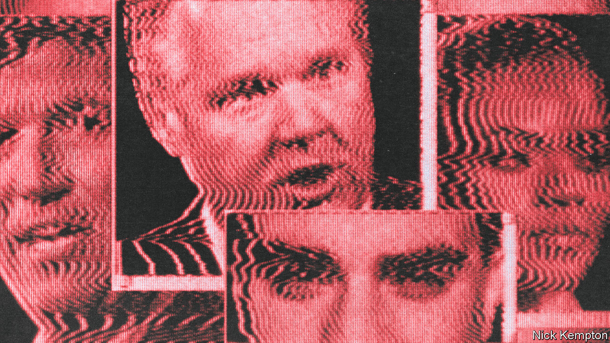
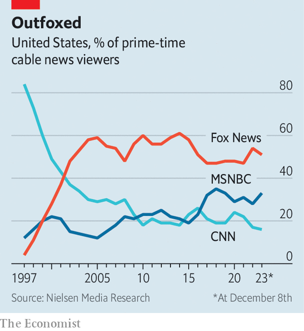

###### Right nation

# Donald Trump is the conservative media 

##### No institution that enjoys the trust of Republican voters can successfully stand up to him 

 

> Dec 14th 2023 

Drake, a rapper, wanted to see his friend, the basketball superstar LeBron James, immediately after the Miami Heat won the 2013 NBA Finals. But a security guard refused him entry into the champagne-drenched celebration because he lacked press credentials. “I am media,” the Grammy winner reportedly responded. Three years later, Donald Trump successfully crashed a much bigger party: the Republican National Convention. Mr Trump, a walking media institution, brushed aside early opposition from right-leaning news and opinion outlets and won the 2016 Republican presidential nomination. In the years since, conservative media either have conformed to his vision of politics or tried and failed to persuade Republican voters to abandon it. This dynamic has accelerated as he pursues his party’s nomination for a third time.

For much of American history, the dominant media institutions were partisan or ideological. George Washington even complained of being “buffitted in the public prints by a set of infamous scribblers”. But the media oligopolies that dominated much of the 20th century—big television and radio networks and print publications with enormous circulations—claimed to bring Americans balanced, non-partisan, objective reporting. American conservatives were highly sceptical of the arrangement.


“There was no conservative media. It was basically a wasteland. And anything that even remotely expressed any kind of conservative point of view was sort of relegated to a smattering of columnists,” says Laurence Jurdem, a historian at Fairfield University and Fordham College and author of a book on conservative media before Ronald Reagan. “Everything sort of changed with .”

Founded in 1955 by William F. Buckley junior, the magazine promoted a political philosophy that came to be known as fusionism. The new conservative coalition would fuse together economic libertarians, social traditionalists and anti-communists. Buckley also served as a gatekeeper at times, denouncing the leader of the conspiratorial John Birch Society in editorials. Other conservative publications—magazine, the  editorial page, the , , and more—influenced the presidency of Reagan. Conservative media continued to grow after Reagan left the White House, and the fusionist consensus largely held together at the end of the cold war, at least at first. That was owing in great part to three men who found a way to do what Buckley and other intellectuals never could: run highly profitable media businesses.

Together, Rush Limbaugh, Roger Ailes and Rupert Murdoch challenged the old guard’s dominance by developing viable conservative alternatives in every medium. Limbaugh, a charismatic radio veteran, took his show national in 1988 and drew a weekly audience of some 20m listeners by the 1990s. He also published books and would sometimes appear on Fox News. Mr Murdoch controls the network that Ailes led from its founding in 1996 until he resigned in 2016. 

The media magnate found ways to make the written word profitable through his acquisition of the  and several publishing houses. But Fox News was special. It overtook CNN in ratings in 2002, and in 2022 it marked 20 consecutive years with more daytime and prime-time viewers than any other network. Perhaps because of its dominance, it is easy to overlook that it serves a niche: 74m Americans voted for Mr Trump in 2020. Fox News’s prime-time audience is below 2m (its digital reach is wider).

Limbaugh, Ailes and Mr Murdoch could have disagreements but shared fundamental conservative instincts. For decades Fox News and Limbaugh, alongside publications like kept Republican Party politicians in line with free markets, hawkish internationalism and fiscal and social conservatism. They did not always succeed in swaying powerful Republicans. Yet a dissenting or unsavoury figure had little way to get his message to a large audience of conservatives if he was banished from Fox News, talk radio or the pages of a few print publications. 

Then came the internet. Blogs, podcasts and social media provided a way for a conservative journalist or pundit to become influential outside the established ecosystem. Mr Trump relied on conservative media to reach Republican voters in the 2016 primary, as all candidates did, but he alone could reset the newscycle with a tweet. 

In early 2016, as Mr Trump’s winning the nomination appeared increasingly likely, devoted an issue to opposing his candidacy. The cover simply read: “Against Trump”, and the magazine’s editors commissioned a range of conservative intellectuals to make the case. Mr Trump, naturally, responded with a tweetstorm about “the dying National Review”. Six months later he became the Republican nominee. Fusionism had been challenged by a conservatism that wanted to cut taxes, maintain entitlement programmes for the elderly, was preoccupied by illegal immigration, fairly relaxed about gay marriage—and had built a cult around the leader. Call it confusionism.

Gone are the gatekeepers

“He’ll be influenced occasionally by things people say, or ideas that are out there, but it’s Trump who lays down the line. And then everyone else follows,” says Rich Lowry, editor-in-chief of . “He is the conservative media.” Mr Trump may call someone after seeing him on Fox News, and he closely studies headlines. But, Mr Lowry adds, “it just doesn’t seem to matter what anyone says about him. He’s just a phenomenon.”

The sheer variety of options available to consumers of conservative media has diluted the power of the old gatekeepers. After Tucker Carlson was fired from Fox News, he began publishing videos on Twitter, now called X, that reflected his increasingly isolationist take on international affairs. They can draw millions of viewers. This week Mr Carlson launched a subscription service.

In 2015 a longtime conservative pundit, Ben Shapiro, co-founded the Daily Wire. Mr Shapiro has many fusionist fans, but the Daily Wire is a big tent. “He also has Candace Owens,” who has been critical of Israel, notes Matthew Continetti of the American Enterprise Institute, a conservative think-tank based in Washington, DC. “And he has Jordan Peterson, who has been sceptical of aid to Ukraine. Even within that institution, there’s a variety of perspectives.” The company earned around $200m in revenue in 2022. The Daily Wire was the seventh-largest podcast publisher in America in November, according to Podtrac, which keeps count.

 


The upstarts cannot act as gatekeepers either. Mr Shapiro was supportive of Ron DeSantis, the governor of Florida, entering the 2024 presidential primary. Other conservative intellectuals and pundits lined up behind Mr DeSantis, who has relied heavily on friendly conservative media for cover from Mr Trump and the mainstream media alike. So far, it hasn’t worked. Mr Trump’s lead over Mr DeSantis in our average of polls is just over 50 points.

With Mr Trump likely to win the Republican nomination, where does that leave conservative media? Alienating Mr Trump also risks alienating consumers of conservative media. Fully embracing the former president’s worst tendencies brings its own risks. Many outlets now balance trying to keep their audiences from fleeing to a growing number of smaller outlets without completely giving in to Mr Trump.

After the 2020 election, some Fox News employees embraced stolen-election conspiracy-mongering similar to what other networks and many conservative influencers were offering on social media. Such recklessness resulted in a $787.5m settlement with Dominion Voting Systems to squash a defamation lawsuit. Mr Trump called Fox News a “hostile network” in June after tough questioning from its chief political anchor, but conservative prime-time hosts like Sean Hannity still throw softballs to the former president. (Mr Hannity recently asked Mr Trump to reassure people that he would not abuse his power in office. “Only on day 1,” Mr Trump replied.)

There are still responsible conservative publications and pundits drawing audiences and forming sustainable businesses. They are far from regaining their past prominence. Mr Lowry is right. For now, Mr Trump is the conservative media. ■


