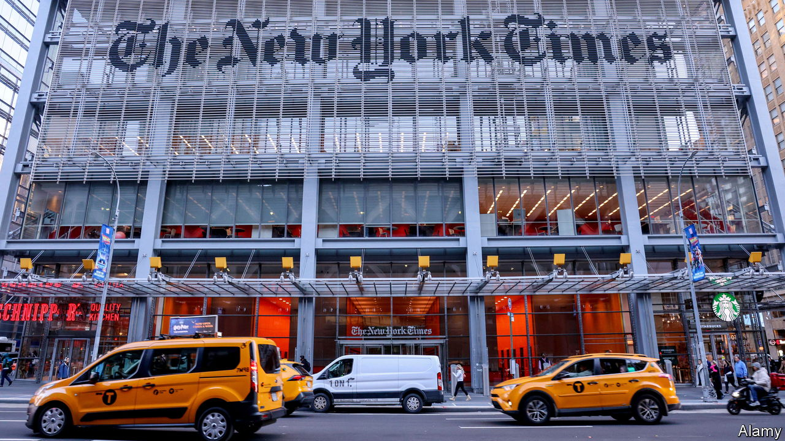

###### The partisan press

# How American journalism lets down readers and voters 

##### The New York Times and other media increasingly speak to their own camps 

 

> Dec 14th 2023 

TO HEAL THE rifts in American politics in the lead-up to next year’s crucial election, American journalism urgently needs renewal. Instead, in much of the mainstream media, journalism is in the grip of an illiberal bias. That includes the , which is best-placed of any of the country’s newspapers to establish a common set of facts and frame of debate.

In an essay James Bennet, s Lexington columnist, and a former editorial-page editor of the , argues that its pledge to pursue the news “without fear or favour” is no longer being honoured. Neither is the promise of the paper to “invite intelligent discussion from all shades of opinion”. Instead, pressure from left-leaning journalists and commercial staff who “do not believe readers can be trusted with potentially dangerous ideas or facts” is undermining the ’s claims to independence.


For the to assert that it plays by the same rules it always has “is to commit a hypocrisy that is transparent to conservatives, dangerous to liberals and bad for the country as a whole,” Mr Bennet writes. “It makes the too easy for conservatives to dismiss and too easy for progressives to believe. The reality is that the is becoming the publication through which America’s progressive elite talks to itself about an America that does not really exist.”

Mr Bennet’s article belongs to a package of stories in this week that looks at the American media in the run-up to next year’s election. This includes a profile of the conservative media, and a deep-dive data analysis of over 600,000 pieces of TV and written journalism. This shows that the language of the mainstream American media has drifted away from the political centre and towards the Democratic Party’s preferred terminology and topics. That could lower the media’s credibility among conservatives.

Mr Bennet was asked to resign from the  in 2020, after his pages published an op-ed by Tom Cotton, a senator from Arkansas, that caused a newsroom revolt. America was reeling after George Floyd, an African-American man, had been murdered by a white policeman in Minneapolis. Throughout the country, protesters were on the march. Reform of the police seemed possible, but, because of the violence and looting in some cities, so did a political backlash.

Opinion had published pieces calling for the abolition of the police and opposing the use of troops to stop the violence, but Mr Cotton argued they were needed to protect lives and businesses from rioters, leading the journalists’ union to describe his op-ed as “a clear threat to the health and safety of journalists we represent”. After three days of upheaval, The asked Mr Bennet to step down and leave the paper. 

In his essay, Mr Bennet chronicles how changes in recruitment, training, newspapers’ business models and intellectual fashion combined to change the , as it is changing so many workplaces in America. Amid the internal upheaval at the paper before he left, he came to see “the ones who were caught up in Slack or Twitter storms, as people who had only recently discovered that they were white and were still getting over the shock.” 

He argues that A.G. Sulzberger, the newspaper’s hereditary publisher, needs to stand up to that faction. “Leaders of many workplaces and boardrooms across America find that it is so much easier to compromise than to confront—to give a little ground today in the belief you can ultimately bring people around”, he writes. “This is how reasonable Republican leaders lost control of their party to Trump and how liberal-minded college presidents lost control of their campuses. And it is why the leadership of the  is losing control of its principles.” Mr Sulzberger declined to be interviewed. 

A spokeswoman said: “The believes unequivocally in the principle of independence, as has been demonstrated consistently by our journalism.” She added that “in the case of the Tom Cotton op-ed, the handling of such a sensitive piece, specifically the decision to rush it into publication without key leaders having read it because it was ‘newsy’, made it unusually vulnerable to attack.” 

Mr Bennet calls for journalists and comment pages to equip readers with the best information to form their own judgments. “The journalist’s role [is] to be a sworn witness; the readers’ role [is] to be judge and jury,” he writes. 

Mr Bennet thinks that opinion journalism also benefits from giving readers a range of voices. “It matters that conflicting views do not just appear before different audiences in politically rivalrous publications or cable news networks,” he writes, “but instead in the same forum, before the same readers, subject to the same standards for fact and argumentation.”

Much more than the  is at stake. Mr Bennet argues that: “It is hard to imagine a path back to saner American politics that does not traverse a common ground of shared fact.”

And he issues a stern warning to his compatriots. As long as Americans are afraid or unwilling to listen to each other, “it is equally hard to imagine how America’s diversity can continue to be a source of strength, rather than become a fatal flaw.”■


