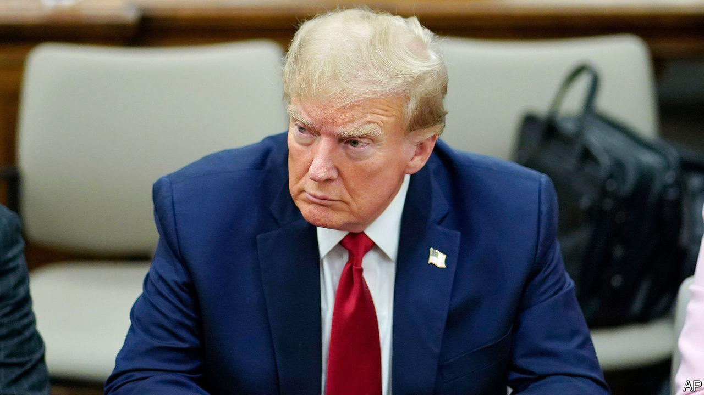

###### Jack Smith, Trump and SCOTUS

# The Supreme Court will decide how quickly Donald Trump is prosecuted 

##### The special counsel tries a gambit to keep the former president’s trial for election subversion on track 

 

> Dec 12th 2023 

“THE SUPREME COURT”, Donald Trump tweeted in December 2020, “has a chance to save our country from the greatest election abuse in the history of the United States.” America’s justices  pleas from Mr Trump and his allies to pilfer the 2020 election on his behalf. But as the 45th president competes in the 2024 contest his fortunes may again rest on the court he helped shape. 

On December 11th , the special counsel prosecuting Mr Trump for extralegal attempts to  the last election after dozens of far-fetched lawsuits failed, filed what he acknowledged was an “extraordinary request” at the Supreme Court. Mr Smith asked the justices to resolve “as promptly as possible” whether former presidents are “absolutely immune from federal prosecution for crimes committed while in office”—a claim Mr Trump has been pushing. The request was for “certiorari before judgment”, a rare attempt (more common in recent years) to short-circuit the usual appellate path by asking the justices to weigh in before the circuit court has completed its review. 

The Supreme Court agreed to hasten its consideration of Mr Smith’s request hours after it was filed, giving Mr Trump’s lawyers until December 20th to respond. After another brief from Mr Smith, the court will then decide whether to hear the case. If it does, the oral argument could be held in January with a ruling arriving before March 4th, the scheduled start date for Mr Trump’s trial in the district court less than a mile away from the Supreme Court in Washington, DC. This schedule, Mr Smith observed, would approximate to that of the accelerated decision in 1974 requiring Richard Nixon to turn over tapes and documents related to the Watergate scandal.

The Supreme Court has said that ex-presidents cannot be sued civilly for actions related to their official duties as president. It has also held that current presidents can be subject to civil lawsuits for things they did before entering the Oval Office. But it has not had occasion to address the question at the heart of Mr Smith’s request, since no other former president has ever been criminally prosecuted.

“A cornerstone of our constitutional order”, Mr Smith wrote to the justices, “is that no person is above the law.” That principle, he contended, is especially important when an ex-president has been indicted for plotting to cling to office despite losing an election. Resolving the matter quickly is thus “at the apex of public importance”.

If the justices find that former presidents are indeed immune to criminal prosecution for actions they took while in office, Mr Trump will get to cross one massive legal headache off his . If they decide to the contrary, his trial could begin, as planned, one day before Super Tuesday—when primaries and caucuses will be held in 16 states. 

Getting the trial moving—and resisting the defendant’s strategy of delay—is clearly the special counsel’s priority. If Mr Trump  another term next November before litigation concludes, that’s it for the special counsel’s case, because of a president’s immunity while in office. Without an early-spring launch, his election-subversion trial could itself be subverted by the next election. ■


