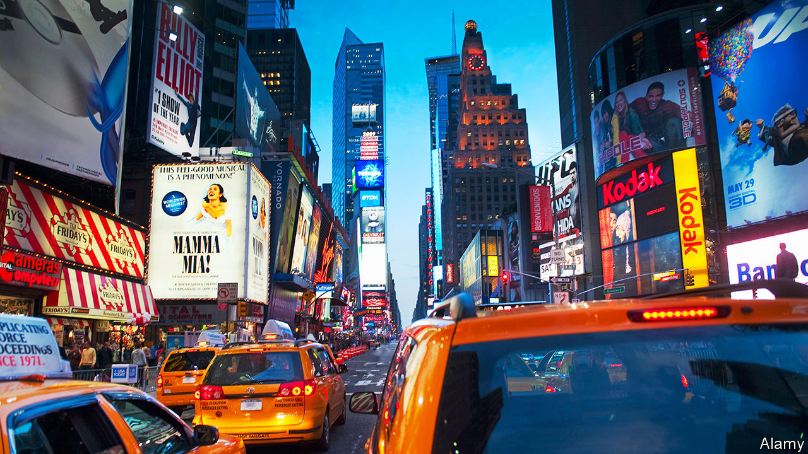

###### First bins, now congestion charging

# Why New York wants to be more like London 

##### Next year the city will charge cars for driving downtown, only two decades late 

 

> Dec 14th 2023 

William vickrey, an economist, first proposed congestion pricing in 1952 for New York’s subways and later for roads. It has taken decades, some false starts and some stalling, but the idea finally has the green light in the Big Apple. Earlier this month the Metropolitan Transportation Authority (MTA), the agency tasked with implementing congestion pricing, gave the fee-scheme the go-ahead. From May (probably), 21 years after London made a similar move, drivers of cars entering Manhattan’s central business district will have to pay $15. Lorries, depending on their size, will be charged $24 or $36. Taxis will face a $1.25 surcharge per ride, rather than fees every time they enter the zone. Rideshare drivers, such as Uber, will get a $2.50 charge. At night, fees will be 75% cheaper. 

The hope is that the fees will alleviate traffic. More than 900,000 cars enter what will become the charging zone daily. Travel speeds fell by 23%, to 7mph (11kph), between 2010 and 2018. It is even worse in Midtown, where cars crawl at less than 5mph. The MTA expects 17% fewer vehicles on the city’s streets. This should decrease air pollution and help the economy. The MTA points to a report that claims traffic congestion costs $20bn a year. But the main reason the plan was approved was because the money it should bring in—$1bn annually—is needed for MTA capital projects. These projects should improve reliability as well as access to the transport system. Some of the signalling equipment on the subway dates back to the 1930s.

The plan has not been met with universal delight. New Jersey drivers already pay a toll to cross into the city, and the Garden State has filed suit. Phil Murphy, New Jersey’s governor, who supports pricing in principle, but not seemingly in actuality, has said that “We can’t fix a broken MTA in New York City on the back of New Jersey commuters.” Fort Lee, a town on the New Jersey side of the George Washington Bridge, has sued over air-quality concerns. The town expects increased traffic as lorry drivers try to avoid paying fees. “If New York is really committed to doing it, they will come to some kind of settlement and/or accommodation,” says Nicole Gelinas of the Manhattan Institute, a think-tank. 

If New York gets this right, says Tom Wright of the Regional Plan Association, which has pushed for congestion pricing since 1996, “it’s going to influence the planning and policy of other great metro regions”, including how they finance capital projects. Fuel taxes have been the main tool of capital finance in transport. They are declining as a revenue source. Congestion pricing could be a new one. 

Sam Schwartz, better known as Gridlock Sam, unsuccessfully tried to introduce congestion pricing in the 1970s when he was a city traffic engineer. Mike Bloomberg also tried to enact pricing when he was mayor. New York’s roll-out has been delayed several times since state lawmakers voted for pricing in 2019. About 60% of the infrastructure needed to charge cars is already in place. ■


