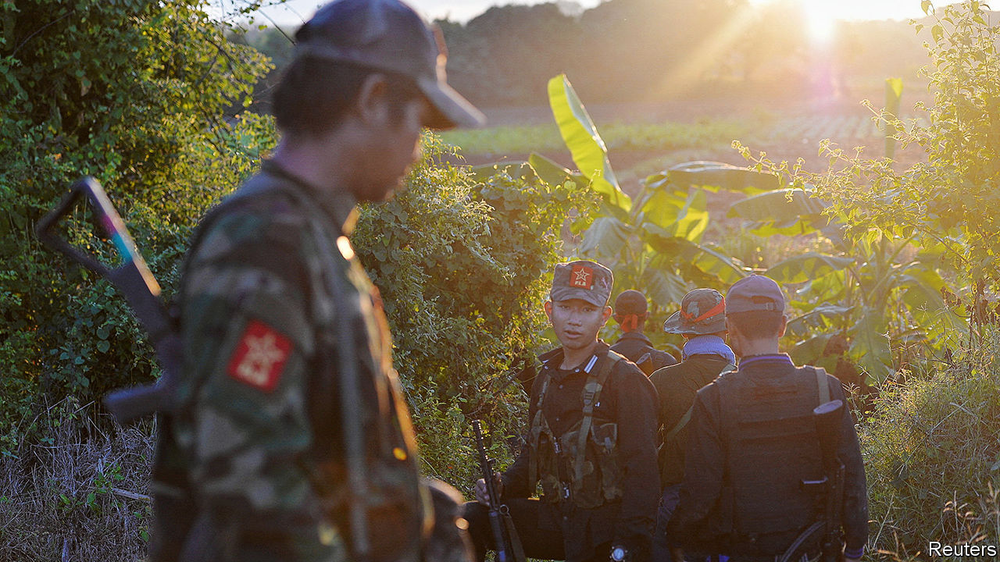
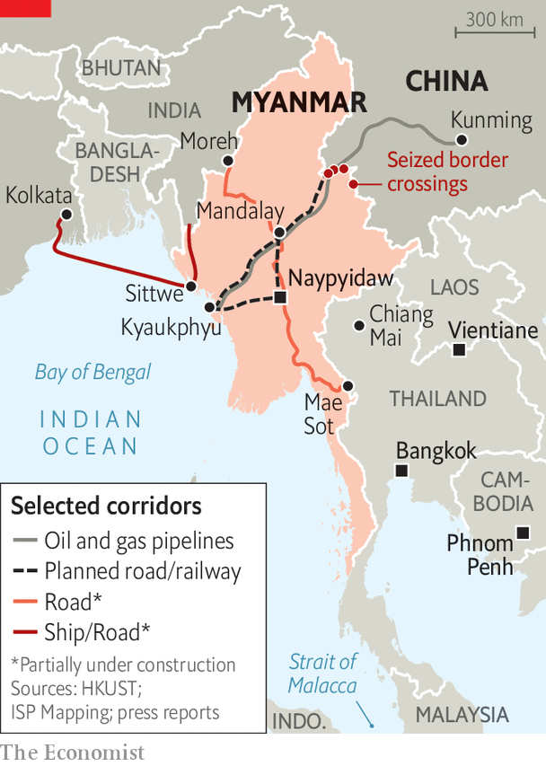

###### Shunting the junta

# China is backing opposing sides in Myanmar’s civil war 

##### But it doesn’t want the murderous junta to fall 

 

> Dec 19th 2023 

When Myanmar’s junta toppled the country’s elected government and seized power in February 2021, China called it a “major cabinet reshuffle”. After that bloody coup sparked a civil war, in which thousands have been killed, almost two million displaced and the generals’ crimes against humanity have mounted, China stood by the generals. It has condemned Western sanctions on Myanmar’s army as “exacerbating tensions”. As Myanmar’s largest trading partner, China has sold the junta over $250m in arms. Yet in late October China appeared to reconsider its interests in its war-ravaged neighbour.

This was illustrated by a major offensive against the army in northern Myanmar carried out by a coalition of ethnically based militias, known as the Three Brotherhood Alliance, which has links to China’s security services. Operating close to the border with China, in an unruly jungle area informally considered part of China’s sphere of influence in Myanmar, the alliance swiftly became the biggest security challenge to the  yet. With no discouragement from China—and even modest help, Burmese analysts allege—its forces claim to have seized over 200 army bases and four border crossings that are vital for trade with China.

 


Inspired by this success, the junta’s many other armed opponents—ethnic and political players in an increasingly complicated conflagration—redoubled their attacks, spreading the conflict across two-thirds of the country, according to the UN. Hundreds of thousands of people have been displaced since the onset of the offensive, which is known as Operation 1027, after its start date on October 27th. Tellingly, the Brotherhood Alliance announced that one of its goals was to eliminate a network of online scam operations that over the past three years has sprung up along the Myanmar-China border. A major security concern of China’s, these operations are estimated to be behind the trafficking of 120,000 unsuspecting workers to Myanmar, many of them Chinese, and to generate billions of dollars a year in revenue, much of it fleeced from Chinese victims.

By November there was speculation that China had switched sides in the conflict, and that the junta’s days were numbered. Signalling their displeasure, the generals permitted their supporters in November to stage rare anti-China protests in several cities. China has since taken steps to reassure the junta. It has conducted joint naval exercises with Burmese vessels. In early December China’s top diplomat, Wang Yi, met Myanmar’s deputy prime minister, Than Swe, in Beijing. Then, on December 14th China announced that it had brokered a temporary ceasefire between the army and the ethnic militias.

The episode encapsulates China’s self-interested, though seemingly conflicted, approach to Myanmar, to the detriment of its 54m people. The dissonance stems from tensions between China’s long-term and more immediate interests. In the long term, it has a big economic stake in Myanmar and wants to prevent it veering towards its pro-Western democrats. In the shorter term, China worries about security.

Although India and Russia also do business with the junta, China has by far the deepest economic links to Myanmar. Despite the war, China has pushed ahead with a plan to build a network of roads, railways, pipelines and ports through the country that could give it direct access to the Indian Ocean. China sees this as an alternative to the choke-point of the Strait of Malacca, through which most maritime trade to and from China flows. China has pledged to invest over $35bn in this ambitious project. By contrast, India plans to invest $500m in road and maritime links between its north-east and Myanmar.

China’s long-term investment and relative aversion to Myanmar’s democrats have made it an ally of the country’s army, which has been in power for most of Myanmar’s independent history. Yet China’s security interests in the country can be more tactical. Ever since Myanmar gained independence in 1948, its government has failed to control its jungly border zone. China, as a result, worries about insecurity spilling across the 2,000km (1,250 miles) of frontier between the two countries. This jeopardises its infrastructure investments, many of which run along the border, and at times flushes refugees and drugs and other contraband into China. The online scam industry is the latest such worry.

The enormous scale of the criminality, and the involvement of Chinese in it as victims and perpetrators, have made it a foreign-policy priority for China. In May, its then foreign minister, Qin Gang, visited Myanmar to demand the junta crack down on the scam industry. Tens of thousands of Chinese nationals had by then been trafficked to Myanmar, imprisoned in large, sweatshop-like compounds, and forced to scam people online through bogus romantic relationships and investment schemes. Those who refuse to comply may be tortured or killed. Yet Myanmar’s army, which is both incompetent and believed to have been paid off by the scammers, did nothing to disrupt them. Thus, China appears to have turned to the ethnic militias instead. The members of one of them, the Myanmar National Democratic Alliance Army, are mostly ethnic Chinese; many of these fighters speak Mandarin.

The ethnic armies are not straightforward Chinese proxies. They advance their own interests, including by gaining territory, while aligning themselves with other groups that are less friendly to China, such as Myanmar’s increasingly well-organised pro-democracy faction. Yet China has periodically pulled their strings, with the recent offensive apparently a case in point. On December 10th it sought to capitalise on the militias’ advance by issuing arrest warrants for ten scam bosses operating in northern Myanmar. Four days later, apparently content that its objective had been served, China brokered the ceasefire. 

Now it is again cosying up to the junta, which still controls most of Myanmar’s airports, banks and big cities, including the capital, Naypyidaw. Despite Western sanctions, the junta buys fighter jets from China and Russia that enable it to carry out indiscriminate bombing of civilians in areas controlled by its enemies. China will by and large back the generals in Myanmar; sometimes it will support their foes. This divide-and-rule policy is not responsible for the disaster in Myanmar. But it is probably making it worse. ■


