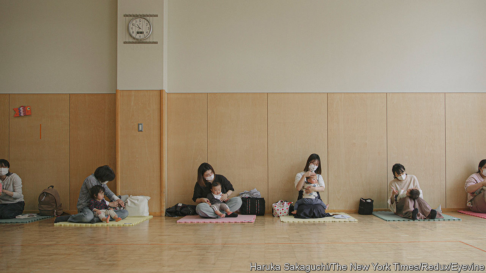

###### Baby-making

# How to entice Japanese couples to have babies 

##### A few cities are bucking the country’s low birth rate 

 

> Dec 16th 2023 

Kishiki Noriyo pulls up outside a house in Akashi, a city in western Japan, in a truck emblazoned with a heart logo and the slogan: “Diaper delivery: we also deliver kindness.” She steps out with two bags of nappies. Higuchi Miki, a young mother, appears at the front door with a baby on her hip. Ms Kishiki is on the front line of a ten-year push by Akashi to encourage its residents to have children. It includes delivering free baby food as well as nappies, free medical care and school lunches. The effort seems to be paying off. Akashi’s population has increased for ten years in a row, to more than 300,000.

This makes the town exceptional. Japan’s  dipped below the replacement level of 2.1 children per woman in the mid-1970s and has been steadily declining ever since. In 2022 the total number of births dropped below 800,000 for the first time since records began in 1899. Of Japan’s 1,800 municipalities, only around 200 have a rising population. According to Kishida Fumio, the prime minister, this has put the country on “the brink”. 

Even in Akashi, which is an easy commute from the cities of Osaka and Kobe, most of the growth is from migration, not births. The town’s birth rate is 1.65. Yet given that the national figure is 1.3, this represents success of a sort. Schools are closing across Japan for want of pupils; Akashi is short of school places.

Many of the obstacles to young Japanese forming families, from high education costs to inflexible family laws, can only be tackled with national policies. But Akashi shows how local communities can make a difference. That starts with improving access to nurseries and day care. Smaller projects such as Ms Kishiki’s, which assist parents of young children, also help.

The population of Nagareyama, a commuter town outside Tokyo, is also booming. Over the past decade it has grown by 24%, to 211,000. The opening of an express-train service to Tokyo in 2005 largely explains that. But Nagareyama’s commitment to child care—the “utmost priority” of its local government—has also attracted young families. In 2007 the town launched a bus service that picks up children at train stations and takes them to day-care centres. Nagareyama has increased its number of nurseries from 17 to more than 100 in the past 15 years. “Our aim was to create an environment in which parents can continue to work while raising children,” says Izaki Yoshiharu, the town’s mayor. 

Lack of child care is endemic across Japan. The central government has made some improvements in this regard, reducing the number of children waiting for a nursery place by 90%. It has also introduced tax and other economic incentives to encourage people to reproduce. But, as scattered examples like Akashi and Nagareyama suggest, making a real difference requires a more fundamental shift. 

Kato Hisakazu of Meiji University reckons Japan “needs to foster a culture that is generous to children”. Efforts to build more child-care facilities are often blocked by locals who worry about increased noise. When Soup Stock, a popular restaurant chain, started offering free food for babies last April, it encountered a fierce online backlash from people who objected to the prospect of sitting next to crying infants.

Tanaka Yumi, a mother of two in Nagareyama, says young Japanese parents are used to receiving a “cold look” from their unsympathetic neighbours. But the abundance of young families in the town and the supportive policies of its local administration provide reassurance, she says. “I have many friends in Nagareyama who decided to have a second or a third.”

Akashi’s pro-child efforts are intended to drive the same cultural change. Morioka Kazumi of the town’s child-care department says the nappy deliveries are more about “alleviating loneliness” than the goods themselves. Ms Higuchi, the young mother, appreciates that. “It’s nice when someone checks on me,” she says. “It makes me feel I’m on the right track.” ■

