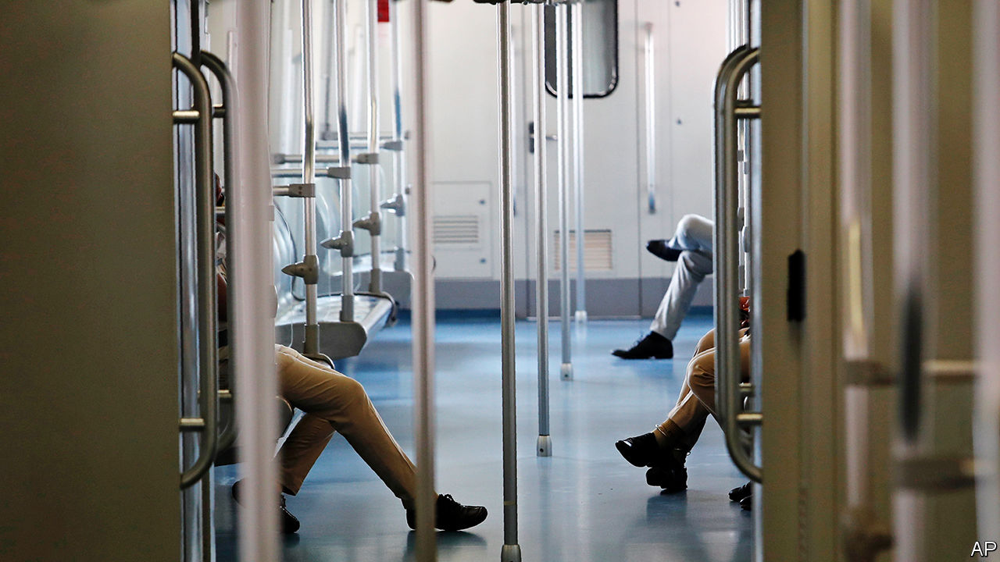

###### Off track

# Why are Indians shunning the country’s shiny new metro lines? 

##### Costly fares, inconvenience and poor planning all play a role 

 

> Dec 20th 2023 

WHEN NARENDRA MODI became India’s prime minister in 2014, the country’s entire metro-rail network spanned 229km (142 miles) in four-and-a-half cities: Bangalore, Delhi, Gurgaon (a satellite of Delhi), Kolkata and Mumbai. That amounted to less than half the length of Shanghai’s metro at the time. Yet Mr Modi’s government has since presided over a massive metro-rail expansion. By last April India’s network covered 870km in 18 cities.

Another 1,000km or so of metro track is under construction in 27 cities. Just under 6km of new track is being commissioned every month. Navi Mumbai, a satellite of Mumbai, became the latest city to boast a metro when its first line opened in November. Yet although the speed and scale of India’s metro build-out over the past decade have been impressive, the associated passenger figures are dismal.

Not one of India’s metro rail systems has achieved even half its projected ridership, according to a study by Geetam Tiwari and Deepty Jain of the Indian Institute of Technology in Delhi. Only their own city’s network, which is the longest and most expansive in India, comes close, at 47%. In Mumbai and Kolkata ridership is a third of what was projected. In most other cities it is in single or low double digits. In gridlocked Bangalore, India’s tech-and-traffic capital, a much ballyhooed metro’s first line attracts just 6% of its projected ridership. That is despite the fact that the average speed for cars during Bangalore’s rush-hour is 18kph, the slowest of any major city bar London, according to TomTom, a navigation-software firm. 

The abysmal figures are all the more surprising given the dearth of decent public transport in most Indian cities and the YIMBY-ish local enthusiasm such infrastructure projects tend to generate. The revenue implications of this failure are dire. In keeping with the august tradition of Indian Railways, not a single metro system makes enough money to cover its expenses, according to another study, by Sandip Chakrabarti at the Indian Institute of Management in Ahmedabad.

Fixing the problem is crucial not only from an economic perspective, but also an environmental one. As India’s middle class expands, those who can afford to are opting for the relative comfort of private vehicles. The result is worsening congestion and traffic pollution. IQAir, an air-quality monitor, estimates that motor-vehicle emissions account for between a fifth and a third of concentrations of PM2.5—a particularly damaging kind of airborne pollutant—in urban India. 

What explains the reluctance of commuters to hop aboard their shiny new, delightfully air-conditioned, metro carriages? For starters, Indian cities are not particularly dense, which means metro lines are not within walking distance for most commuters. Feeder services, such as bus routes, are rarely integrated with metro lines. So taking the metro to work can be complicated and involve walking, buses, shared autorickshaws and more walking.

A second reason is that metro systems are best suited for longer commutes. In the Indian context, they save time only on trips of 10km or more, reckon Mr Tiwari and Mr Jain. But around three-quarters of trips in most Indian cities are under 10km, and half are under 5km. Metro fares also tend to be high by Indian standards. The last time the Delhi metro raised its fares, in 2017, ridership fell by 15%. 

Transport analysts and urban planners say India is backing the wrong horse. Bus services are far cheaper and more flexible for route-planning than metros. They can also be rolled out quickly. The emergence of electric buses has made them a greenish option, too. The best way to maximise these benefits is through dedicated bus lanes, known as a “bus rapid transit system”. Yet attempts at building such systems have often failed, owing to poor implementation, half-hearted enforcement, resistance from motorists and a lack of political will. The gulf in attitudes towards buses and metros is easily explained, says Devashish Dhar, whose book “India’s Blind Spot” looks at such urban problems: “Buses are not sexy. Metros are sexy.”

The result is a slew of expensive transport infrastructure that is failing to attract passengers even as poorer commuters walk in the heat and richer ones idle in traffic. Mr Modi and his advisers have done well to build so many metro lines. Now they need to make them more convenient to use—and improve India’s urban bus networks while they’re at it.■


