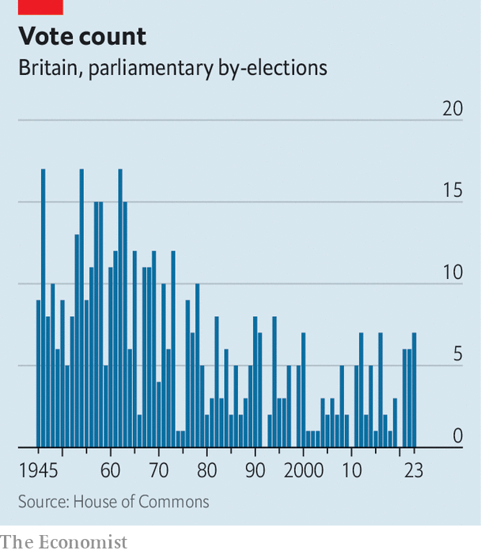

###### The power of recall

# How British voters remove misbehaving MPs 

##### Peter Bone is the latest politician to succumb to a recall petition 

 

> Dec 19th 2023 

The british constitution is . Today’s innovations can fast become a familiar part of the landscape. Take recall petitions, a device introduced in 2015 whereby locals can vote on whether to fire their MP and force a . 

One such petition has just been held in Wellingborough, a town in Northamptonshire. It felt much like a municipal election. Locals headed to one of nine polling stations, signed a piece of paper and put it in a ballot box. On December 19th it was announced that 10,505 signatures had been collected—13.2% of the electorate, more than the 10% needed to fire Peter Bone, the seat’s Tory MP. A by-election will take place next year; Mr Bone is eligible to run again as an independent. 

Recall petitions were brought in by David Cameron’s coalition government to help clean up politics after the MPs’ expenses scandal. A petition is triggered if MPs receive a prison sentence (they are automatically booted out if they are locked up for more than a year), are convicted of fiddling their expenses or get suspended from the Commons for more than ten sitting days after a disciplinary investigation. 

In Mr Bone’s case, he had long been regarded as an eccentric backbencher—someone obsessed with the EU and the BBC who would raise questions in Parliament on behalf of “Mrs Bone”. A report by a parliamentary watchdog into the treatment of a member of staff cast him in a much more sinister light. He allegedly walloped his assistant over the head when displeased; he would ask for massages, the report said, and exposed himself on a trip abroad. The report found him to have been bullying and sexually inappropriate; MPs voted to suspend him for six weeks. Mr Bone says the claims against him are false and the investigation procedurally flawed. 

The trickle of people going to the polling station at the Castle Theatre on December 18th did not suggest a town in uproar. Most had made up their minds on Mr Bone long ago. “He’s made us look quite foolish,” said Lorraine Redden, a Labour voter. Madeleine Robinson, a 19-year-old student, was pleased to be casting her first ballot to fire Mr Bone, whom she never liked.

 


When recalls were introduced, some critics said the scheme was too onerous to be effective. Instead, recall petitions have become a bit of a fixture. Wellingborough’s is the fifth since 2016; all but one has resulted in a by-election. Another four MPs quit the Commons before a petition could be organised against them; they included Boris Johnson, a former prime minister. The number of by-elections each year is still far below post-war highs, when unhealthy MPs often died in office (see chart), but recalls have prompted several recent by-election blows to the Tories.

The rise of recalls reflects a subtle change in the nature of an MP’s lot. Historically it was seen as a public office, with MPs fulfilling the role more or less as they saw fit and answering to voters every five years. Increasingly, it is seen more like a salaried job, with MPs scrutinised by something akin to a human-resources department and fired if they fall short. If Labour wins the next election, this professionalising trend will continue: the party wants to ban MPs from holding “second jobs”.

Recall petitions have another effect: they tip by-elections in favour of challenger parties. The six-week petition period gives them a head start. They can canvass locals and boost the profile of their candidate while the hapless incumbent can only sit tight and hope the petition fails. During the recall earlier this year of Margaret Ferrier, a Scottish National Party MP who breached covid-19 rules, Labour hoovered up potential voters’ data with an e-petition called fireferrier.com and won the subsequent by-election. 

Another recall petition now looms in Blackpool South. Scott Benton, its Tory MP, was recently caught in a cash-for-influence sting by a reporter pretending to be a gambling lobbyist. Mr Benton is appealing against a 35-day suspension. For the Tories, recalls mean bad memories. ■


