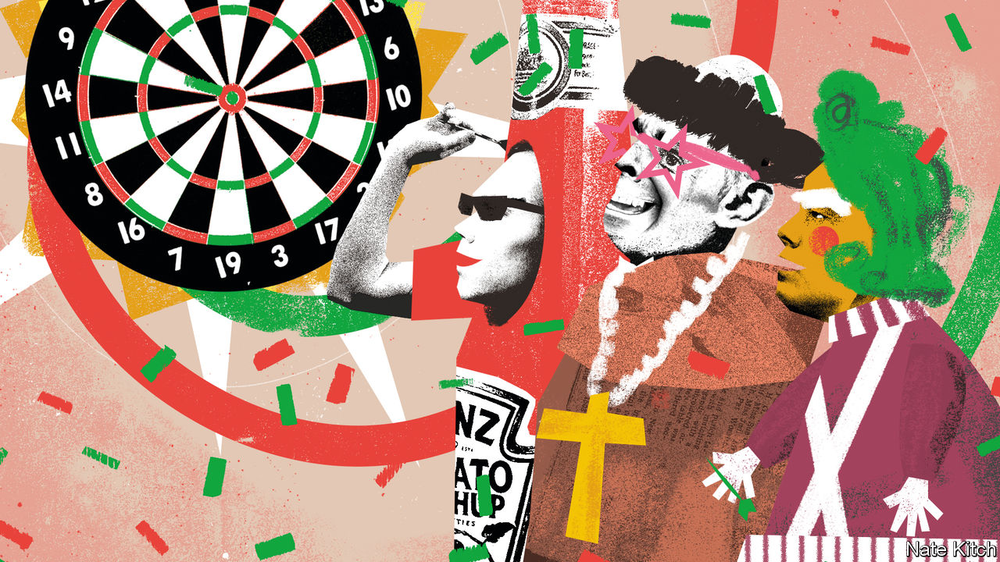

###### Bagehot

# Inside the banter-industrial complex 

##### What the world’s darts championship says about Britain 

 

> Dec 20th 2023 

For two weeks from mid-December, a walk up the hill to Alexandra Palace, a venue in north London, is a trip through a lager-soaked fever dream. At one point a squad of human traffic cones waddles past. Next comes a gaggle of men dressed as condiments. At a bus stop, four judges wait for the next W3 service. 

The Professional Darts Corporation (pdc) world darts championship has become an end-of-year institution, a debauched collision of fancy dress and elite sport. For a fortnight each year, a corner of the British capital is transformed into a place where it is always 11.30pm on a Friday night. Inside the venue a confused bottle of Heinz tomato ketchup looks for his seat. Two monks hurry by, carrying eight pints between them. On stage a first-round match between Stowe Buntz, a goateed American, and Kevin Doets, a Dutchman, takes place in front of a semi-oblivious crowd. Before long, a chant begins. Oompa Loompas, nuns and traffic cones stand up, arms wide, and yell: “Stand up if you love the darts.” 

Darts sits squarely in the middle of Britain’s banter-industrial complex—the laddish industries of drinking, gambling and sport that have found a profitable niche and infuse the country’s culture. At “Ally Pally” the darts is a melting pot, albeit still a very male one. “Where else would a young plumber or banker rub shoulders with. . . Prince Harry?” wonders Barry Hearn, the sports impresario who turned the championships into a juggernaut, in his autobiography. At the darts men from all levels of society rub together—just blokes in fancy dress in a peculiarly long queue for a toilet cubicle, even though urinals are free. Banter is the great leveller. 

Mr Hearn likens darts to “working man’s golf”. Alexandra Palace feels more like a working man’s Wimbledon. Both offer class tourism. At Wimbledon everyone pretends to be posh; at the darts accountants pretend to be massive lads. For strawberries and cream during a fortnight of sport on the telly in the summer, substitute a 29-year-old dressed as a traffic cone during a fortnight of sport on TV in the winter. Each offers the same form of escape. 

Unlike the tennis, however, this is not an event for purists. Darts is a sport doused in irony and then dipped in lager. It has always had a natural bathos, given that it involves throwing a 20-ish gram dart at a target 237cm away. It manages to be at once difficult, dramatic and fundamentally unimpressive. The sport leans into this contradiction. Each player has a nickname and entry music, aping professional wrestling. “Rapid” Ricky Evans, a player built for comfort rather than speed, emerges to the soundtrack of “Merry Christmas Everyone” by Shakin’ Stevens; he wears a shirt with a large cartoon of himself as Santa. The competition is almost incidental. In a queue containing a bearded nun, a pair of Ali Gs and a man dressed as a jockey, the only person to attract strange looks was a man wearing a replica shirt of Joe “The Rockstar” Cullen, the world number 14. 

Yet the sport is stronger than ever. Big money helps. Top players can earn millions over the year. The eventual winner of the title at Ally Pally will take home £500,000 ($635,000). The pdc started life as a breakaway organisation in 1992, attracting players who felt underappreciated and, more importantly, underpaid by the more stuffy British Darts Organisation. (The Premier League, England’s top-flight football league and the country’s most successful cultural export, began with a similar logic the same year.) Greed has been good for both sports. The more people pay, the better the contest; the better the contest, the more people will pay. Sky Sports once paid £100,000 for the rights to televise darts; now it costs them about £10m per year. With an audience of 4.5m last year, Sky Sports’ viewing figures during the tournament will be bettered only by the Premier League. Banter sells. 

To the naked eye, darts is a dreadful spectator sport. At 45.1cm in diameter, the board is practically invisible from the back of the hall, never mind the darts themselves. The sport becomes spectacle only on television. In Alexandra Palace the throng watches on big screens, making the venue a bit like the world’s drunkest living room. Without the crowd, however, the show would not work. The organisers know this. When a man dressed as a princess accidentally poured a pint over someone dressed as Toad from Super Mario, the moment was shared by the pdc’s official social-media accounts: “Only at the darts.”

The lad economy 

Like any canny business, the banter-industrial complex is alive to changing social mores. In 2016 a former world champion was sacked from a commentary gig after a rant about victims of an abusive football coach. “I would have went back and sorted that poof out,” he wrote. “Dart players tough guys footballers wimps.” In 2023 a “kiss cam” started out as a firmly heteronormative exercise, zooming in on the few women in the crowd; it ended with two men in sombreros in a passionate embrace to roars of approval. 

A predecessor tournament was known as the Embassy, after its cigarette sponsor. Players received a stipend of 200 cigarettes per day. Now the sport’s premier event is plastered with warnings about prostate cancer. Paddy Power, the bookmaker sponsoring the jamboree, is donating £1,000 to a prostate-cancer charity for each 180 (the maximum possible score for three darts). Players implore watching 50-something men to go for a test (“And speaking of checkouts, here’s another checkout that all us men should do”). From Big Tobacco to Big Prostate in a generation. 

Only tighter regulation can threaten Britain’s banter-industrial complex. A sport synonymous with drinking and supported by bookmakers is a little anachronistic in an era in which “public health” concerns and environmental, social and corporate governance investing are in vogue. But other enjoyable sins are determined to avoid the same fate as tobacco. And even the most puritan of politicians are leery of pursuing popular industries. Lucky everyone loves the darts. ■


