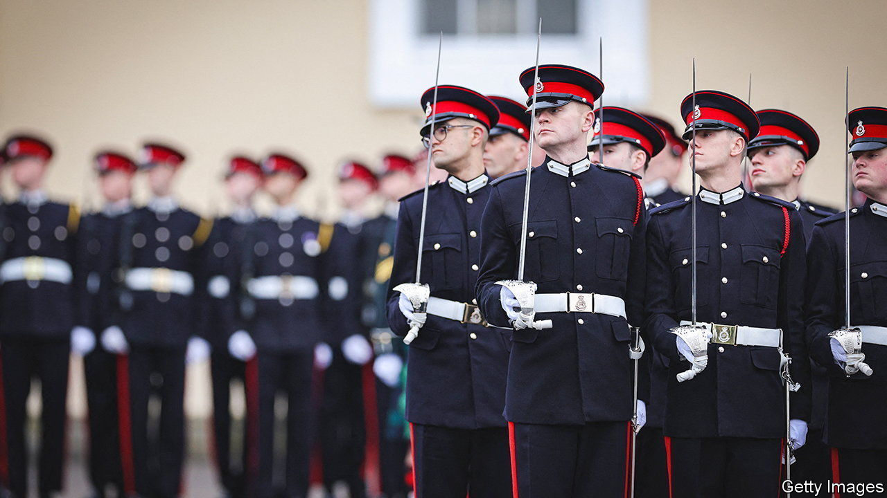

###### Hair today

# The British army mulls allowing beards 

##### Soldiers helped to spark the Victorian beard craze 

 

> Dec 18th 2023 

“It is time to modernise,” was the message from Grant Shapps, the defence secretary, in an interview with  earlier this month. Mr Shapps was talking not about weaponry or strategic doctrines, but facial hair. The Army Board, a management committee for the service, is pondering whether to end a century-long ban on beards for soldiers. 

At present serving soldiers are usually allowed to grow a beard only with the permission of their commanding officer; such permission is typically granted only on religious grounds. There are a handful of other exemptions. The Goat Major—actually a corporal—who tends the Royal Welsh regiment’s goat is allowed to have facial hair. So is the goat, which is technically a lance-corporal. (Britain is like this.) Everyone else is expected to be clean-shaven. 

The Royal Navy, plainly a bunch of woke progressives, has long embraced (full) beards; the Royal Air Force has allowed them since 2019. Army traditionalists have no truck with such nonsense. “I do not think a group of men marching with beards looks nearly as smart as a group without,” harrumphed a retired colonel in the  recently. The morning wet shave “adds to fighting spirit”. Some argue that beards impede the effective use of gas masks, although there is little concrete evidence for that assertion.

The British army has not always been pogonophobic. Indeed, soldiers helped to usher in the Victorian beard craze of the 1850s to 1880s. During the Crimean war in the mid-1850s, a ban on beards was relaxed due to the extreme cold weather and the difficulties of shipping in shaving soap. This conflict was also the first to be extensively photographed. As images of whiskered soldiers were transmitted back to Britain, full beards, which had been out of fashion since Tudor times, became associated with martial virtues. By 1860 the army was actively requiring moustaches.

According to Alun Withey, a historian at Exeter University, this happened at a time of growing worry that “British men were becoming weedy as more and more of them were working in offices”. Nothing could be more manly than facial hair.

Many also believed that not shaving offered health benefits. In 1854, more than 400 members of the Dublin police force petitioned to be allowed to join the beard movement on the ground that “almost all, if not all, diseases of the respiratory organs are in great part, if not altogether, caused by the practice which obtains of shaving off the beard.” Beards were even thought to bring productivity gains. An article in the  in 1861 calculated that America lost 36m working days each year to shaving. 

Prior to the 1850s beards had been a rarity in Britain. Now bristles sprouted everywhere. The full-bodied “cathedral” or “patriarch” beard, of the kind sported by late Victorian statesmen, was the favoured style of the elites. Beard fashion spread to the lower social classes, too. For a research project, Dr Withey studied the photographs of prisoners at three Victorian jails, taken soon after their arrest, and found that 58% had some form of facial hair. Almost three-quarters of their beards were “chin straps”—long sideburns meeting underneath the chin, without a moustache. 

The beard craze petered out in the 1890s as fashions shifted, better razors became available and doctors took to warning against facial hair (a damp beard was thought to spread germs). Beards became the preserve of older men as the young rejected the fashions of their fathers. The army was slower to adapt. The requirement for moustaches lasted until 1916; some regiments maintained a stockpile of artificial ones for those unable to grow their own. Only the recruitment of ever younger men during the first world war, and fears about the close fit of gas masks, led to the regulations being reversed.

A decision on whether to allow beards again is expected soon. Mr Shapps thinks it is “ridiculous” that the army is turning away potential recruits because of facial hair. The Victorians would agree. ■


