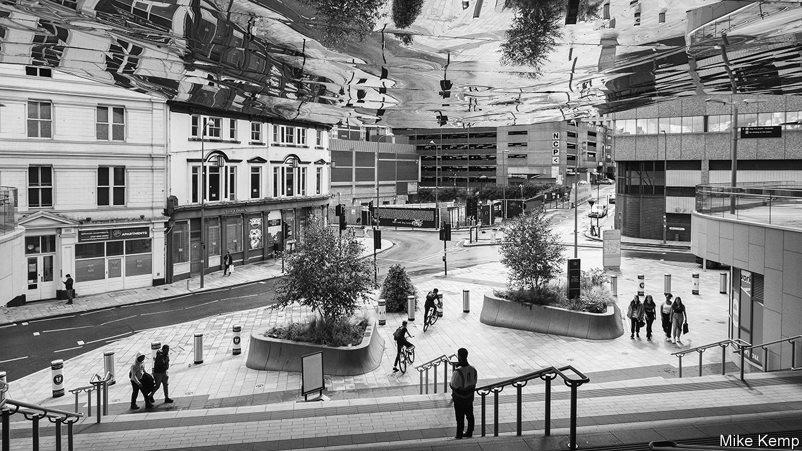
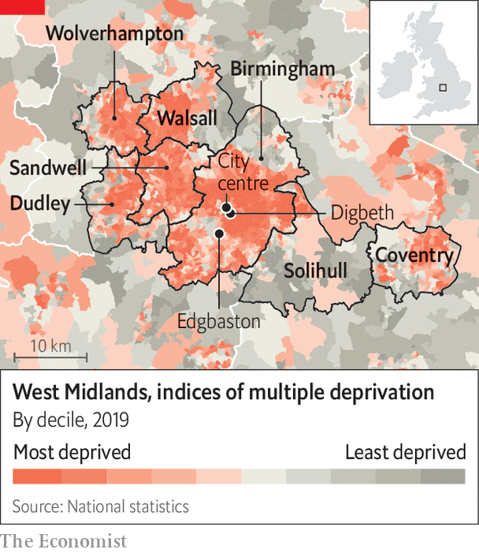

###### The second city

# The parable of Andy Street, the mayor for the West Midlands 

##### Britain’s second-tier cities are too constrained from above and below 

 

> Dec 19th 2023 

Andy Street’s management tips are conventional enough. As the boss of John Lewis, a high-end department-store chain, he was “obsessed with the details’‘ and taught his 70,000 employees that “every interaction matters”. The method : sales rose by 50% in his decade in charge from 2007. In 2014 , a trade magazine, named him “Britain’s most admired leader”. 

Since 2017 Mr Street has turned to a tougher task: running the West Midlands Combined Authority (WMCA). The region spans three cities—Birmingham, Coventry and Wolverhampton—and almost 3m people. It is Britain’s most populous urban area after . Fifty years ago it was an industrial powerhouse, churning out more than 1m cars a year. Its fortunes have since slumped. In September Birmingham council, the largest of seven within the combined authority, went bust.

Along with , Mr Street is the most high-profile figure in an experiment in English devolution that now extends to ten cities and regions. A moderate Tory, he has squeezed money from Conservative-run ministries. His business career makes him an ideal interlocutor for investors (“he speaks our language”, gushes one attendee at a meeting with housebuilders, architects and investors in Wolverhampton earlier this month). His pragmatic, consensual style has proved popular with voters. They probably could not have hoped for a better-equipped first mayor. And yet he has barely begun to move the dial. 

The productivity of the Birmingham urban area is 14% below the national average. It has hardly budged in two decades. Economic inactivity is higher than almost anywhere in the country. Investment has increased since Mr Street took over. But success is spotty. Many boroughs are run down and cut off from opportunity. Whereas Barcelona, Hamburg and Lyon help to propel their nations’ economies, Britain is held back by the weakness of its .

The West Midlands’ first problem is that it is constrained from above. Take public transport. In September Birmingham’s tram line was extended: sleek blue-and-grey carriages run every ten minutes or so from Wolverhampton to Edgbaston. Yet that upgrade had been discussed for almost two decades; and almost everywhere else remains poorly connected. Three-quarters of people drive to work; the city is even more jammed than London. Those without cars rely on snail-like buses. 

Local politicians are not blameless: almost all, including Mr Street, reject the idea of a congestion charge. But cities outside London have been starved of the funds needed to benefit from agglomeration. Half of graduates living in and around Birmingham cannot commute to the city centre within 45 minutes, according to the Resolution Foundation, a think-tank. 

Mr Street has gradually won control over funds for transport, housing and adult skills. But his entire budget is still just £880m ($1.1bn), a rounding error in a Treasury spending review. Because Britain’s mayors have little ability to raise their own money, nearly every pound must be solicited—Mr Street calls this “begging-bowl politics”. In Lyon, which has four metro lines and six tramways, the transport authority alone has a budget similar to Mr Street’s; half of it is raised through local taxes, says Tom Forth, a transport wonk. 

 


Mr Street is also constrained from below. Seven local authorities—Birmingham, Coventry, Dudley, Sandwell, Solihull, Walsall and Wolverhampton (see map)—agreed to create the mayoralty in 2016. They did so with the proviso that they would hold onto power themselves. Each has a place on the combined authority board; many decisions need two-thirds approval. The councils also kept a grip on planning policy, the critical lever for determining land use. The mayor’s office was designed as a “big tent with nothing in it”, says Max McLoughlin, leader of the Greens on Solihull council. 

Mr Street gamely talks up the benefits of “collective endeavour”. In reality the region is often less than the sum of its parts. In 2018 the Labour-run councils in the WMCA blocked Mr Street from using his main revenue-raising tool, a “mayoral precept” that would be levied on top of council tax (he has not tried again). A plan to reopen a commuter line connecting Birmingham’s suburbs with the city centre has been complicated by Birmingham council’s decision to sell off adjacent land. 

Large cities should link dense housing to jobs via mass transit. Mr Street’s lack of control over spatial planning makes that hard, says Paul Swinney of the Centre for Cities, a think-tank. In pushing brownfield development the mayor has made a virtue of necessity: several councils have blocked the kind of building on the green belt that might attract commuters. Four of the seven local authorities have not brought forward for development enough land to keep up with housing needs. 

The design of the WMCA causes other problems. In October it won the right to create an investment zone where firms will benefit from tax breaks and direct funding. To keep everyone happy the goodies have been split among three sites, reducing the benefits of clustering. Forging a new institution was always going to be tough. Unlike Barcelona or Hamburg, Birmingham was never a true second city with a regional government, points out Richard Vinen of King’s College London. Nor is “West Midlander” a cohesive regional identity. 

And if one of Mr Street’s successes has been sweet-talking investors, the woeful state of Birmingham council could sour things. Facing a £760m (£960m) bill for a long-neglected equal-pay claim, the council will begin slashing services and selling assets next year. A shoddy IT system means councillors cannot even see how broke their administration is. The mayor has been urging businesses to “keep the faith”. 

Turning around a region that has struggled for four decades was always going to take time. Walk around and you will see pockets of success. Birmingham city centre is clean and vibrant: Goldman Sachs, HSBC and Deutsche Bank have opened or expanded offices since the pandemic. HS2, a high-speed rail line, has already brought investment; Mr Street still hopes that a northern connection to Manchester, binned by Rishi Sunak, will be built. 

In Solihull advanced manufacturing is growing despite Brexit. In Digbeth a creative quarter is booming, centred on a studio opened by the creator of “Peaky Blinders”, a show about Brummie gangsters. “The bits of the economy that were doing well are doing a bit better,” says Adam Hawksbee, a former adviser to Mr Street now at Onward, another think-tank. In October Messrs Street and Burnham secured a big concession from Whitehall: the right to be treated like a department with a single budget, rather than having to bid for money from dozens of different funding pots. 

Yet patience and attention to detail will not be enough. For Britain’s second-tier cities to be transformed, they will need greater control over spatial planning and, in particular, the ability to raise more money locally. Only then will they have the means to become more productive and the incentive to grow. Mr Street is running for a third term in May. But to make a real difference, he needs more power. ■


