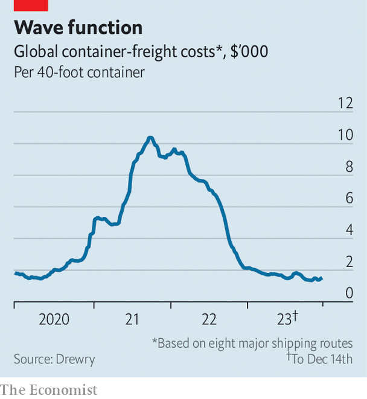

###### Straitened out

# Attacks on shipping in the Red Sea are a blow to global trade 

##### But alternative routes are a boon for shipping firms 

 

> Dec 19th 2023 

Until the Suez Canal opened in 1869, merchant ships in the  mostly carried coffee, spices and slaves. The waterway changed everything. So far in 2023 around 24,000 vessels have plied the passage, accounting for some 10% of global seaborne trade by volume, according to Clarksons, a shipbroker. That includes 20% of the world’s container traffic, nearly 10% of seaborne oil and 8% of liquefied natural gas. 

So missile and drone attacks by  in Yemen on ships passing through the narrow strait of Bab al-Mandab, which connects the Red Sea to the Gulf of Aden, apparently in support of Palestinians in Gaza, look like the latest blow to the shipping industry—and to its customers. It has struck just as both groups try to return to normality after the upheavals of the pandemic and, more recently, troubles which include a drought that has restricted large vessels from passing through the Panama Canal for several months. 

A dozen Houthi attacks in recent weeks and four more on December 18th pose an unacceptable danger to shipping. Container firms accounting for some 95% of the capacity that usually crosses Suez, including giants like Swiss-based msc and Denmark’s Maersk, have suspended services in the area. A few energy firms, such as bp and Equinor, have also temporarily stopped their ships from using the canal. As when the route was disrupted in 2021 after , a giant container ship, ran aground and blocked the canal for six days, shipping companies are already rerouting vessels around Africa. This will extend journeys from around 31 to 40 days between Asia and Northern Europe, reckons Clarksons. Unless the route can safely reopen, delays and the inevitable disruption at ports as vessels arrive out of schedule will create disorder in the coming months. 

Still, this Suez crisis will not “put a cork in global trade”, says Lars Jensen of Vespucci Maritime, a consultancy. The reason for the cautious optimism has to do with shipping’s remorseless cyclicality. In contrast to the  fiasco, supply chains are not currently under immense strain. Back then cuts to capacity coupled with a surge in spending by locked-down consumers had sent shipping rates surging to astronomical levels. A global index from Drewry, another consultancy, hit over $10,000 per standard container. On some routes, spot rates surpassed $20,000. That helped push shipping firms’ combined net profits in 2022 to $215bn, according to the John McCown Container Report, an industry compendium, compared with a cumulative loss of $8.5bn in 2016-19. 

 


The shipping firms’ usual response to such price signals is to order new vessels. Those are starting to arrive. Though demand has remained flat over the past year or two, the global fleet’s capacity will swell by 9% this year and another 11% in 2024, according to ing, a bank. Already, the industry’s profits may have plunged by 80% in 2023. With capacity to spare, running longer routes should not cause the disruption seen at the height of covid-19. By mid-December Drewry’s index was becalmed at $1,500 or so (see chart). Rates could double as a result of the Red Sea turmoil, reckons Peter Sand at Xeneta, a freight-data firm. But they will probably stay well below their pandemic peaks—and so will shipping companies’ profits. ■

