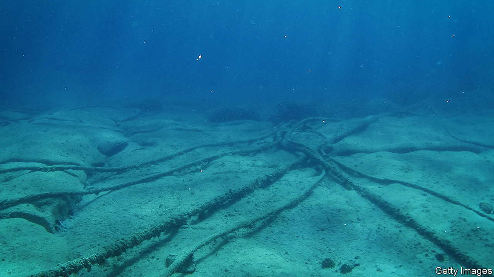

###### 4,000 terabits under the sea

# Big tech and geopolitics are reshaping the internet’s plumbing 

##### Data cables are turning into economic and strategic assets 

 

> Dec 20th 2023 

WHEN THE navies of Britain, Estonia and Finland held a joint exercise in the Baltic Sea earlier this month, their goal was not to hone warfighting skills. Instead, the forces were training to protect undersea gas and data pipelines from sabotage. The drills followed events in October when submarine cables in the region were damaged. Sauli Niinisto, the Finnish president, wondered whether the Chinese ship blamed for the mischief dragged its anchor on the ocean bed “intentionally or as a result of extremely poor seamanship”. 

Submarine cables used to be seen as the internet’s dull plumbing. Now giants of the data economy, such as Amazon, Google, Meta and Microsoft, are asserting more control over the flow of data, even as tensions between China and America risk splintering the world’s digital infrastructure. The result is to turn undersea cables into prized economic and strategic assets. 

Subsea data pipes carry almost 99% of intercontinental internet traffic. TeleGeography, a research firm, reckons there are 550 active or planned submarine cables that currently span over 1.4m kilometres. Each cable, which is typically a bundle of between 12 and 16 fibre-optic threads and as wide as a garden hose, lines the seabed at an average depth of 3,600 metres. Close to half have been added in the past decade. Newer ones are capable of transferring 250 terabits of data every second, the equivalent of 1.3m cat videos. Data may be stored in the cloud, but it flows under the ocean. 

Since 2019 demand for international internet bandwidth has tripled to more than 3,800 terabits per second, estimates TeleGeography. The boom in data-hungry artificial intelligence may strengthen this trend. Synergy Research Group, a data firm, predicts an almost three-fold increase in big cloud providers’ data-centre capacity over the next six years. To connect these data centres to the internet, between 2020 and 2025 the data-cable industry will install 440,000km of new subsea lines. 

One big shift has come from big tech. Until the early 2000s subsea cables were mainly used for transporting voice traffic across the world. Telecom operators like BT and Orange (formerly France Telecom) controlled most of the capacity. By 2010 the rise in data traffic led internet and cloud-computing giants—Amazon, Google, Meta and Microsoft—to start leasing capacity on these lines.

As their data needs surged, the tech firms began investing in their own pipes. In 2012 the four companies used around a tenth of international bandwidth; nowadays they claim almost three-quarters. Big tech’s deep pockets ensure that projects are completed. According to Submarine Telecoms Forum, an industry body, only about half of all announced cable systems actually get built—unless they are backed by tech firms, in which case they almost always do. 


Big-tech-backed cables account for almost a fifth of the $12bn in planned investments in new systems over the next four years. Amazon and Microsoft part-own one and four networks, respectively. Meta owns one cable system outright and is an investor in another 14. Google is the most aggressive—the search giant directly owns 12 of its 26 cables. This year it completed Firmina, a $360m project that stretches more than 14,000km from the east coast of North America via Brazil to Argentina. 

Dedicated cables allow the tech giants to avoid competing with others for third-party bandwidth, and to react quickly to changes in user demand and to any problems (if a cable on a route is damaged, data can be redirected to another one of the firms’ lines). Alan Mauldin from TeleGeography points out that being owner-operators also gives the tech giants the luxury of designing routes that meet their specific needs. Most telecom carriers rely on public “landing stations”—which connect the cables in the sea to customers’ data centres on land. By owning their cables, the companies can plug these more directly into their own data centres, speeding up traffic. 

Their bandwidth and speed is further enhanced thanks to clever technology, which ownership makes easier to deploy. In 2019 Google introduced an innovation (“space division multiplexing”) that increased the number of fibre threads in a cable from 16 to 24. This year it went further, doubling the number of “cores”—clusters of fibre threads—in its new TPU cable system that links Taiwan, the Philippines and America, increasing capacity while lowering the operating cost per bit. 

All this is transforming the business of data cables. Having begun as large buyers of bandwidth from telecom companies, big tech is now leasing capacity on some of its cables to telecom operators. Legacy telecom firms are happy with this arrangement, since they face constant pressure from consumers for more capacity but, unlike big tech, they are desperately short of capital. As for the specialist companies which supply the equipment and lay the cables, these are go-go years.

Like many other global industries, the data-cable business is also being entangled in the tech contest between America and China—a second big shift. Take the Pacific Light Cable Network (PLCN). The 13,000km data pipeline was announced in 2016, with the backing of Google and Meta. It aimed to link the west coast of America with Hong Kong. By 2020 it had reached the Philippines and Taiwan. But last year America’s government denied approval for the final leg to Hong Kong, worried that this would give Chinese authorities easy access to Americans’ data. Hundreds of kilometres of cable that would link Hong Kong to the network are languishing unused on the ocean floor. 

America is stymieing China in another way. Laying cables at depth is a complicated job. Only a handful of contractors have the required chops. Three—Alcatel Submarine Networks from France, NEC from Japan and SubCom from America—receive more than 80% of the spending on cable construction. HMN Tech, a Chinese challenger spun out of Huawei, China’s telecoms-gear champion, claims 9% of new annual construction spending. But amid Sino-Western tensions, new cables that have links to America, which is to say most of them, avoid HMN Tech as a supplier. Telecoms executives say they are discouraged from using HMN. In 2022 a lucrative contract for SEA-ME-WE 6, a 19,000km line owned by a group of telecoms operators including India’s Bharti Airtel and Singapore’s SingTel, and linking South-East Asia to Europe, was awarded to SubCom, even though HMN’s bid was reportedly lower. 

China is responding by charting its own course. PEACE, a 21,500km undersea cable linking Kenya to France via Pakistan, was built entirely by Chinese firms as part of China’s “digital silk road”, a scheme to increase its global influence. Reuters reported that this year three Chinese carriers—China Telecom, China Unicom and China Mobile Limited—are investing $500m in a cable network that connects China and France via Singapore, Pakistan and Egypt. The project, to be built by HMN Tech, will compete directly with SEA-ME-WE 6. 

Despite the growing Sino-American rivalry, from 2019 to 2023 bandwidth between the two has grown by 20% a year. American and Chinese mobile operators, which also rely on cables, continue to increase network connectivity in each other’s territory. The necessary licences are, however, getting harder to secure. 

In March America’s Federal Communications Commission issued a proposal that would require licensees to provide more information about who owns them. It also acknowledged concerns that the presence in America of physical infrastructure of China Telecom is “highly relevant to the national-security and law-enforcement risks”. All this is making the route taken by bits and bytes more circuitous than before, and thus costlier. If transpacific tensions continue to mount, those routes may one day vanish altogether. ■


