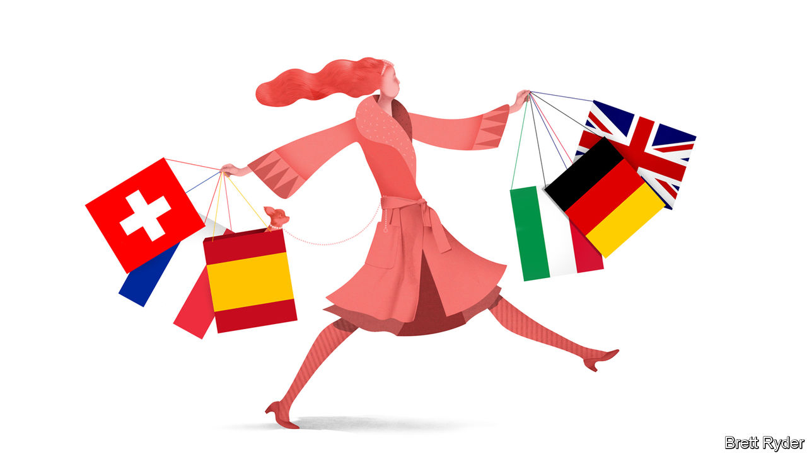

###### Schumpeter

# Can anyone bar Europe do luxury? 

##### The old continent enjoys a unique blend of heritage, skills and strategy 

 

> Dec 20th 2023 

At this year’s holiday soirées luxury bosses may be stingier than usual with the champagne. It has not been a sparkling six months for the industry, as well-heeled consumers from East to West have tempered the excesses of recent years. The S&amp;P global luxury index, which tracks the industry’s performance, is down by 9% since the middle of the year. Still, the purveyors of splendour need not forgo the merrymaking altogether. The global market for personal luxury goods, from handbags to haute couture and horology, grew by 4% this year, reckons Bain, a consultancy. That is disappointing compared with 20% last year—but nothing to scoff at amid fears of a slowing global economy.

The past two decades have been remarkable for the industry. Global sales have tripled to nearly $400bn, thanks largely to a swelling of the ranks of crazy rich Asians. The biggest beneficiaries of the boom have been European companies. These account for around two-thirds of luxury-goods sales, according to Deloitte, another consultancy, and nine of the world’s ten most valuable luxury brands, according to Kantar, a market-research firm. Bernard Arnault of LVMH, a European luxury goliath, is the world’s second-richest man. The industry remains a rare bright spot for Europe at a time when the continent seems at risk of fading into economic and technological irrelevance. Why has it been so immune to foreign competition?

Heritage is one explanation. Europe’s luxury firms have ridden high on the world’s continuing fascination with the old continent. It is home to seven of the ten most visited countries in the world. Tourists flock to Europe’s historic cities to ogle its artworks, taste its local delicacies and drink its fine wines; the rich and famous gather in the summer for lavish parties on the Riviera. In his book, “Selling Europe to the World”, Pierre Yves Donzé, a business historian, argues that the ascendancy of European luxury is thanks to “the powerful attraction of an idealised way of life, combining elegance, tradition and hedonism”.

In an interview with the  in 1996 Tom Ford, a famed American designer, gushed that Europeans, unlike his compatriots, “appreciate style”. American fashion labels have struggled to break into the most exclusive end of the industry. Even America’s pricier brands like Ralph Lauren concentrate on what insiders contemptuously call “accessible luxury”. In Asia home-grown rivals have thrived mostly in categories like jewellery (China’s Chow Tai Fook or India’s Titan) and cosmetics (Japan’s Shiseido) where local tastes are more pronounced.

Europe, meanwhile, has entrenched itself as the centre of design and craftsmanship in the luxury business. Three of the “big four” fashion weeks take place in European capitals. New York, the exception, has valiantly tried to build a cluster of high-end fashion talent, with design schools to rival those of Milan or Paris. Yet it has lost top designers to European capitals much as Europe has lost techies to Silicon Valley. As Mr Ford saw it, “If I was ever going to become a good designer, I had to leave America.”

Hobnobbing with other fashionistas is not the only advantage on offer in Europe. The continent is dotted with artisanal workshops that have for decades catered to the exacting standards of the luxury industry. Hermès handbags, some of which sell for upwards of $10,000, are produced by experienced craftsmen who can spend 20 hours or more on one bag. Over decades the continent has developed specialised clusters of production, from watchmaking in the Jura Arc of Switzerland to shoemaking in the Veneto region of Italy, where techniques are handed down over generations through specialist schools and coveted apprenticeships.

Europe’s luxury champions deserve credit, too, for pursuing strategies that have reinforced their dominance of the industry. They have been steadily buying stakes in their suppliers, giving them a competitive edge through greater control of production, notes Thomai Serdari of New York University’s Stern Business School. In May Chanel and Brunello Cucinelli, two luxury houses, bought a joint 49% stake in Cariaggi Lanificio, an Italian cashmere supplier. Vertical integration in the industry has stretched all the way back to alligator farms in Louisiana and sheep stations in Australia. It has also extended in the other direction, into distribution, with luxury firms increasingly opting to sell directly to shoppers through their own swanky stores, rather than entrusting the customer experience to others.

All that has required plenty of capital, which helps explain the parallel trend towards horizontal integration in the industry. LVMH now houses 75 luxury brands. Although these mostly operate autonomously, the model provides economies of scale in areas like marketing and back-office functions. It also gives the group the financial firepower to invest in prime real estate. In July LVMH bought the building on the Champs Elysées that houses its Louis Vuitton flagship store. Swatch, which owns watch brands from Blancpain to Omega, controls a portfolio of component suppliers, too. The conglomerate model also helps to lure in top talent by offering opportunities for designers and craftsmen to move between brands, notes Stefania Saviolo of Bocconi University.

Continental drift

Enthusiasm for horizontal integration among European luxury firms has not been universal. Early in the 2010s Hermès fended off a takeover attempt by LVMH. It has done just fine on its own—its shares have outperformed LVMH’s by more than half over the past five years. Other independent luxury brands, however, have struggled to keep up. That is especially so for Italian firms, which account for 23% of luxury’s 100 largest businesses but only 8% of their combined sales, according to Deloitte. Many of these are multigenerational family businesses that have balked at joining forces with old rivals. If they are to maintain their position at the ritziest end of luxury, they may need to swallow their pride. ■


