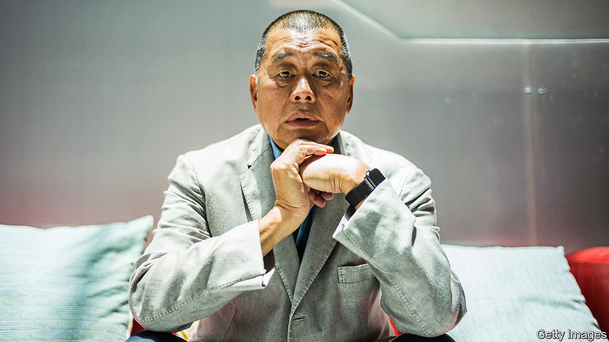

###### Democrat in the dock

# The unfair trial of Jimmy Lai begins in Hong Kong 

##### The outspoken media tycoon will be punished for supporting democracy 

 

> Dec 18th 2023 

IT HAS BEEN more than three years since the police in Hong Kong  Jimmy Lai and stuck him in Stanley Prison. But as Mr Lai stood in court on December 18th, facing charges of sedition and colluding with foreign forces, it felt like the culmination of a much longer saga. The pro-democracy media tycoon has  the administration in Hong Kong and the national government in Beijing. They, in turn, consider Mr Lai a traitor and have been relishing the chance for more payback.

Revered by many Hong Kongers for his bravery, Mr Lai has led a rags-to-riches life. At the age of 12 he escaped Mao Zedong’s China by stowing away on a boat. Once in Hong Kong he worked his way up from factory dogsbody to clothing impresario and media mogul. The government in Beijing forced him out of the garment industry in 1994 after he wrote a column in one of his magazines calling Li Peng, China’s prime minister at the time, “the son of a turtle’s egg” (a rather nasty insult).

In 1995 Mr Lai founded , a popular tabloid that mixed tittle-tattle with criticism of the government. By 2021 the authorities in Hong Kong had had enough. Acting under the national-security law, they froze the paper’s assets, raided its offices and arrested several of its leaders. (People across Hong Kong queued to buy the paper’s farewell edition.) The charges against Mr Lai are based in part on articles in  that called for international sanctions against Chinese and Hong Kong officials. Prosecutors argue that this amounted to collusion with foreign forces. Six of the paper’s former staff members pleaded guilty to the charge in 2022.

The government in Hong Kong has gone to great lengths to ensure that Mr Lai’s trial goes its way. It prevented him from appointing his preferred barrister, a Briton named Tim Owen. (The fight over that contributed to the trial’s being delayed for months.) Paul Lam, Hong Kong’s justice minister, insisted that Mr Lai be tried not by a jury, but by three judges approved by John Lee, the city’s chief executive (this is now the norm in national-security cases). Chris Tang, the security minister, has already proclaimed that the proceedings will prove Mr Lai is “bad”. The government likes to boast that it has a 100% conviction rate in national-security trials.

In 2022 Mr Lai was sentenced to five years and nine months in prison for fraud, a verdict denounced by human-rights groups. Now he looks set to spend the rest of his life behind bars. America, Britain and the European Union have condemned the trial. Mr Lai’s legal team hopes this will help. But the defendant is said to be reconciled to his fate. ■


