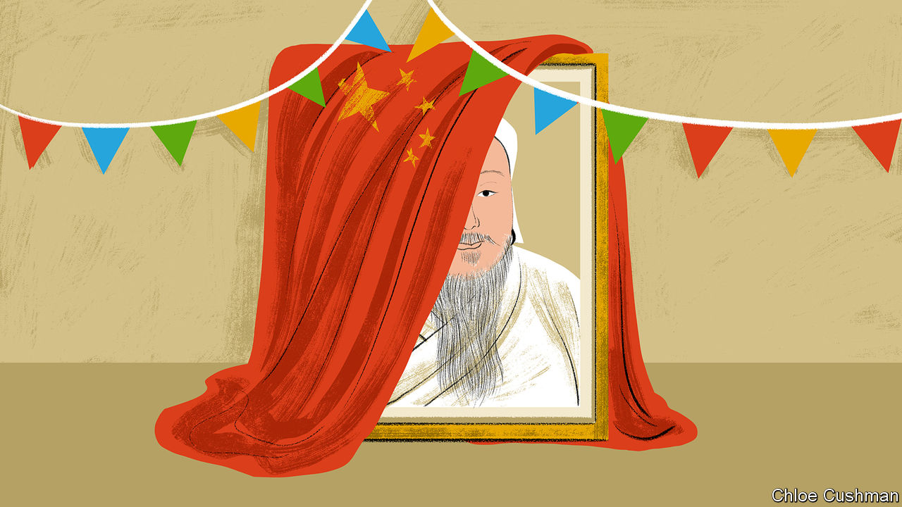

###### Chaguan

# Why China’s rulers fear Genghis Khan 

##### Repression reaches one of China’s quirkiest ethnic communities 

 

> Dec 20th 2023 

HARSHNESS IS A crude metric for judging an unelected regime. To keep power, lots of rulers will crush dissent with an iron fist. A more subtle measure involves thoroughness. Dedicated autocrats use cold, patient repression to bring even the meek and unthreatening into line. Their aim is to snuff out any belief—no matter how harmless—that might divide subjects’ loyalties.

This grim trend may be seen in the Communist Party’s handling of China’s ethnic minorities, a diverse bunch who between them make up around 9% of the overall population. Since Xi Jinping took power in 2012, such groups have lost many of the limited privileges granted to them and faced aggressive campaigns to assimilate into mainstream Chinese culture.

Apologists present Xi-era policies as tough but rational responses to threats. The government’s actions in Xinjiang are indicative. To defend China’s cruelties in the region—including mosque demolitions, re-education campaigns, the jailing of poets and the surveillance of millions of Uyghurs and other minorities—officials play up the dangers of Islamic extremism. 

National security is also used to justify an intensifying campaign to assimilate ethnic Mongolians who live in China’s northern region of Inner Mongolia. New laws mandating the use of the Chinese language over Mongolian in schools and public institutions aim to “safeguard national sovereignty”. When protests greeted similar changes in 2020, the local government responded by making the rules stricter. Citing Mr Xi’s calls for “ethnic solidarity”, the authorities have banned some history books and closed memorials to Genghis Khan, the founder of a dynasty that conquered tracts of Eurasia and ruled China between 1271 and 1368. Defenders of such hardline policies note that Inner Mongolia is a border region, sharing ties of language, religion and history with an independent, democratic country next door, Mongolia. 

Revealingly, though, the Xi era has seen moves to smother traditions that pose no conceivable challenge to national security. Chaguan recently travelled to one of the oddest places on China’s ethnic map, the Xingmeng Mongolian Township of Yunnan province. This rural township of about 6,000 people lies in the lush, tobacco-growing hills of southern China near the border with Vietnam—about 2,500km from the grasslands and deserts of Inner Mongolia. Locals claim descent from Mongolian armies, initially led by Kublai Khan, grandson of Genghis, that conquered the region in the 13th and 14th centuries. In their telling, some soldiers stayed on after their Mongol overlords were defeated and driven back north by Ming-dynasty emperors. After an early flurry of intermarriage with local women, these “Yunnan Mongolians” reputedly settled down as fishermen and carpenters in five villages. 

Today locals praise their ancestors for stubbornly declining to marry outsiders, thereby—they insist—preserving traces of Mongolian language and dress for over seven centuries. Declaring himself a descendant of Genghis Khan, a village elder admits that he married a woman from China’s Han majority, “so my daughter is only half Mongolian”. To the elder, a longtime party member, his child is fully Mongolian nonetheless, because she “inherited the spirit of the Mongolian nation”.

Xingmeng’s history was rediscovered in the 1950s, a time of Sino-Soviet amity, by party officials and ethnographers, as well as by envoys from the Soviet-controlled Mongolian People’s Republic. Alas, as Mao Zedong led China deeper into paranoid isolation, ethnic minorities with ancient traditions and links to foreign lands became the target of attacks. After China broke with the Soviet Union and sank into the frenzies of the Cultural Revolution, terrible violence reached Inner Mongolia. Tens of thousands of ethnic Mongolians were killed, accused of treason and feudal thought. Far to the south in Yunnan, minorities were attacked in a “Political Frontier Defence” campaign aimed at border counties. Xingmeng avoided the worst violence, older locals relate, though a temple and ancestral clan halls were damaged. Some temples survived because they had been turned into schools.

After Mao’s death in 1976 Xingmeng enjoyed something of a golden age, as history was harnessed for economic development. Teachers visited from Inner Mongolia to give language lessons at the primary school. Cement replicas of nomads’ tents, horse sculptures and other Mongolian touches appeared. A damaged temple was restored in 1985 as the “Three Saints Temple”, housing statues of Genghis and Kublai, as well as Mongke (Kublai’s brother). A Mongolian folk festival, called Naadam, was held every three years. It began with ceremonies honouring those royal ancestors.

No stately pleasure-domes here

Not this year. No worship of Genghis Khan was allowed as the latest Naadam began in Xingmeng on December 15th (though early that morning some locals quietly slipped into the temple to light incense before the Khans’ impassive statues). At the opening ceremony, a parade featured cloth and bamboo models of fishing boats, shrimp, clams, dragons and a large, dancing white elephant. Missing was a cloth and bamboo model of Genghis Khan on horseback, which appeared at the last Naadam in 2017. 

A few years ago Xingmeng’s schools stopped offering Mongolian language lessons. The state has also reduced the number of bonus points given to ethnic-Mongolian students taking university-entrance exams. Pointedly, at the Naadam opening ceremony local leaders hailed Xi Jinping Thought and the ethnic unity of the Chinese nation. In Xingmeng’s cobbled back alleys, your columnist heard wistfulness and fatalism about the new Naadam, rather than revolt. Asked about the changes, an old man said: “All nationalities should unite, and all Chinese should listen to what the party says. Isn’t that how it works with political issues in China?” 

It takes an implacable regime to hear such words and still detect a need for stricter controls. China has such a regime. ■


