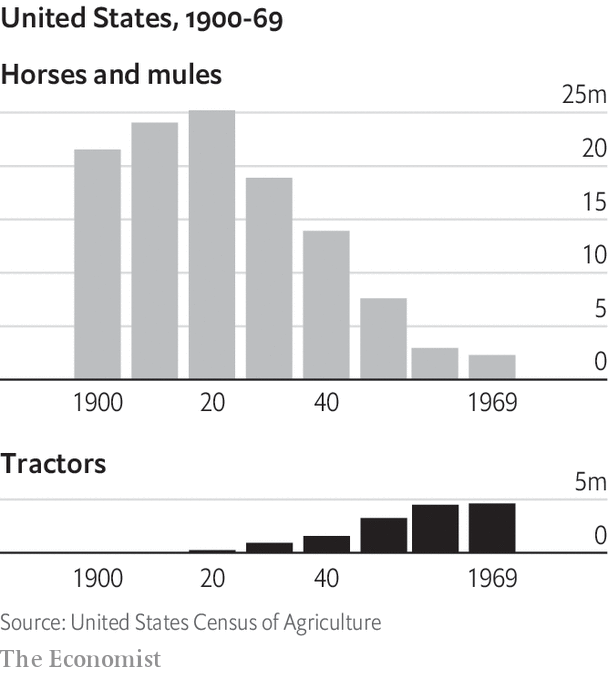

###### The economics of technology

# A short history of tractors in English 

##### What the tractor and the horse tell you about generative AI 

> Dec 20th 2023 


It was the Chatgpt of its day. “Come and see the tractors”, entreated an article in the  in 1915, advertising a trade show in Illinois showing off the new tech. “It will mark a new epoch in farming—the farmer’s liberation from sole dependence on the weary horse.” “Tractors are more economical than horses,” insisted an agricultural expert in a government report around the same time, “not only making farm work cheaper but easier.” The tech clearly impressed people, but it also scared them. One American observer, watching a tractor in England, said it “walked over the earth like some huge animal, puffing and snorting”. Tractors promised a revolution in American agriculture, an industry which in 1900 employed about a third of workers and produced about 15% of gdp.

Today many people expect another revolution, linked to developments in generative artificial intelligence (ai). Like then, the general public today view the technology with a mixture of awe and fear. Goldman Sachs, a bank, reckons generative ai could raise annual global gdp by 7% over ten years. Some economists now talk about “explosive growth”. Others say that before long, jobs will be eliminated in their millions. Yet the economic history of the tractor casts doubt over these predictions. Over the sweep of history the tractor has indeed had an immense impact on people’s lives. But it conquered the world with a whimper, not a bang. 

Historians disagree about who invented the tractor. Some say it was Richard Trevithick, a British engineer, in 1812. Others credit John Froelich, working in South Dakota in the early 1890s. Still more point out that the word “tractor” was little used until the start of the 20th century; and that only then did people start seriously talking about the average farmer buying one. At the time horses and mules pulled around an impressive array of farm implements, from ploughs to reapers. 

The horses faced up to a bigger, more powerful beast. You can put yourself in the shoes of an early 20th-century horse by visiting Gene Jones’s tractor museum in Millbrook, a small city in rural Alabama, which contains dozens of machines, including Farmalls and Fords, from the 20th century. The tractors are beautiful—and not just because Mr Jones has lovingly restored them, painting them in a variety of rich auburn-reds. They are also intimidating. Some weigh thousands of pounds. Others have cranks to start the engine which can break your arm if you don’t know what you’re doing. 

With hindsight, it is clear that the tractor had profound impacts. It meant that a given quantity of farmland could feed more people. Tractor-owning farmers no longer needed to pasture horses, each of which required about three acres of cropland for feed each year. More intensive farming also had downsides. Some researchers have argued that tractors helped bring about the Dust Bowl of the 1930s. Their powerful ploughing techniques damaged the topsoil that had once prevented wind erosion. 


The economic impact eventually became clear, too. The greater efficiency afforded by tractors allowed farmers to expand their operations, as they could manage more land with the same number of workers. Farms began to grow in size, with smaller family farms giving way to larger, mechanised operations. According to one estimate, by 1960 the average American farm was 58 acres (equivalent to the land occupied by ten big Walmarts today) larger than it would have been without tractors. The tractor also reduced the number of workers needed to produce food by about 2m, or 25% of farm employment in 1960. All these improvements added up. In a paper published in 2012 Richard Steckel and William White, two economists, argue that by the mid-1950s farm mechanisation had raised American gdp by about 8%. 

And yet for much of the first half of the 20th century, tractor-induced changes did not feel very profound. This is because the tractor diffused across the American economy slower than one of Mr Jones’s old Fords trying to cross a waterlogged field. In 1920, despite rave reviews in the , just 4% of American farms had a tractor (see chart). Even by 1940 only 23% had them. In the 1910s opportunistic businessmen had piled into the tractor-making business, hoping to make a quick buck (just as every second tech firm in Silicon Valley now describes itself as “ai-first”). Many had no customers and were forced to close. 

 


The horse endured for a surprisingly long time. For much of the 1930s the total productive capacity of equine animals—quite literally, horsepower—across American farms still exceeded that of tractors. In 1945 a quarter of farms reported both draft animals and tractors. The slow diffusion of the tractor produced slow productivity gains. The data are spotty, but in the first half of the 20th century annual productivity growth in agriculture probably never exceeded 3%. That 8% gdp effect is real, but it made itself felt only over decades. Explosive growth? Hardly. 

The tractor’s plodding progress is one of the big puzzles of economic history. If they were so good, why did farmers not buy them more quickly? They were not Luddites who resisted new technologies on principle. True, anti-tractor lobby groups, such as the Horse Association of America, warned that buying one would land the farmer in unmanageable debt. But in the 1910s and 1920s many tractorless farmers did own cars, suggesting that they were willing to try new tech. In 1917 , a journal, published letters from 15 farmers who used tractors. They were probably solicited, but these letters urged others to follow suit. 

Three reasons explain why the triumph of the tractor took so long. First, early versions of the technology were less useful than people had originally believed, and needed to be improved. Second, adoption required changes in labour markets, which took time. And third, farms needed to transform themselves. 

Take capabilities first. The early tractors of the 1900s were behemoths. They were useful for ploughing, and a few other things, but not for cultivating fields of growing crops. Many early models had metal wheels, not tyres, so they got stuck in the mud. They were also costly. Between 1910 and 1940, however, the machines became both more versatile and smaller, making them suited to a wider range of tasks. 

In 1927 John Deere released a power lift for its models. This meant that a farmer could pull a lever to raise an implement (such as a plough), rather than doing it manually. Rubber tyres came along in about 1933. For a long time the general-purpose tractor could not mechanise corn and cotton harvests, one reason why the area in which Mr Jones lives was one of the slowest to adopt tractors. But by the 1920s America had the corn-picker, followed by the mechanical cotton-picker after the second world war. By the end of the fighting, tractor prices had also fallen from their level in 1910, after adjusting for inflation, by about half.

Wages were the second factor. Horse technology was labour-intensive: horses require feeding, cleaning and medical care, even when they are not working. In the early 1930s, during the Depression, average real wages in agriculture fell. So for many farmers it became easier to hire someone to manage a horse—you could always fire them—than it was to splurge on a tractor. But by the second world war, labour shortages mounted, leading real wages to rise quickly. Suddenly, machines seemed like a better deal. 

The third factor was corporate restructuring. Tractors worked best on big farms, where the farmer could spread out the expense of a huge upfront investment. As a result, enlarging the size of their holdings and buying a tractor were two sides of the same coin. In a survey in Illinois in 1916, for instance, farmers who used tractors profitably also talked about increasing their acreage. But growing a farm takes time. A farmer looking to expand had to gather the necessary capital, and then negotiate the purchase with the owners. 

The history of the tractor hints at how quickly generative ai may take over. At present most ai models still have metal wheels, not rubber tyres: they are insufficiently fast, powerful or reliable to be used in commercial settings. Over the past two years real wages have hardly grown as inflation has jumped, limiting companies’ incentives to find alternatives to labour. And companies have not yet embraced the full-scale reorganisation of their businesses, and in-house data, necessary to make the most of ai models. No matter how good a new technology may be, society needs a long, long time to adjust. ■


