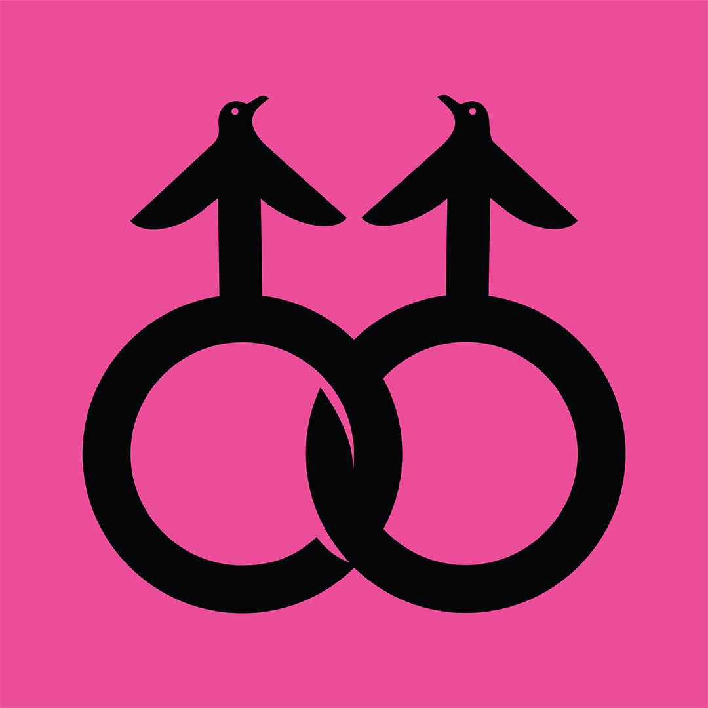

###### Free speech, gay rights and waterfowl

# A tale of penguins and prejudice is a parable of modern America 

##### When two male penguins hatched an egg in Central Park, they set off an enduring controversy 

 

> Dec 20th 2023 

Once upon a time in America there lived a pair of penguins called Roy and Silo. They were just like the other penguin couples in their zoo, except that they were both boys. Together they sat on an egg until a chick popped out. Later two men wrote a story about them—igniting a controversy which, almost two decades later, is still blazing.

This is the story of that story, and it has many morals. It is a tale of parenting and devotion, and a fable of progress and the backlash it can provoke. It is a feathery parable of America’s divisions, in this case over freedom of speech and gay rights. An ongoing saga of politics and prejudice, in the beginning it was, first and foremost, a story about penguins.

Thronged with children, the penguin exhibit at Central Park Zoo in New York is an unlikely battleground in America’s culture wars. It is easy to see why the creatures are a hit. They wobble around their barren terrain like drunks trying to walk straight for a patrolman. Some engage in what seem to be lively conversations, flapping their wings for emphasis. (Others spend a lot of time staring at rocks.) Diving into their pool they become as lithe and dexterous as they are clumsy on land, rocketing out after their dips in gravity-defying bursts. 

Of the various species in the cold, smelly enclosure, the feistiest are the chinstrap penguins, so called because of the black markings below their beaks. For a novice they are hard to tell apart; but, says Rob Gramzay, who oversaw their care for 17 years, zookeepers come to know the penguins individually while hand-feeding them fish twice a day. Some are sweet, says Mr Gramzay, others “really ornery”. Between Silo and Roy, “Silo was definitely the one with more attitude.”

In 1998 Mr Gramzay noticed that these two males were spending most of their time together. They exhibited the same behaviours as male-female pairs, such as squawking at each other and showing off in courtship displays. When, a year later, Mr Gramzay saw Silo sitting on an egg-shaped rock in the nest the pair had built, he swapped in an egg made of plaster. In 2000 he gave them a real egg that two other chinstraps, Betty and Porkey, had discarded. His aim, he says, was purely to support the penguin colony, which had not raised many chicks.

Roy and Silo took turns incubating the egg for around 36 days. At the time Mr Gramzay was enjoying the tango music of Astor Piazzolla, an Argentine composer; when the egg hatched he called the new penguin Tango. She was “a very sturdy chick”, he recalls. He helped her learn to swim.

That might have been that, had it not been for a double stroke of fate. In 2004 the  ran an article about the penguins, headlined “Love That Dare Not Squeak Its Name”. And, in their kitchen in Greenwich Village, a particular human couple read it.

They were just the right pair to incubate the story. A psychiatrist and psychoanalyst who teaches at Columbia University, Justin Richardson had interests in sex education and gay and lesbian mental health. On a blind date almost a decade earlier he had met Peter Parnell, a playwright who worked on “The West Wing”. Lots of people, they knew, were squeamish about discussing homosexuality and gay parents with their children. Here was a tale of same-sex parenting from which everything that might cause discomfort—even the word “gay”—could be omitted. Two cute characters would overcome obstacles to reach their goal in a classic narrative arc. Unusually for the time, the children of same-sex couples would glimpse a version of their own experience.

They wrote fast. Mr Parnell quickly got out of his system a draft in which Roy and Silo loved Broadway musicals. Aided by a visit to the zoo, they stuck closely to the facts. “We got to hear them,” Dr Richardson says of the penguins, “and smell them.” An illustrator, Henry Cole, contributed dreamy yet realistic watercolours. Intended for four- to eight-year-olds, the book was published in 2005 as “And Tango Makes Three”.

It is a delight. “Every day”, it explains of Central Park Zoo, “families of all kinds go to visit the animals.” The animals have families too, mostly featuring male-female partnerships. Roy and Silo, however, were “a little bit different”. As in real life, Mr Gramzay gives them an egg, which they sit on until—“CRAAAACK!”—out comes Tango with “fuzzy white feathers and a funny black beak”.

The story was well-received by reviewers and readers. “It’s a great feeling”, says Dr Richardson, “to hear a kid loves your book.” Then fate—or what you might call a penguin —intervened again.

Life imitates penguin

The authors expected objections to their fable of same-sex union; the first illustrator they approached had declined on religious grounds. But they could not have anticipated the way penguins came to be enlisted as political warriors. “The March of the Penguins”, a documentary about emperor penguins in Antarctica, was released later in 2005. Some conservatives saw those birds as exemplars of parental devotion and stable relationships. In response, some on the left invoked the non-traditional family in “And Tango Makes Three”.


When, in 2006, two parents in Missouri complained about the book at a public library, it was reshelved in non-fiction. Stephen Colbert defended it satirically on “The Colbert Report” (“It’s all just another part of the homosexual flightless waterfowl agenda”). After that, the herring was in the penguin pool.

The American Library Association (ala) tracks “challenges” to books in public and school libraries—ie, bids to have them removed or access to them restricted. By its count “And Tango Makes Three” was the most targeted book in America in 2006-08, and again in 2010. Complainants alleged that it is “anti-family” and “promotes the homosexual agenda”. Penguin skirmishes erupted overseas: Singapore’s authorities resolved to pulp library copies of the book until, amid an outcry, it was moved to the adult shelves instead.

 


The attacks betray several misconceptions, the most elementary involving science. Same-sex attachments among penguins are not a pernicious invention but a fact of nature. Mr Gramzay saw other such pairs in Central Park; they have been sighted in captivity in Berlin, London and Sydney. As for animals in general, says Paul Vasey of the University of Lethbridge in Canada, incidents of same-sex courtship and bonding have to some extent “been observed in many, many species”. (Hardly any animals, cautions Dr Vasey, are exclusively homosexual. And since many creatures have nasty habits like infanticide, basing moral arguments on their behaviour is inadvisable.)

A second misconception concerns human sexuality. Whatever its mysteries, it is unlikely to be swayed by a picture book about penguins, a fear that seems to lurk behind many objections to “And Tango Makes Three”. As Dr Richardson puts it, wearing his psychiatrist’s hat: “There’s no reason to believe that reading a book about homosexual waterfowl makes a child more likely to be gay when they grow up.” Conversely, banning books with gay characters—or their avian avatars—won’t change the fact that “gay families exist”.

A final confusion is over children and reading. It is not a mechanistic process whereby a story propounds a message and a child absorbs it. To think it is, says Marah Gubar, an expert on children’s literature at the Massachusetts Institute of Technology, is to see young readers as defenceless blank slates, altogether inferior to grown-ups and worryingly impressionable. In reality they are, like adults, exposed to umpteen competing influences that they sift and process. As anyone who has read to a toddler knows, Dr Gubar notes, they already have tastes and ideas; they interpret books—which tend to have several possible meanings—in their own ways. The response to this one might be, “I wanna be a zookeeper!” In the encounter between child and book, “It takes two to tango.”

The real-life union of Roy and Silo did not, alas, end happily ever after. They “stayed together for a couple more years”, remembers Mr Gramzay. Then Silo had a fling with a female chinstrap named Spike, before forming a long-term partnership with another female, Scrappy. (News of his change of mate and taste was greeted by some as a triumph of heteronormativity.) For his part, Roy took up with a male named Blue. Tango found a female partner called Tazuni.

There was a happier sequel for the authors. Like Roy and Silo, when they wrote “And Tango Makes Three” the couple felt, in the words of the story, that “Their nest was nice, but it was a little empty.” In that line, confides Dr Richardson, “We were talking about our own lives, too.”

In 2008 David Paterson, New York’s governor, ordered state agencies to recognise same-sex marriages performed elsewhere. Mr Parnell and Dr Richardson quickly tied the knot in Massachusetts, the first American state to make that possible. They hurried because, through surrogacy, they were about to become parents themselves. In 2009 their child was born: a girl (like Tango) whom they named Gemma. A few years later Mr Parnell wrote a funny, moving play about gay parenting called “Dada Woof Papa Hot”, those four words having been Gemma’s first. “Isn’t being normal the most radical thing of all?” muses one of his characters.

This case of life imitating art, or artists imitating wildlife, would have made a fairy-tale ending to the saga of the “gay penguins”, as, rather anthropomorphically, they are often known. Yet like the tango of progress and pushback at its heart, the story was not—and is not—over. As swallows are to summer, the appearance of these chinstraps is a sign that cultural rows are dominating American politics. Now they are back.

Book bans come in waves. As Jonathan Friedman of pen America, a free-speech watchdog, recounts, they surged in the McCarthyite era after the second world war and again in the late 1970s and early 1980s. Amid a wider battle over how and what children are taught, they are soaring again today. pen America clocked 3,362 bans in American schools in the 2022-23 academic year, a third more than in the previous one. The ala says more books are being challenged than at any time since it began keeping records more than 20 years ago. Whereas, in the 1950s, the censors fretted about un-American ideologies, today they focus on portrayals of race, gender identity—and sexuality.

 


Teachers and librarians, says Mr Friedman, are caught in a pincer movement between two forces. One is new state laws, in which Florida has been a trailblazer. Its Parental Rights in Education Act, known by critics as the “Don’t Say Gay” law, severely restricts instruction in “sexual orientation or gender identity”. Other regulations oblige school authorities to vet every book on their premises, and prohibit the depiction in them of many sorts of sexual activity. Emulated elsewhere, such laws are powerful tools for conservative pressure groups, the other claw in the pincer.

“We’re not banning books,” insists Keith Flaugh, co-founder of one such group, the Florida Citizens Alliance (FCA). “We’re protecting the safety of our children.” Invoking Florida statutes, he argues that “You either have a rule of law or you have anarchy.” As a guide for parents and spur to action, the FCA produces a “Porn in Schools Report”, which lists commonly available books that it says “contain indecent and offensive material” and are “wilfully grooming our children to be sex-trafficked”. As well as “Normal People” and “The Kite Runner”, the list includes “And Tango Makes Three”. The FCA’s reviewer calls it “an attempt to influence young impressionable minds to accept the gay lifestyle”.

In Escambia County, Florida, meanwhile, a teacher named Vicki Baggett asked the school board to withdraw “And Tango Makes Three” from its libraries, with other titles, on grounds of “indoctrination”. Schools, she says, should be “protecting [children’s] innocence until they are more mature”. At a heated public meeting, a local queried whether “Goldilocks” should also be deemed a menace, since it might indoctrinate children into crime. The board sided with Ms Baggett.

Strong language for a book about androgynous-looking birds, in which the most explicit passage describes how Roy and Silo “wound their necks around each other”. The characters are exemplary homemakers, as, apparently, were the actual birds. (“They were really, really great parents,” Mr Gramzay says, dutifully regurgitating their fish for Tango to swallow.) The charge that the story is pornographic reveals more about the accusers than about the book, suspects Dr Richardson. Perhaps they associate the term “gay” with sex and assume everyone else does, too—even five-year-olds. As for “indoctrination”, it’s “a word that you use to make education sound nefarious, right?”

“And Tango Makes Three” has now been challenged in 32 states. It was the joint most-banned picture book of 2022, tied with two others with gay or transgender themes. All this troubles the authors more than the first bout of penguin-hunting did. Those early opponents “were at least sincere”, says Dr Richardson. Now the campaign is not spontaneous but organised; rather than reading the story, some people seem merely to have seen the title on a pressure group’s list. Another difference is that, with support from fans, free-speech activists and America’s constitution, in bygone years the book would eventually be restored to shelves. In some cases today, it hasn’t been.

So the penguins are fighting back. Mr Parnell and Dr Richardson are suing two school boards in Florida and the state’s department of education. They want a federal court to affirm that removing the book from school libraries was unconstitutional, and to rule that the “Don’t Say Gay” law, under which it has been targeted, has enabled discrimination. After all, it has not been used against, say, “Make Way for Ducklings”, a children’s classic featuring heterosexual ducks.

Taking it on the chinstrap

A sanguine view is that this strife is the price of progress—not least the Supreme Court’s ruling in 2015 that same-sex marriage is a constitutional right. In decades past, Mr Parnell didn’t think getting married was something he would ever be able to do. Mr Gramzay, who is also gay and also married, says he envisaged himself living alone with his dogs. (Now retired and taking wildlife photos, he still talks with touching affection about the animals he looked after.)

Some Americans resent these changes; a few take it out on Tango. On one point, though, they and the authors agree. “Books are powerful,” says Dr Richardson. “Books can change attitudes.” Back in 2004, he and Mr Parnell dared hope that theirs would nudge forward acceptance of gay parents and people—and in their own diminutive way, the penguins have. The book helped its readers see that “families can be different”, reckons Cheryl Greene of the Human Rights Campaign, a lobby group, and that “It’s love that actually makes a family.” Tributes to the tale have included penguin figurines atop gay-wedding cakes and students attending proms in penguin costumes.

Go to the penguin exhibit today, and you will not see Roy, Silo and Tango in the raucous black-and-white colony. All three have waddled off to the great ice floe in the sky. But their fictional doubles march on, improbable standard-bearers in the culture wars, on an epic odyssey of reform, resistance and hope.

The authors share a memory that encapsulates this zigzagging journey. As a toddler, their daughter saw a statuette of the penguins and exclaimed: “Look, there’s Tango!” There’s her father, she went on—“And there’s her mommy!” Laughing, Dr Richardson recalls thinking, “What did we do it all for?” Then he asked her, who is mommy? “And she said, ‘Daddy is mommy.’” ■


