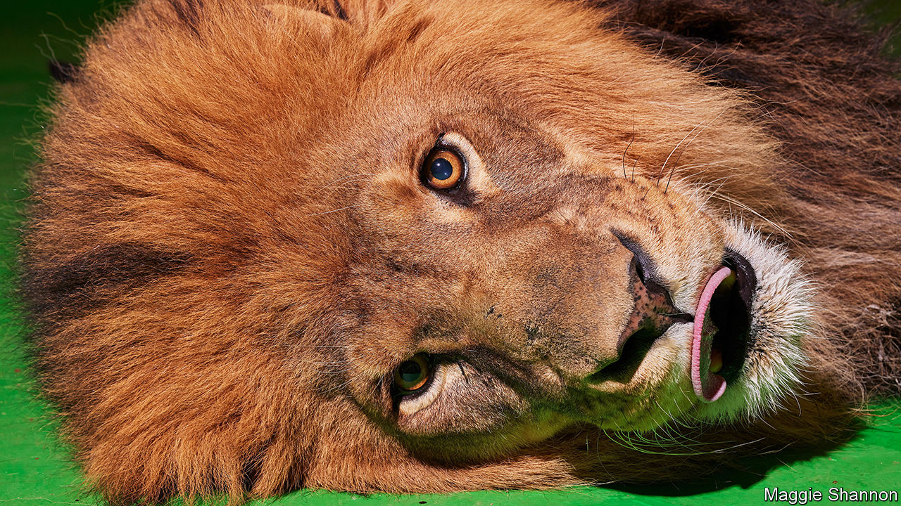
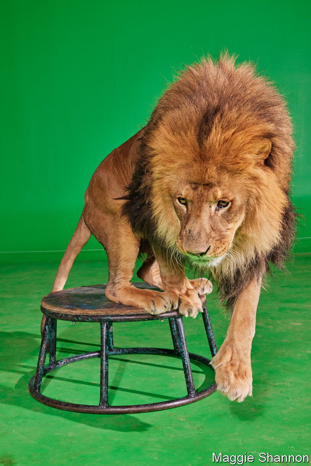
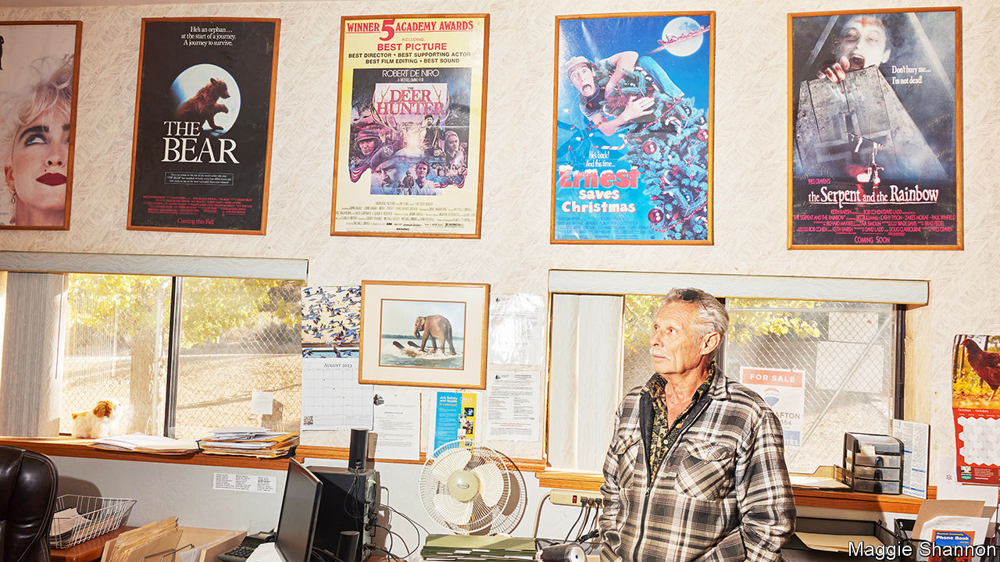

###### Hollywood and AI

# AI is stalking the last lions of Hollywood 

##### The first actors to lose their jobs to artificial intelligence are four-legged 

 

> Dec 20th 2023 

Padding around his spacious ranch in the hills outside Los Angeles, Luke has the swagger of an actor who has made it in Hollywood. After six successful years in the movies he lives in an open-plan home with mountain views, a large swimming pool and staff who bring him steak or smoothies when required. A driver is on hand to take him into the city when he gets a call to shoot an ad or make a paid appearance at an event, for which he commands a fee equal to a week’s pay for a lowlier actor. Luke turns heads like few other artists. His agent’s only complaint is that, given half a chance, he might try to eat his co-stars.

As a 500lb African lion, Luke (pictured) has to deal with challenges not experienced by other actors. But lately, he and his human colleagues have found common cause. America’s screenwriters and actors spent half of 2023 on overlapping strikes. One of the reasons for their bust-up with the studios was the use of artificial intelligence (ai) in film and television production. Writers worry that ai will soon be churning out scripts, while actors fear that, as the technology improves the quality of computer-generated imagery (cgi), they may be replaced by digital stand-ins.

For most human actors that is still a hypothetical worry. But for four-legged screen stars it is already a reality. Work for animal actors is drying up as computer graphics offer an easier—and, some argue, more humane—way to portray creatures on screen. As ai makes those special effects still more realistic and easier to produce, the replacement of real animals with digital ones is accelerating, in television and advertising as well as in high-end movies. As demand for animal actors declines, their owners and trainers are leaving the business. Luke and his colleague, Maasai, who lies snoozing in a nearby enclosure, are the last two working lions in Hollywood.

Rendered in tooth and claw

Ever since a lion appeared on the title card of Goldwyn Studios, later part of mgm, animals have been an essential part of the Tinseltown talent pool. The star who saved Warner Bros from bankruptcy in the 1920s was Rin Tin Tin, a German shepherd who was in more than 20 pictures and was so bankable that producers dubbed him “the mortgage lifter”. From the 1950s an annual Oscars-style awards ceremony, first compered by an actor called Ronald Reagan, gave out gongs to stars such as Flipper the dolphin. In 1993  ranked “the most powerful non-humans in entertainment”, including Moose, a dog-actor in “Frasier” (whose human co-stars were smeared with liver pâté to encourage him to nuzzle them).

Animals with the right skills can still find fame. Steve Martin, Luke the lion’s owner and trainer, has been in the business for more than 50 years, supplying everything from the deer in the “The Deer Hunter” to a pair of skunks named Alice and Cooper. One of the first big roles he landed for Luke was in “A Royal Romance”, a tv movie about Prince Harry and Meghan Markle. Luke played a wild lion in Botswana who, the film implied, may have been Princess Diana reincarnated. Another of Mr Martin’s lions, the late Major, had his paw prints set in Hollywood’s Walk of Fame, during an appearance alongside a nervous Sylvester Stallone to mark mgm’s 90th anniversary.

 


In an enclosure next to Luke and Maasai is Tag, an 11-year-old bear who lumbers over to greet Mr Martin with a lick. For a role in “Action Point”, a film released by Paramount Pictures in 2018, the 1,000lb bear was trained to drink from a beer can. “He never dented one, even,” says Mr Martin, proudly. Earlier this year Tag had to maul a dummy inside a sleeping bag, for an independent movie called “Night of the Grizzly” (Tag is a Kodiak, but he can play a grizzly). Training for that scene took two weeks, and a lot of biscuits. Like any good film star, Tag has become somewhat fussy about his diet, shunning the raw salmon that a bear might eat in the wild in favour of cooked chicken from Walmart.

Such successful animal-acting careers are increasingly rare. Mr Martin once kept 100 or so animals at his 60-acre ranch, looked after by 15 trainers. Now his staff is down to a core of three, and most of the enclosures on the ranch are empty. Other businesses have closed or radically reduced their stock. Trainers are fewer, too. Moorpark College, on the edge of Los Angeles, has supplied animal wranglers to Hollywood through its Exotic Animal Training Management course since 1974. Gary Mui, a faculty instructor, estimates that when he graduated from the programme in 1995, about 70% of his classmates went into the entertainment industry. These days only about 10% of graduates do.

One reason for the industry’s contraction is a growing public sensitivity to animal welfare, a hot topic in Hollywood since animals were first put in front of the camera. Early moviemakers treated animals as disposable props; Westerns used tripwires to make horses fall as if they had been shot. Public outcry greeted a cowboy film, “Jesse James”, in 1939 in which a horse was deliberately driven off a cliff into a lake, where it drowned. The following year the American Humane Society, a charity, began providing its now-famous certification that “No animals were harmed” in the making of productions that passed its on-set inspections.


Animals’ treatment in Hollywood has vastly improved since the days of “Jesse James”. But abuse has not disappeared, and the risk of scandal makes studios nervous. hbo cancelled its racing drama, “Luck”, after three horses died on set (poor ratings may have been another factor; one critic quipped that the animals may have died of boredom). “Gladiator 2”, currently in production, has faced protests for using macaque monkeys and horses. These days many trainers are reluctant to talk about their work; one, who says that animal-rights activists once called a police swat team to his home, insists (amid deafening squawking) that for security reasons he can no longer disclose whether he keeps animals on the premises.

Truly plausible digital stand-ins are now an alternative to real animals for wary studios. For many years, computer-generated creatures were convincing only in limited circumstances. “Jurassic Park” wowed audiences with its special effects in 1993, but used animatronic dinosaurs more than cgi ones. For years after that, computer models struggled to create realistic hair, which animals tend to have a lot of. Furry cgi creatures looked weirdly smooth—“like Gummi Bears”, recalls Mr Mui. Then, in 1998, came Disney’s “Mighty Joe Young”, whose star is a giant ape created from animatronics and cgi. Mr Mui watched it in dismay. “I said, ‘Oh, our days are numbered now’,” he recalls. For the first time, the hair looked good.

As the effects have got better, directors have relied on them more often. Disney has produced a series of live-action remakes of classic animal-based animations, including “The Jungle Book” (2016) and “Dumbo” (2019), in which it has cast real actors in the human roles but created the leading animals on a screen. In its blockbuster remake of “The Lion King” (2019) every creature, from warthog to wildebeest, was computer-generated. Disney is not alone. The star of Universal’s comedy-horror hit in February, “Cocaine Bear”, was a cgi creation. Tag never even got to audition. “They used to call us for stuff like that,” says Mr Martin. “Those guys really pushed us out of business.”

So far the “exotics” have lost the most work. Chimps have not acted in a big American movie since Paramount’s “The Wolf of Wall Street” in 2013. The last elephants are thought to have lumbered out of Hollywood around the same time. Studios are increasingly unwilling to work with big cats, says Mr Martin. “For wild animals, it’s basically finished,” he concludes.

Man’s best avatar

Trainers of smaller stars are wondering how much further the digital trend will go. An hour or so from Luke the lion’s ranch is Studio Animal Services, with an obstacle course in its front yard and multiple dog chews and fly swatters inside. Karin McElhatton, who has trained animals in Hollywood since the 1970s, is the company’s owner—though Rumor, a white Pekin duck, appears to believe that he is its real proprietor, as he waddles in from a swim and preens in front of a fan, filling the room with a cloud of feathers and down.

 


“The business is getting more and more narrow in terms of the animals they want to use,” says Ms McElhatton. She once flew a team of five squirrels, raised from babies, to Hungary for a Kinder chocolate ad, which required them to carry a coin to a vending machine. These days such jobs are nearly always computer-generated, she explains. 

Ms McElhatton’s 35 cats and 25 dogs still find work. Albert, a serene brown tabby on a pink lead, spends most of his time modelling for pet food commercials, though he also scored a recent role in a horror film pretending to devour a corpse. Tank, a German shepherd, is in demand as a sniffer dog on shows like “ncis” and “911” (his trainer, David Meyers, has a Screen Actors Guild card so that he can play the accompanying police officer). Two golden retrievers, Parker and Porter, are often cast as family pets. Two years ago they went to Mexico for a comedy movie called “El Roomie”; they were flown first-class and got their own trailer.


Domestic animals have been somewhat protected against digital competition. Audiences are more familiar with the real thing and thus quicker to spot a fake dog than a fake bear. Animal-rights protesters seem somewhat less bothered by their involvement, too. Yet even man’s best friend is now losing work to digital doppelgangers. “The Call of the Wild”, a Disney movie released in 2020, called in computer animators to create Buck, the St Bernard-Scotch shepherd who co-stars alongside Harrison Ford. Audiences didn’t much like the digital dog; for now, directors still prefer to cast the real thing. Nonetheless, “it was extremely disconcerting for us,” says Ms McElhatton, who was relieved when the movie fizzled at the box office.

Could cgi replace the two-legged animals at the top of the acting food chain? Near Seattle, an unusual team of animal trainers has seen signs that it might. The trainers recently taught a lion cub to climb onto its father’s head, before rolling off his back and onto the ground. Yet the lions in question do not live in a cage, but on a hard drive, and their training is not done with biscuits, but with biomechanical elastic-body solvers and quasi-static integrators.

The digital lion-tamers work for Unity, which creates virtual environments and characters for video games and has dabbled in movies (including 2022’s sequel to “Avatar”). Creating believable animals is still easier than creating realistic humans, says Allan Poore, who moved to Unity after working as an animator at Disney’s Pixar. “We stare at faces and people all day...so we’re going to notice.”

Eyes are hard to get right, and skin can look waxy without elaborate light-diffusion techniques. But creating digital humans is getting easier. The addition of ai to the animator’s toolkit has sped things up, meaning that “rigging” a digital model of a human face (think the wires on a puppet) might take an hour or two, down from a month. “We’ve been on this journey a long time, and I think we’re getting closer and closer,” Mr Poore says. “I’ve seen some stuff [where] it’s hard to tell the difference. And you’ll see more of that.”

Actors are already being “de-aged” for roles which might once have gone to young lookalikes. In “Indiana Jones and the Dial of Destiny”, released in June, the octogenarian Mr Ford was rejuvenated by half a century by animators who used ai to mine footage of the actor in his “Raiders of the Lost Ark” days. Robert DeNiro underwent a similar transformation in Netflix’s “The Irishman” (2019), as did Samuel L. Jackson in Disney’s “Captain Marvel”, released in the same year. Background actors, or extras, fret that they may soon not be needed at all.

What kind of work awaits human stars then? The animals offer a preview of the coming attractions. Some still give performances that are later digitally enhanced. Disney’s live-action remake of “Lady and the Tramp” (2019) mixes footage of real dogs with cgi shots, including animating their mouths to simulate talking (an effect that trainers used to achieve by feeding the dog something chewy before the cameras rolled). Real dogs acted in Warner Bros’ “Birds of Prey” (2020), only to be morphed into a hyena in post-production. American Humane explains that a herd of 100 cgi horses is likely to be modelled on ten real ones.

Others have moved away from feature films to focus on more humdrum work. Social-media influencers, prizing high-impact, low-budget stunts, have become regular employers of exotic animals. Tag the bear has gamely “wrestled” with Logan Paul, a YouTuber, and taken on humans in a hot-dog eating contest organised by Barstool Sports, a blokeish entertainment site. Live events are also fairly safe from ai interlopers. Tag was hired in 2021 to appear at campaign rallies alongside John Cox, a California Republican who called himself “the beast”. Even this kind of work is becoming scarce, however, amid animal-welfare concerns. Mr Martin is being sued by an animal-rights group over Tag’s appearance at the rallies.

Circle of life

Many of Hollywood’s last animal-handlers are now near retirement. “When this generation of trainers kicks the bucket, I don’t know that you’re going to have hardly anything in America,” says Ms McElhatton. 

Animal-rights advocates are delighted. peta, a lobby group, advocates more use of cgi creatures, arguing that “creative people can tell compelling, emotional stories using special effects and without exploiting any real animals.” “I understand some of the motivations of animal-rights people. And they need to understand that we have more in common with them than we don’t,” says Mr Mui sadly. “I want what’s best for animals, but I don’t have an issue with animals working with people as long as it’s done correctly,” he says. But now, “it’s all fading away.”

At Luke’s ranch, a for-sale sign has gone up at the end of the long driveway. Mr Martin, 76, is planning to move to Oregon with his remaining animals. He believes that their absence from the screen will ultimately harm the cause of animal welfare, by removing the audience’s connection to real, living creatures. “These guys are ambassadors for the ones in the wild,” he says. Soon, Luke and Maasai will head north with him in their air-conditioned trailer. And then the only lions left in Hollywood will be digital. ■


