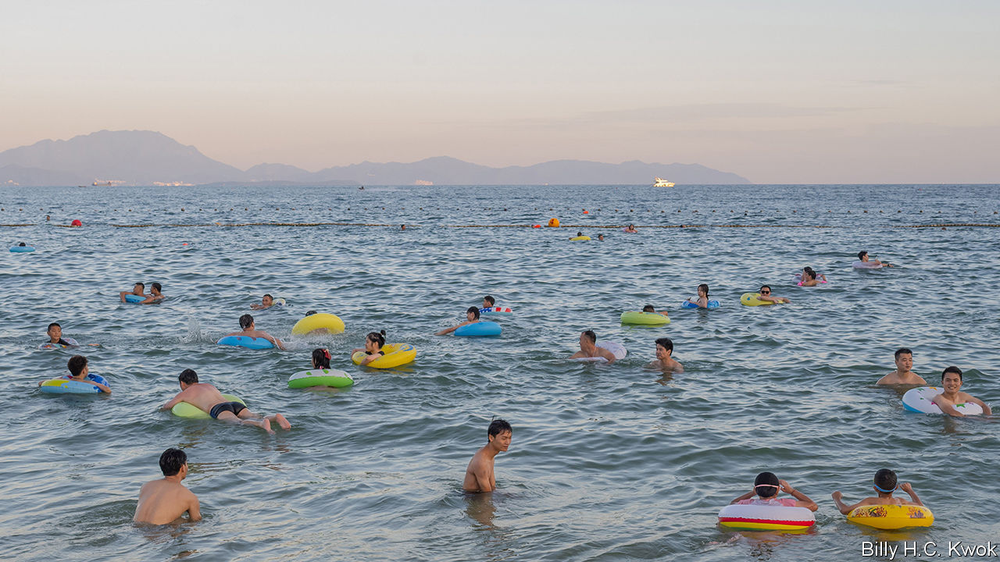
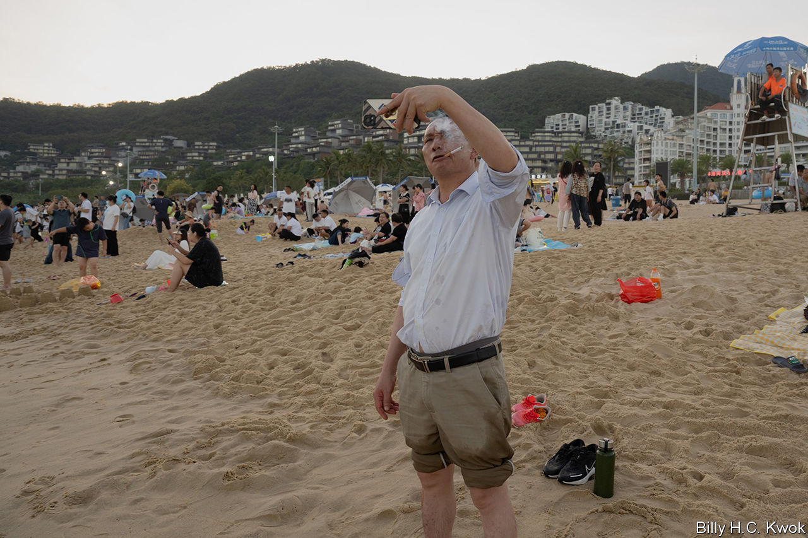
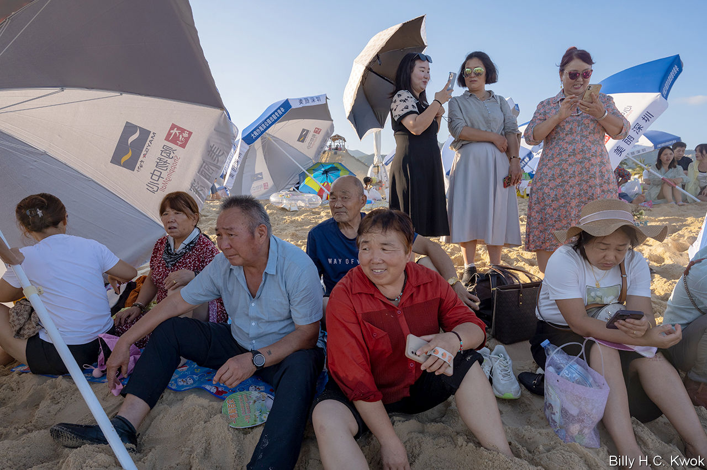
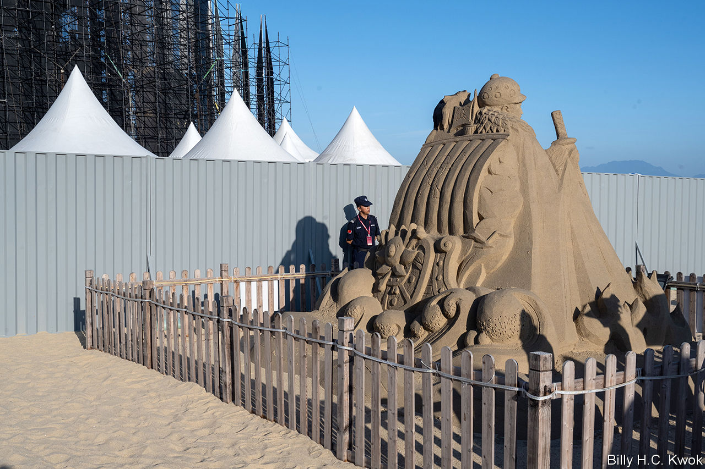

###### Beside the seaside

# Millions of Chinese are venturing to the beach for the first time 

##### China’s beach culture is a microcosm of society 

 

> Dec 20th 2023 

A man with a giant tattoo of a carp jumping over a dragon is making a video of himself standing in the water, a green inflatable ring around his waist. As he films, waves move up the shore and catch the black flip-flops he has left on the sand. He grabs at one, but the water pulls the other out of reach. It is 7am and the competition is on, selfie versus shoe. The sandal floats out into the South China Sea.

On the shoreline nearby, several of the man’s high-school classmates are smoking. Two of them sport matching flowery swimming trunks that they have just bought for 45 yuan ($6). Last week the 18-year-olds drove six hours south to Shenzhen in southern China, a stone’s throw from Hong Kong.

Fortune-hunters from all over the country have tracked a similar path since 1978, when this rural backwater led the way in powering China’s growth. Today, however, the streets of China’s most prosperous city are no longer paved with gold. The economy is struggling. But the tattooed man and his blossom-shorted friends are a different kind of pioneer. Like millions of Chinese, they are making their first trip to the edge of their country—to sample the pleasures of the beach.

Mention of China’s coast is more likely to conjure visions of warships in the South China Sea or Taiwan Strait than sandcastles. But the population’s growing enthusiasm for being beside the seaside also points to the changing relationship between state and society in China over the past 70 years. Tiny pockets of the country’s 18,000km shoreline were first domesticated some 150 years ago, mostly by foreign colonialists, just as European beaches were becoming destinations for pleasure rather than simply medicinal sea-bathing or “taking the air”. In the 1950s Mao Zedong rejected traditional imperial retreats for a summer getaway with top Communist officials at Beidaihe, near Beijing, once frequented by the British. It was from there that the Great Leap Forward was launched in 1958.

Few Chinese had jobs as portable as party bosses, however. In the West the dawn of mass travel saw holidaymakers jetting off to sunny shores at a time when most Chinese were tied to the land or factory. Leaving the city became a punishment for intellectuals in the 1960s, not a sightseeing experience. Even after restrictions on movement eased in the 1980s, urbanites typically used their one annual holiday to return home.

Since then domestic tourism has taken off, boosted by speedy transport links and rising disposable incomes. China’s beach culture was turbocharged by the pandemic, when socialising outdoors became desirable and those accustomed to overseas travel were forced to pursue their foreign-holiday practices at home. Even the party seemed to approve. When “Born to Fly”, China’s answer to “Top Gun”, was released in April 2023, it portrayed the fighter-pilot hero as a steely daredevil. The evidence? His love of surfing.

The little white look

Yi Wangxia—her name means sunset—came to the beach to feel the “force of nature”. The landscape is beautiful at Dameisha, “big plum sand”, says the 26-year-old, then leaps back as the water looms at her crisp white dress. She recently passed a basic swimming test for her maritime-management course but is afraid to go in the ocean. Nor will communing with nature involve eating seafood. Chinese officials have stoked fears about contaminated fish since August, when Japan began releasing treated wastewater from the nuclear plant destroyed by a tsunami 12 years ago.

Those who do brave the water face little danger. Mao swam the Yangzi river in 1966 to demonstrate his physical and political prowess as he launched the Cultural Revolution. Decades on, however, the Chinese remain largely a nation of non-swimmers. Apart from a dedicated troupe of dawn swimmers, most who venture into the sea at Dameisha wear inflatable rings—even the adults—and stay in the shallows. A lifeguard smokes or shouts into a megaphone, less to save lives than to enforce the boundaries of a narrow rectangle of the water given over to swimming. 

Even more glaring is the absence of figure-hugging swimming costumes ubiquitous in the West. Some women wear suits with sleeves and skirts or long shorts. Others sport swimming dresses with reinforced bodices and knee-length skirts. A few enter the water fully clothed. In four days, only one Chinese woman was observed in a regular swimsuit—bright pink with frills—which she had bought for her first beach holiday in 2021.

Wives of Communist leaders at Beidaihe sometimes wore Western-style swimsuits. (Mao and Deng Xiaoping, his successor, were both photographed in trunks but Xi Jinping, China’s leader, eschews bare-chested beach shots.) It was in Shenzhen that the first bikini was worn in public in China in 1986, for an international bodybuilding contest, 40 years after the two-piece debuted in Paris. Why, then, the lack of swimsuits or bikinis today?

“Being dark makes you look ugly and old,” says a 57-year-old Beijinger who wears her cap low and an spf face-covering across her cheeks. To many people pale skin is also a proxy for class, distinguishing toiling farmers from city-types who think their office work and service jobs make them refined. (Europeans held a similar view until the 1920s when a tan became a sign of having leisure time.) Beachside shops cater to such fears, selling cotton sheaths to pull over bare arms, umbrellas for shade, covid masks repurposed as face protectors, and “facekinis”—swimming masks that reveal only the eyes, nose and mouth.

No swimming and no sunbathing. Few picnics; despite an outbreak of “picnic fever” during the pandemic, most mealtime food in China is hot. Little booze and even less canoodling. Sure, some children dig holes and paddle. But at Dameisha a beach-volleyball net and giant swing are largely unused. So why does anyone bother to visit the seaside at all?

 


Ms Li’s antics provide a clue. She and her boyfriend of two years are not at Dameisha to swim (they cannot) or eat oysters (radiation). They wanted to go to the sea because their native Lanzhou in western China is so dry. But mainly because the beach is the perfect spot for photographs.

In a cream mesh dress and floaty veil Ms Li looks as though she is posing for her wedding photos. In fact, she and many others are dressed for the beach: the shoreline is one long photo shoot. Four women have set up a tripod to snap selfies, two in flowing red dresses, two in , a form of Chinese dress, with right arms raised to look as if they are holding up the sea. A woman in her 20s had travelled several hours that morning wearing a purple wig and purple mouse ears to take photos holding an illuminated star with fairy lights draped around her short purple dungarees.

In the 1990s, when few Chinese had their own cameras, photographers with instant cameras would snap visitors at tourist sites. People wanted images not merely of an attraction or landscape, but of themselves in front of the setting. Those rare, precious Polaroids were the forerunners to the smartphone selfies posted online today; both are proof of an individual’s experience. And a new destination must be celebrated with a special outfit. One woman (dressed in ordinary clothes) has brought her cat, Luna, trussed up in a peaked cap with holes for her ears and a lilac bodysuit.

For centuries China’s imperial rulers viewed the country’s shorelines as a buffer against a barbarian world. At times they forbade people from living within 15-25km of it. Today the sands at Dameisha are dominated by giant winged sculptures, commissioned by the city government. Impressive facilities serve the day-tripper—large toilet blocks (which even boast soap, rare in Chinese bathrooms) and showers; the metro will soon connect the seaside to urban Shenzhen. 

Look closer, however, and the party’s presence is more insidious. Day-trippers are not the only ones taking photos. Entry gates capture an image of everyone who enters the beach; no state has more sophisticated face-recognition software than China. Tall towers stand every 120m up the beach with surveillance cameras pointing in all directions. Rather than encourage citizens to trust one another, a sign by a giant shoe rack reminds visitors that the cameras are watching. 

 


 


In many ways this surveilled sandy fringe embodies the social contract that the Communist Party made with the Chinese people after the crackdown on pro-democracy demonstrations in 1989: political loyalty in return for greater personal freedom and affluence.

Anyone is free to come to the Chinese seaside, from the spotty 16-year-olds who dropped out of vocational college to the son of a tech worker who dashes in and out of the water, a giant grin revealing a gap where his front tooth came out at lunchtime while eating a spicy snack. (Or almost anyone—next to the free public beach is a private one, plus yacht club: “Shenzhen has many bosses,” says a staff member.) 

The beach party

Even under the party’s watchful gaze, there are signs that the social contract is beginning to fray. Political loyalty is no longer guaranteed. Few people mention Mr Xi’s name at the seaside but his policies are ripe for discussion. A construction worker came for a dip because he can no longer find work now the property sector is floundering. A 20-something is feeling the pain of urban youth unemployment: he sells fingers of bright pink, processed sausage for three yuan apiece, cooked on a hotplate mounted on his three-wheeled bicycle. Often he makes just 100 yuan a day. A beach cleaner abandoned life as a subsistence farmer four years ago and now works seven days a week, living in a dorm for 300 yuan a month, aged 50. “It’s tough, but what can you do?” 


Not everyone is getting richer or thinks that life is getting better. People still bemoan the long lockdowns in the late days of the government’s “zero-covid” policy. A woman whose tutoring firm had to shut when the government banned extra-curricular classes in 2021 is now applying for postgraduate degrees in Hong Kong—she wants a “better education” for her five-year-old. (Her husband, also a tutor, is trying his luck as an influencer-come-English teacher on Douyin, China’s TikTok.) A government worker from Inner Mongolia had to hand in her passport during the pandemic, as did most state employees, and must now apply to the authorities if she wants to go abroad.

As the light dims after 5pm, the state comes to the rescue again: bright floodlights flash on, extending the day’s joy. Even when it is wholly dark, children build castles and race toy diggers. A couple walks in the water, shin deep. A family unfolds a table and chairs to eat a kfc dinner. The social contract is safe—for now. And more brave folk step out into the South China Sea. ■


