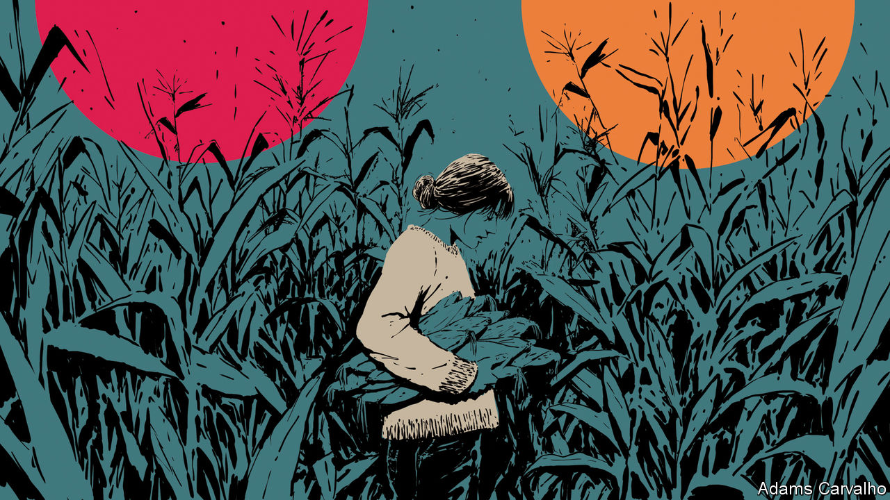
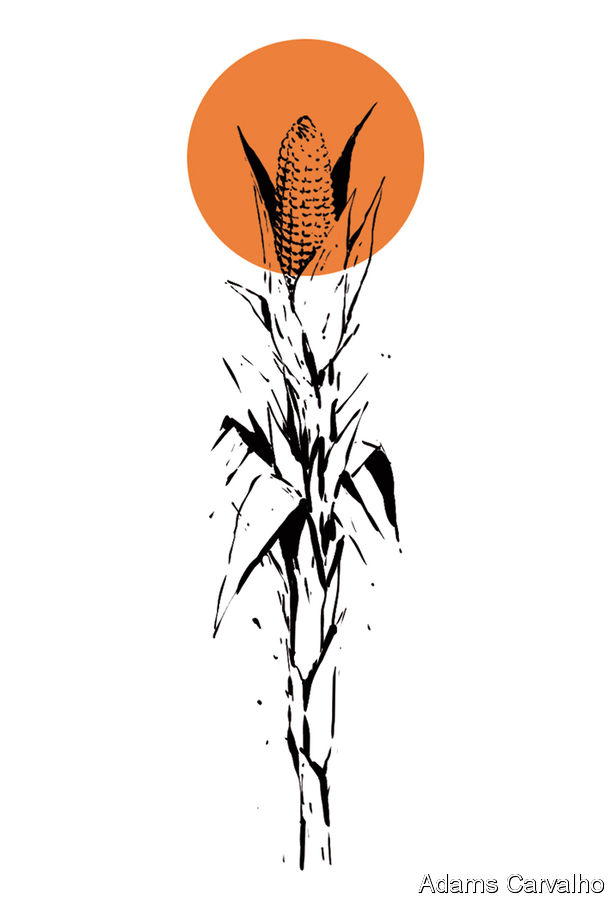

###### Cereal killer

# The life-giving, death-dealing power of corn 

##### Maize fed ancient civilisations, then wiped out 100,000 American Southerners. What went wrong? 

 

> Dec 20th 2023 

A plain wooden house in a sea of cotton. A gaunt woman is sat at the kitchen table, mouth parched, insides burning. She is dying. Across her face a rash has spread from her nose to her ears, a red butterfly resting its giant wings against her cheeks. She is used to its return, for three springs since 1903. By summer it took off, took with it the terrible thirst and the pain.

Not this time. Next comes the delirium. Her children stare at her wide-eyed; her husband takes her to the asylum. Two weeks and she is dead. And yet, as he will tell anyone who listens, they’d never gone hungry: home-baked cornbread and fatback, johnnycakes with molasses, and always plenty of grits.

Pellagra was first seen in southern Europe, in the mid-1700s. Its cause and cure were still unknown when it showed up in the American state of Georgia in 1902. A decade later the disease had become a “national calamity”, said the surgeon-general. It was South Carolina’s second-biggest killer after tuberculosis.

Its first symptom was a symmetrical rash—on both hands and feet, and joining below the collarbone like a necklace. It caused stomach pain and vomiting, then confusion and delusions. These were known as the “4Ds” (dermatitis, diarrhoea, dementia and death). Some victims killed themselves at the first D.

Cases of pellagra peaked in 1928, by which time it had sickened more than 3m Southerners. Some doctors thought it was carried by flies. Others, noting that pellagrins were mostly peasants, blamed poor hygiene. In 1913 South Carolina concluded that it was an intestinal disease circulating in outhouses.

A few observed that pellagra was common in places where corn was a staple. Italian peasants ate lots of polenta and American Southerners ate grits—not to mention cornbread, cornpone, hushpuppies, hasty pudding and spoonbread, all made from cornmeal. What if some of this meal harboured a tiny toxic organism?

The corn theory gripped the public. “If you fear pellagra, beware of corn”, warned the  in 1909. Yet the theory didn’t fully make sense. Why did only some members of a family fall ill? And why was pellagra only now an epidemic, when Southerners had been eating corn for centuries?

In 1914 the surgeon-general put his best infectious-disease specialist on the case and sent him south: Joseph Goldberger, a New Yorker who began his career examining immigrants. In the Public Health Service he studied malaria, typhus, measles, dengue and yellow fever (and caught at least three of them himself).

Goldberger saw that pellagra was nothing like the diseases he had spent his life battling. From a mental hospital in Mississippi that was filled with pellagrins, he reported that not a single case had developed in the staff. As he spent time in milltowns and orphanages, he observed that Southerners subsisted on the “3Ms”—cornmeal, fatty meat and molasses—in winter and spring. Rates of pellagra shot up in those months, then fell again when the first vegetables became ready. They were also higher in women than men. He observed that families routinely fed children and men the protein-rich tidbits; mothers ate the leftovers.

Goldberger was convinced the disease was a “fault of nutrition”—that something essential was lacking. It seemed to be in milk and vegetables. In a series of tests, he modified diets to show pellagra could be prevented or induced (prisoners who took part were promised $5 and their freedom).

The idea of a deficiency was new. Though citrus fruit had long been known to cure scurvy, vitamin C was not identified until the 1930s; limes were viewed as an antidote to noxious air on ships. Goldberger was inspired by the discovery that rice husks cured beriberi, which afflicted those who ate lots of polished white rice. Only years later was a vitamin found in husks and named B1.

B3, or niacin, was identified as pellagra’s cure in 1937. It helps the body turn food into energy and make new DNA. Sweet potatoes and peas have it, protecting Southerners in summer and autumn; milk contains an amino acid that produces it. In 1941 America’s Food and Drug Administration set standards for fortifying food with vitamin B3. By 1950 America eradicated pellagra by manufacturing a food additive on an industrial scale. But there had always been another way.

800 kernels of truth

Corn gave life to humans—twice. The Maya gods made people out of corn dough. And corn gave birth to Mesoamerican civilisations like the Maya. By 2000BC it made up over half of their diet, the earliest evidence of its use as a staple grain. Today corn provides one fifth of human calorific intake, mostly as cornmeal. No country grows or consumes more than America.

Humans gave life to corn, too. Over 8,000 years ago in Mexico, a passer-by chewed on a sweet wild grass called teosinte and, liking it, shared it with others. Over time they changed its genetic make-up, by selecting for the development of milky seeds. Corn cannot self-pollinate. It depends on humans for its survival: only they can free and plant the seeds trapped in its husk.

 


Few plants hold so much fat, sugar and carbohydrates. An acre of corn yields 15m calories to rice’s 11m and wheat’s 4m. But drawing nutrition from corn required wizardry. Nixtamalisation involves cooking kernels with an alkali—often wood ash or limestone. The high pH dissolves the kernels’ tough skin, making them easier to grind by hand. It also boosts the body’s ability to absorb calcium, copper and zinc. Crucially, it unlocks vast stores of niacin.

Rely on untreated cornmeal for half of your calories, and pellagra may kill you. But eat nixtamalised corn in the same quantity, and you can thrive. The chemistry may be the closest the world gets to an elixir, by transforming an innutritious food into one that is ultra-nutritious.

European colonists saw tribes soak kernels with ash. They dismissed this as a curious ritual. They had no taste for the earthy, bitter aroma of nixtamalised corn, says Rachel Briggs of the University of North Carolina at Chapel Hill (UNC). In the mid-1800s officials seized tribal lands and forced tens of thousands of Native Americans west. Many died. But women sewed seeds into the hems of their skirts and nixtamalisation survived. When pellagra showed up on their ancestral lands, few Native Americans fell ill with it.

In 1901 the Beall Improvement Company extended the shelf life of ground corn by removing its germ—the reserve of all its niacin. Midwestern millers could ship their cornmeal to the South, whose poor relied on its calories. Machines have since dissected corn kernels into their tiniest parts—protein, fibre, starch, germ—to refine them into additives that sweeten and stabilise ultra-processed food. Calorie-rich, nutrient-poor.


In 2004 Barry Popkin, a nutrition epidemiologist at UNC, suggested a link between rising obesity and high-fructose corn syrup, a sugar alternative used in ultra-processed food. Today less than 5% of the corn America grows is eaten on the cob, from the can, as popcorn or cornmeal (most goes into cattle feed and biofuel). Yet corn is central to American diets. It shows up in 4,000 products in the average grocery store, as dextrose, lecithin, sorbitol and xanthan gum. Test almost any strand of American hair for a form of carbon found only in corn, and you will find that a majority of the carbon in that person’s body is corn.

The American idea of corn has been reduced to a genetically engineered ear of around 800 yellow kernels in 16 rows. So some farmers, millers and chefs are reviving “heirloom” corn, strains that have been preserved over decades for their flavour. They can produce white, blue, green, pink or many-coloured corn.

Among them is dazzling Jimmy Red, whose high sugar content once made it a favourite of hooch-brewers. It was thought extinct until some was found growing at the home of a former moonshiner. High Wire Distilling in Charleston, South Carolina, now makes a bourbon from it. Look for notes of maple and cinnamon, says its head distiller. Millers of stone-ground grits—which retain the germ and its aromatic oil—pride themselves on preserving flavour lost in industrial processing. Corn connoisseurs speak of terroir.

Elsewhere, Native American tribes are searching for their lost ancestral seeds. Some varieties of corn are bound to a location and associated with a tribe: Cherokee White Eagle corn or Hopi Blue, for instance. The Catawba Nation, a tribe in South Carolina that has lived in the area for 6,000 years, is growing its rainbow-coloured corn for the first time in generations. The kernels were found at a local agricultural agency, where they had been since the 1800s.

None of the 1,000 Catawba living on the reservation knew how to nixtamalise anymore. So for their first batch last year the nation called on a Mohawk chef in the region. Dave Smoke McCluskey roasts his kernels to recreate the effect of smoke-filled longhouses, where braided corn would hang from the rafters. “I’m chasing a memory of Native food,” he says. Harder to remember, even for those alive then, was a time around a century ago when corn had been their talisman. For there was nothing remarkable in that; corn had always been there, somehow granting life from the finality of ash. ■


