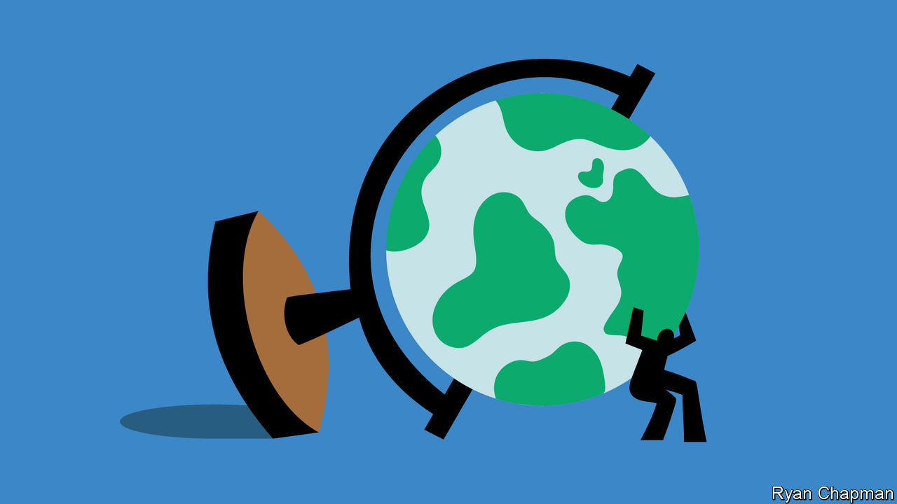
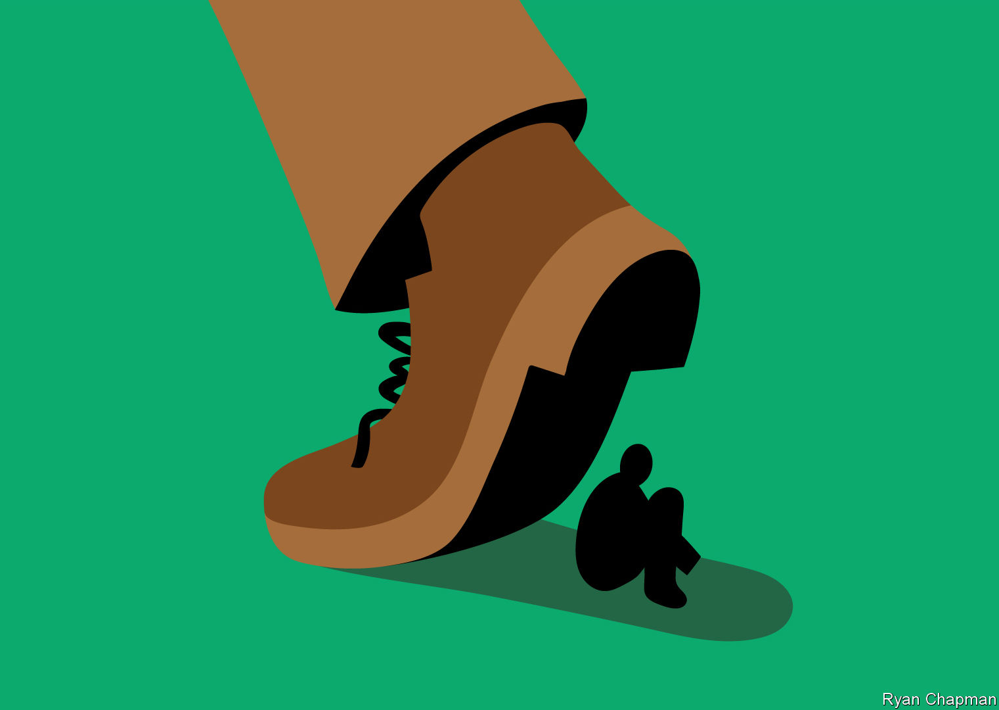

###### The green man’s burden

# What responsibilities do individuals have to stop climate change? 

##### The nature of climate change makes that a tricky question 

 

> Dec 20th 2023 

The vast majority of readers of  would recoil at the idea of stealing from a poor Malian goatherd or a struggling Bangladeshi farmer. Next to none would countenance murdering such a person. They would feel little differently if they committed these crimes as part of a mob, rendering the responsibility diffuse. Nor would they feel much better if their actions were only likely, but not certain, to do blameless strangers serious harm: they would not scatter landmines in a populated area, for instance. 

How, then, should we think about readers’ (and your correspondent’s) responsibility for global warming? Almost every human activity involves some emissions of greenhouse gases. Global warming is already harming the livelihoods of many people, including lots of poverty-stricken goatherds and farmers. At the extremes, the increasing frequency and intensity of droughts, floods, storms and heatwaves brought on by global warming is killing people—a tragedy that will get worse as the planet bakes. Are rich Western consumers thus conniving in theft and murder?

Many would dismiss such a question as hyperbole. How much harm is any one person doing through their planet-cooking ways? How could you even answer that question, given that the precise impact of any given wisp of greenhouse gas is unknowable? 


Yet the relationship between carbon emissions in aggregate and extreme weather is strong. And during the course of their lives, wealthy Western consumers generate a lot of emissions. Estimates of the damage done vary widely, but none concludes it is insignificant. In 2011 John Nolt, a philosopher at the University of Tennessee, estimated that a typical American, born in 1960, would be responsible for enough greenhouse-gas emissions over his or her lifetime to cause between one and two deaths. John Broome, another philosopher, thinks the typical Westerner shortens a human life by six months. Either way, it is a grim thought. And that is only the average. Drive a gas-guzzling car, heat or cool a big house or fly a lot (ahem, readers of  ) and your rap sheet gets worse.

Is it too much to ask individuals to do their part to mitigate these harms? That doing so will impose a heavy burden on some does not let them off the hook. That is true regardless of your underlying moral theory. Schools of philosophy that focus on outcomes, such as utilitarianism, make big demands on the individual for the greater good. Even theories that frame morality in terms of individual rights, including many kinds of liberalism, still entail a duty not to harm others without reason. 

Plenty of people feel a moral obligation to curb their own emissions of greenhouse gases. Take Grahame Buss, a retired British engineer, who thinks climate change means that the world is headed towards economic collapse and war. His response has been to reduce his own carbon footprint dramatically. He keeps his house so cold in winter—to minimise emissions from heating—that guests ask what is wrong with his boiler. He consumes only a couple of kilograms of meat a year, he reckons, and no beef at all.

How far should someone worried about the climate take such self-denial? There is no obvious answer. Mr Buss stopped taking flights three years ago, even though his son lived in Brazil at the time. But his wife refused to forswear visits to their offspring, despite the emissions. Mr Buss also decided that he should not drive cars that run on fossil fuels. But he has not just stopped using his two polluting cars; he is paying to have them crushed so that no one else can.

Mr Broome has argued that, since all emissions are sure—or at least very likely—to hurt some people in some form over the thousands of years they linger in the atmosphere, we have a duty either not to cause those emissions or to compensate the victims. (He considers activity to reduce others’ emissions or to remove carbon from the atmosphere—offsets, in the jargon—a suitable form of compensation.)

This logic can be taken even further. Some people decide not to have children—a question itself of great debate among climate activists. Early in 2023 a Belgian man in his 30s with two children was reported to have taken his own life after a long discussion with a chatbot about how best to curb global warming. 

Such horrors are rare. But they hint at the high standards the most ferocious forms of carbon abstinence place on individuals in the rich world. No living person can eliminate all their emissions, and even the dead decompose. What volume of emissions, then, may an individual reasonably inflict on the planet?

Attempts to answer that question empirically inevitably involve some arbitrary assumptions. The first concerns how much greenhouse gas the planet can bear. Harm occurs at any level. The effects of global warming are already fairly awful, and so producing any more emissions at all would be foolhardy. The increase in global temperatures above the pre-industrial average reached almost 1.5°C in 2023—a threshold once thought of as the maximum acceptable rise. The Paris agreement calls for the rise to be kept “well below 2°C”.

A further set of assumptions is required to estimate the volume of emissions that would lift global temperatures by that much. That is not straightforward. Most climate scientists think that by 2070 humans can pump only 1trn tonnes more carbon dioxide into the atmosphere if Earth is to stay below the 2°C target. Divide the trillion by the number of years between now and then and by the number of people on the planet and you end up with a volume of emissions—2 tonnes or so—that an individual can generate each year without pushing the planet towards perdition. 

Divide the emissions generated in America each year by the number of Americans, and you get around 15 tonnes per person. Even virtuous Sweden is 3.6. And Americans and Swedes bear some responsibility for China’s 8 tonnes a head, given how many Chinese-made goods they buy. Only poor countries meet the threshold. The global average is 4.7 tonnes. One long-haul flight in a year leaves you no “carbon budget” for heating, eating, driving—or flying home.

What does it mean to share the costs of reducing these emissions fairly? You might say that the rich, being rich, can better afford the extra expense of electric cars and heat pumps, so should have smaller budgets. However, plenty of people in rich countries, although well-off by the standards of Mali or Laos, cannot afford to trade in their gas-guzzling car for an electric one, or to replace their inefficient boiler.

How green was my basket?

Part of the problem with the notion of carbon budgets is that individuals cannot fully control the volume of emissions they cause. In most societies it is hard to participate in everyday life without joining in some carbon-belching activities. Where public transport is bad, it is difficult not to drive. Most individual customers cannot pick whether they want their electricity generated using wind or coal. And given that few supermarkets systematically distinguish between carbon-intensive and climate-friendly products, it is hard to know what is best to buy. Even if painstaking research might reveal the least damaging choice, it is not reasonable to expect a single mother working two jobs, say, to spend hours pondering the optimal course for the climate for every purchase. Nor is it fair to hold her responsible for the social structures that leave her with little practical choice but to cause emissions.

What is more, argues Julia Nefsky of the University of Toronto, talk of budgets makes sense only within an overarching regulatory system. Every individual should definitely do their bit, but making detailed prescriptions about how big that bit must be and what shape it should take is the job of governments. That is in part because it is a political decision, like designing a tax code. Ideas about distributive justice may inform the design, but cannot determine the rates.

Some ethicists go further, and argue that  governments have a responsibility to fight climate change, and that individuals should feel no obligation to curb their emissions beyond the burdens that governments impose on them. Walter Sinnott-Armstrong of Duke University maintains that those who condemn racing around in an suv are confused about the nature of climate change. Each tiny emission of greenhouse gases does not have a tiny effect, he argues, trillions of which can be aggregated into a giant effect. Instead, tiny emissions of greenhouse gases themselves have no clear effect. The carbon-dioxide molecules involved may disperse in such a way that they do not stop any heat from escaping the atmosphere. They may get caught up in other biochemical processes and not linger in the atmosphere. It is only society-wide, aggregated emissions that clearly harm the planet, he says; the whole is more than the sum of its parts. 

Mr Sinnott-Armstrong does not deny that individuals have moral duties regarding climate, in particular to press their leaders to tackle the problem. The idea that lobbying governments to change the rules is an individual’s main duty when it comes to climate change is widespread among climate activists. If social and economic structures make it hard for people to reduce their emissions, they argue, it makes sense to focus on changing those structures.

Mr Buss, the engineer-turned-car-crusher, thinks along these lines, despite his hair-shirted lifestyle. He is wary of appearing preachy, and argues that, whereas pushing governments to restrict emissions much more severely is a matter of the utmost urgency, his own efforts are a question of personal conscience. He used to work as an engineer for Shell, developing alternative fuels, among other things. Having tried to bring about change from within, he has concluded that businesses and politicians are moving too slowly, and that the painless transition to a low-carbon world they seek is no longer possible, if it ever was.

 


Mr Buss became an activist in Just Stop Oil, a green pressure group, a couple of years ago, joining protests that blocked roads and impeded traffic. This helps to reframe the political debate, he thinks, by making milder environmentalists seem middle-of-the-road. Without such protests, he argues, the government would not have enshrined in law the goal of reaching net-zero emissions by 2050.

Focusing on activism rather than abstinence, however, still raises the same question: exactly how demanding are individuals’ obligations in preventing climate change? Mr Buss has carried his convictions quite far: he was arrested at a protest in 2019 in London for obstructing a public highway. But, as he points out, he was rapidly released without charge. Other climate activists have been tried and, in a few cases, jailed for disruptive protests. What is more, he has relatively little to lose. He is retired, so he cannot jeopardise his career. And he has a good pension to fall back on.


The same is not true of Ali Rowe, a former mental-health nurse with Britain’s National Health Service who is now an activist in Extinction Rebellion, another pressure group. In 2022 she was one of eight women arrested at a protest at the main office in London of JPMorgan Chase, a bank that finances the extraction of lots of oil and gas. The protesters put stickers on some of the building’s windows that read “In case of climate emergency, break glass”. They then broke the windows. She was charged with criminal damage and is to be tried in June. If convicted, she could be jailed for up to four years. She has burned through her savings and gone into debt preparing her defence.

As Ms Rowe sees it, global warming directly threatens the health—and sometimes lives—of young people, and not just in faraway places. As Britain gets more humid, she says by way of an example, mould will become more common. Exposure to certain types can harm or even kill children with respiratory ailments. The number afflicted in this way is bound to rise, she argues, as the planet heats up. Having taken an oath to protect life, she considers it her responsibility to do whatever she can to prevent such outcomes.

But most consumers in the rich world regularly demonstrate that they are not ready even to forgo flights, meat or petrol-fuelled cars, let alone to risk their career or freedom, to stop the planet heating up. So some activists focus instead on persuading people that green behaviour need not mean total upheaval. 

Little green men

Jesper Lund lives in a green community called Permatopia about an hour’s train-ride from Copenhagen. The houses are all hyper-insulated. A windmill powers a heat pump, providing hot water and heating with negligible emissions. There is a natural sewage-treatment facility, and all the houses have toilets that separate urine and faeces, the better to use both as fertiliser. The community grows much of its food, which is cultivated in ways that minimise harm to the atmosphere. 

All this, Mr Lund explains, has enabled residents to slash their carbon footprints. But the community is not doctrinaire or conformist. Plenty of residents commute to work in Copenhagen in cars, not all electric. Some fly away on foreign holidays. The communal canteen (which residents are under no obligation to use) serves fish on Thursdays and meat on Fridays.

The question of just how green residents should be caused great upheaval in the early years of the community. Some saw no problem driving gas-guzzlers; others thought only electric cars should be allowed. In the end, the most extreme carbon misers and spendthrifts moved away, leaving those who wanted to be green “without living in a hole in the ground”. 

In fact, Permatopia was always designed to set a plausible, replicable example of green living to the world. Almost half the houses are reserved for those paying rent, to make joining the community less of a financial commitment. Adult residents are required to provide only two hours’ labour a week to the various communal endeavours. Visitors are often amazed to discover how normal it all seems, Mr Lund says. But that is the idea: what better service can you do the environment than to show that it is possible “to live a good life without damaging the globe too much”? ■


