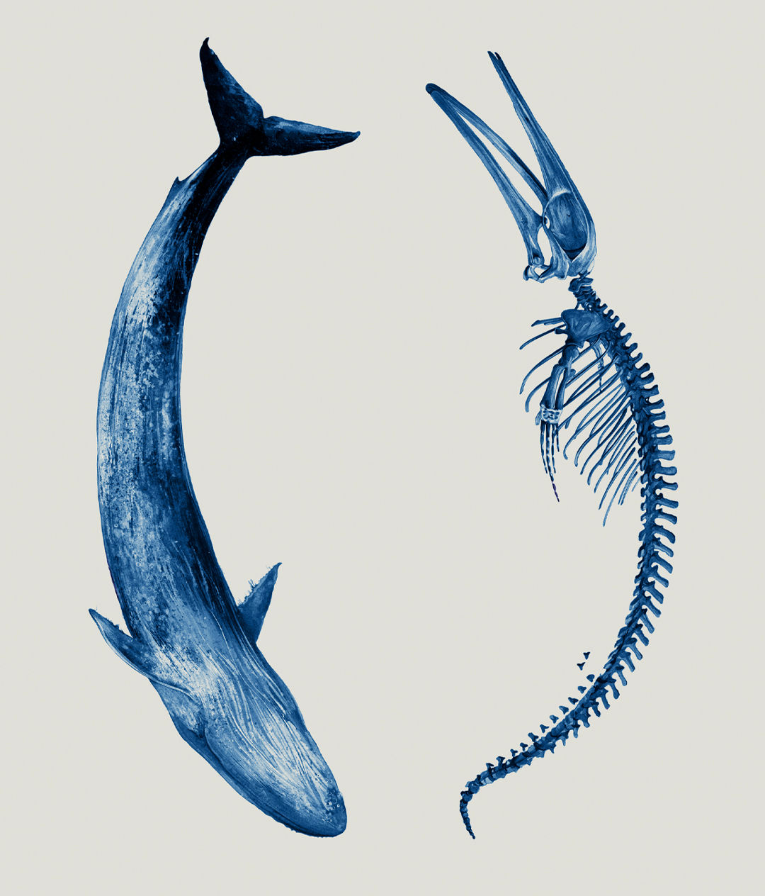
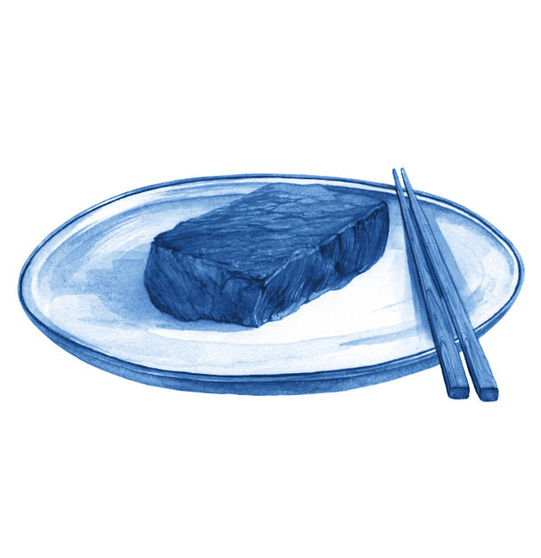
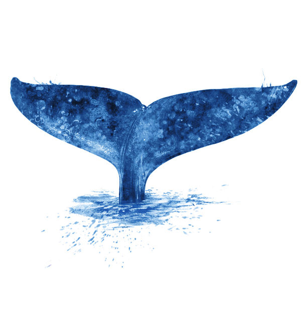

###### The price of a whale

# Where capitalism and conservation meet 

##### Can you put a price on the wonders of nature? 

 

> Dec 20th 2023 

Spurn point would be a desolate place to die. Stretching five precarious kilometres into the North Sea, the constantly shifting finger of East Yorkshire coast is little more than a narrow sand bank held together by sea grass, the only obvious signs of human habitation a long-abandoned lifeboat station and lighthouse, both now given over to the winds and the rain. It is a permanent home solely to wading birds and the bugs they feast on, perhaps to the odd vole. But it is also, on occasion, the death bed of the world’s largest creatures. Beached on its sand, they suffocate from the weight of their own bodies under its open skies. 

In England whales, sturgeon and porpoises are “royal fish”. Those caught off the coast are property of the Crown; so, in general, are those beached on the shore. Those which expire on Spurn Point, though, are an exception. The wonderfully named Lords Paramount of the Seigniory of Holderness, a line of local nobles, have first dibs on them. This has sometimes been lucrative. When, in 1749, a sperm whale expired on its sands the then lord sold it to David Bridges of Kingston-upon-Hull, the closest city, for £90 (£16,000, or $20,000 in today’s money). But sometimes it was not. The estate’s records show that when it chose to dispose of a whale on its own the following year it cost £7 more to cut the beast up than the sale of the meat made at market, valuing the whale’s remains as a liability worth £1,276 today. 

In the 18th century, then, the value of a whale was a matter, albeit an uncertain one, of material trade: what would the parts bring at market. Today things are more complicated. In 2019, Ralph Chami of the International Monetary Fund, calculated that a great whale was worth about $2m to the global economy; from that he went on to value the world stock of great whales at around $1trn, or roughly the market capitalisation of Amazon, an online retailer. 

Mr Chami’s approach sits within the “natural capital” paradigm of environmental economics, in which components of the biosphere are treated as assets to be valued. The fair value of a stock or bond is based on its monetary returns—the dividends a shareholder receives or the coupon payments a bondholder gets—appropriately discounted for the time it takes those returns to materialise. The value of a piece of natural capital follows the same logic. The “ecosystem services” provided by the relevant bit of the environment just by dint of its continued, unharmed, existence are treated as the returns which it generates; an estimate of the monetary worth of those services gives it its value. In 2011 Robert Costanza, an economist, put an annual value of $125trn on all of these ecosystem services, compared with a yearly global gross domestic product of $75trn. By this logic the natural world is humankind’s greatest asset. 

For some the idea of putting a price on the wonders of the natural world sits somewhere on the borders of the cynical and the sacrilegious. On top of its apparent impiety, it is held to be a form of academic imperialism, yet another example of economists’ endless desire to bring more of the world into their territory. When Adrienne Buller, a dissident economist, published a critique of the way “green capitalism” seeks to financialise every aspect of the world, she could find no better emblem of such excess than Mr Chami’s research, and so she chose to title her book “The Value of a Whale”. Her point is that whatever that value is, it is not one reducible to dollars and cents.

To some extent, Mr Chami agrees; but he has a compelling defence. Now having set up his own consultancy, he says that he wanted to help preserve whales not by telling a story about their intrinsic beauty but about the service they render to the world by moving carbon which was recently in the atmosphere into the ocean depths. And there is only one way to communicate such value. “If I had said that without putting a dollar amount no one would listen,” he says. 

Through most of modern history the idea that the value of a whale was not discoverable through its market price would have seemed silly, at least to anyone operating in that commercial market. But for three centuries whales have occupied a peculiar point where economics and the environment meet, their fortunes tracing the changing relationship between the two. In the 19th century a drop in the demand for whale-based products worked to the whales’ benefit. In the 20th century, though, the supply of whale-based products became much cheaper and demand returned redoubled. Whales became increasingly endangered until societies newly focused on the environmental costs of affluence imposed a worldwide whaling ban. That made them literally priceless. 

In the 21st century they are once again being talked of as things with value by economists versed in the lexicon of natural capital, public goods, ecosystem services and the like. These new valuations lack the precision offered by a Hull trader’s willingness to buy, or the market price for a barrel of whale oil printed in a newspaper. But their vagaries have a good excuse. They seek to value not just the whale’s body, but its living presence. This means the price of a whale has become, like the creature itself, a slippery, barely seen thing, showing its flukes to those straining to see it before disappearing once again. More imprecise than economists would wish; but better than the certainties of the flensing deck and the butcher’s slab.

In 1861 , a magazine, published a cartoon showing sperm whales in black tie and ball gowns raising their champagne glasses in celebration and relief. It was, the caption informed readers, “The Grand Ball given by the Whales in honour of the discovery of the Oil Wells in Pennsylvania”. The oil rush which started in Titusville, Pennsylvania in 1859 had produced a new commodity that would reilluminate America. Light would no longer come from burning whale oil but from kerosene gushing out of the ground. Thanks to this substitution of fossil-fuel energy for biomass, the whale would be left at peace. 

Those employed in the American whaling fleet, sailing predominantly out of New Bedford in Massachusetts, were less moved to celebration. Oil had been their main product; baleen for corsets, ambergris for parfumiers and other ancillaries could not support the industry. From a peak of 137 whaling voyages in 1851, the year in which Herman Melville’s “Moby Dick” was published, the number dwindled to around a dozen a year by the turn of the 20th century. Whale oil prices halved from £32 a barrel in 1874, when the data series starts, to £16 in 1887. In a piece which draws a parallel between the economic and strategic importance of the historical whaling industry and the oil industry, Charlotte Epstein, a political philosopher, notes that “Whale oil constitutes the only form of energy that our societies both centrally depended upon and turned away from completely.” 

That final turn, though, was still a few twists away. Whales of the 20th century would have cause to look back on their forebears in  swilling champagne under a banner saying “Oil’s well that ends well” with bitter irony. Yes, fossil fuels initially made whale oil less valuable. But before long they would also make whale hunting much cheaper. Fossil fuels allowed Norwegian and British steamships to chase them into the waters around Antarctica, which Melville had called the whales’ “polar citadel”. Explosive harpoons, made possible by the fossil-fuel-driven growth in explosives, made whale hunting easier and also, worst of ironies, more important for nations going to war, as whales were an excellent source of the glycerine used in nitroglycerine. 


These new hunting technologies made the great whales a source of fat cheap enough to be used as pet food, a treatment for trench foot and, overwhelmingly, spread on bread. By 1935 roughly 84% of the world’s whale oil was being turned into margarine, at a price per barrel of £15 or so. With up to 120 barrels of oil in a typical blue whale’s blubber, the largest animal to have ever lived had a market value of about £1,800 ($130,000 or so in 2023). 

Whales are, in principle, a renewable resource. But the rate at which they renew themselves is fairly slow. Blue whales have calves every two or three years. It takes those calves a couple of decades to get to their full size. This meant that as sales increased, stocks diminished, a change which first became a matter of official concern in their breached citadel: the Antarctic waters administered from Britain’s South Atlantic colonies. 

In 1911, Sir William Allardyce, governor of the Falkland Islands Dependencies, began to worry that the rapid expansion of this Southern Ocean whaling risked becoming unsustainable. The whales were, to all extents and purposes, free to whoever could catch them; the government required only that the whalers pay for a whaling licence—£25—and a royalty on each whale caught—£10 for a right whale (so called because they were the right whales to go after), ten shillings for a sperm whale and five shillings for any other whale. Such fees were less than 1% of the whalers’ profits. 

Had Allardyce been a modern economist he would have raised the prices. Instead he limited the number of licences he was willing to issue. He also communicated his concerns to London. As a result the British Colonial Office developed an interest in cetology. The levies on whale hunting were used to fund Antarctic research voyages on board the refitted , once the ship of polar explorer Robert Falcon Scott. Her complement of scientists took note of the abundance of nutrients in the waters around the islands, their currents and temperatures, the types of phytoplankton (which photosynthesise, like plants) and zooplankton (which eat the phytoplankton) which they were home to, the volume of krill (crustaceans that eat plankton of all sorts) and the populations of whales (most of which eat the krill). To track the whales’ movements they fired on them with harpoons which left stainless steel darts buried under their blubber; whalers were paid £1 for every dart they recovered. 

The  expeditions showed an appreciation that measuring the true wealth of nations requires ecologists as well as economists: a well-run country needs to know about the natural assets on which its prosperity ultimately depends. They did not call it “natural-capital accounting”, but armed with the expeditions’ data the Colonial Office saw the need to protect the future of the country’s assets. It pressed for restrictions on catches, including limits on the hunting season, and prohibitions on the hunting of juveniles. 

Attempts at spreading such regulations internationally, however, were thwarted by politics, economics and technology. When, in 1927, the recently formed League of Nations proposed an international conference on whaling, various countries objected that such issues should properly be bilateral, not global. There were economic objections, too: when it decided not to hold the conference, the league said it was because the market had no need of such regulation: “If hunting becomes unprofitable it will stop by itself, long before whales are exterminated.”

Technology, meanwhile, was helping the industry escape almost all regulation. In Allardyce’s day whales killed at sea still had to be processed on land, or at least at a near-shore “floating factory”, allowing some oversight. The advent of the factory ship allowed whalers to do all that they needed to do on the high seas, and thereby pay nothing for their catches. Overexploitation continued: whale numbers fell further. Writing in 1933, Harold Salvesen, scion of a whaling family but also, in the 1920s, an economist at the University of Oxford, explained why the simple nostrums that had apparently satisfied the League of Nations did not work. “The reason is quite simple”, he wrote. “Whaling companies never have property in the whales they hunt; if one company spares them not the whales but another company will profit from it.”

It was the needs of the whalers, not the whales, which drove change. The Great Depression saw the world with more whale oil than consumers wanted. Unilever, a British consumer-goods company and the world’s largest buyer of the stuff, said that it would buy up the excess stock—but only if the Norwegian fleet sat out the 1931-1932 hunting season. The following year the British and Norwegian industries decided to self-regulate, setting quotas for catches so that prices would rise. The companies’ quotas were measured in “blue-whale units”, each equivalent to a single blue whale, two fin whales, five humpback whales or 12 sei whales. Salvesen, the whaler-economist, bought his rivals’ quotas, paying them to keep their ships at home while maximising the capital efficiency of his own.

Prices went up. So did profits. But there was an unforeseen consequence. Giving all blue whales the same value encouraged whalers to seek out the largest of them, which meant the cows, especially pregnant ones storing up blubber for later conversion to milk. In 1932-33 the whalers working under the quota system took 422 cows for every 100 bulls. They were profiting today at the expense of the future in a peculiarly literal way.

The end of the second world war saw a new internationalism take hold. The International Whaling Commission (IWC) was founded “to provide for the proper conservation of whale stocks and thus make possible the orderly development of the whaling industry”. Its early decades were an abject failure. Alongside the long-standing whaling giants of Norway and Britain, other nations were joining the hunt. General Douglas MacArthur, who administered the American occupation of Japan, encouraged the defeated and semi-starving country to use its decommissioned navy ships to hunt whales in the Southern Ocean. 


The Soviet Union, too, became a major whaling nation, with the help of American whaling ships provided through the wartime lend-lease programme and a German factory ship seized as reparations. Joseph Stalin, the Soviet leader, encouraged IWC delegates to conserve whales from “predatory and irrational exploitation”. The logic of scientific socialism would, the USSR thought, do better than free markets at preserving natural resources. It didn’t.

The IWC was not completely supine. From 1955 on it imposed limits on the catch of the largest whales, the blues. But overall it continued to grow. In 1964, roughly the industry’s peak, an estimated 82,000 whales were slaughtered. Blues and rights being protected and scarce, sperm whales bore the brunt of the hunt. 

In that decade, though, whales, and in particular endangered ones, started to take on a new symbolic and cultural value. Big-eyed, warm-blooded and viciously slaughtered, they served well as stand-ins for peace and the environment in general at a time when young people were increasingly exercised about both. The growth of Soviet whaling added some cold war needle to the mix. 

The cold war bolstered the whales’ standing in another way, too. After the second world war, the whaling industry adapted sonar systems and helicopters from their military uses to whale spotting. In the 1960s new ways of underwater listening developed by American engineers listening out for Soviet submarines made the first recordings of humpback-whale song. Scientists took note; so, soon, did the public. “The Songs of the Humpback Whale”, an LP released in 1970 at a retail price of $9.95, breached the Billboard top 200 the following year, reaching number 176 in May 1971 and staying in contention for eight weeks. The whales received no royalties, but their plaintive calls provided great PR.

America’s Endangered Species Conservation Act of 1969 included protection for the eight largest whales. In 1971 the country proposed an outright moratorium on whaling at the IWC. At the UN’s 1972 Stockholm conference on the environment, forebear of today’s COP climate summits, the American delegation proposed and won a vote calling for a ten-year moratorium on commercial whaling. When the USSR and Japan rejected the whaling quotas the IWC assigned them for being too limited, President Gerald Ford threatened a trade embargo. 

 


Countries without any prior history or economic interest in whaling began to join the IWC, keen for the diplomatic boost from being on the side of nature. Steadily, it turned from a whaling organisation into an anti-whaling one. The eventual moratorium on commercial whaling was passed at the IWC in 1982. 

Overall, the 20th century saw an estimated 2.9m great whales killed; Phillip Clapham, an American biologist, called it “the largest hunt in human history”. Many species were on the verge of extinction.

To a large extent, the IWC ban worked. Whale populations are recovering, albeit slowly. The IWC estimated that there were roughly 450 blue whales left in the Southern Ocean at the time of the moratorium; its latest estimate, made at the turn of the millennium, was that there were now 2,300. That is a rate of growth of about 8.5% a year. Humpback whales have done even better: numbers in the south Antarctic have increased from 10,230 to 42,000. The environmental movement had scored what might be seen as its first global success. But there were still a few places where whales had a price. 

The flesh of a great whale tastes something like beef or venison. It is iron-rich and coloured almost purple thanks to the amount of haemoglobin needed to store a body’s worth of oxygen while diving into the abyss. In a basement restaurant in Tokyo, it is served as steak, battered like fried chicken, wrapped into shumai, a kind of Chinese dumpling, and finally fried as a set of well-spiced rice balls. It all tastes fine, but not quite good enough for your correspondent to overcome his discomfort. Most of the dishes are left abandoned after a token effort. Eating whale comes more naturally to Japanese people, suggests Konomo Kubo, the secretary of the Japanese Whaling Association and your correspondent’s dining partner. 

After the IWC’s 1982 moratorium Japan continued to hunt under the auspices of research. Kyodo Senpaku, the national whaling company set up in 1987, auctioned off the meat. Initially prices increased as supply dwindled: the cost of a kilogram of whale meat rose from $9 straight after the moratorium to around $30 per kilo in the early 1990s, according to official auction statistics. Today it is a minority habit. In 2023 a Tokyo fishmonger sells a 130g steak for ¥702, roughly $35 per kilo. Overall consumption has collapsed from 233,000 tonnes a year in 1963, the peak, to 1,000 tonnes in 2021, roughly 16 grams per person. 

That was two years after Japan had left the International Convention for the Regulation of Whaling, the treaty under which the IWC operates, and resumed commercial whaling. Commercial, here, does not mean economically sustainable. The government was spending around ¥5bn ($35m) a year to keep the industry running in 2019. Spread over the 335 whales the Japanese fleet caught in 2019 that amounts to slightly less than ¥15m per whale. Since the exit Kyodo Senpaku, the whaling company, has had the hard job of demonstrating that commercial whaling is still a viable industry. In 2022 it managed to eke out a small operating profit of ¥132m, which management attributed to cost-cutting. But in 2024 it will have to start making payments on ¥3bn it borrowed from the government after subsidies ended.

One way to see this propping up of the whaling industry is through the lens of ecosystem services. An accounting system used by the UN divides these services into four kinds: provisioning, regulating, supporting and cultural. For provisioning services think of cutting timber and mining coal; hunting and gathering the bounty of the natural world. Regulating means keeping natural processes ticking over; bees pollinating flowers or freshwater plants purifying water. Supporting services are more fundamental and include the operation of carbon cycles, creation of atmospheric oxygen or the maintenance of the soil that ultimately keeps all plants and animals alive. And then there are cultural services. Nature provides people with the symbols and language to understand the world as well as food, fibre and fuel to survive it. 

Whales provide cultural services in abundance. Ancient and indigenous literature often treats them as the guardians or descendants of the gods; in modern works of literature, such as “Whale Fall” by Rebecca Giggs, whales die elegiacally and thereby remind humanity of its cruelty. A first edition copy of “Moby Dick” has an auction price of over £53,000, more than the roughly ¥8.4m ($60,000) worth of meat that Mr Kubo reckons is typically on a whale. 

In Japan, part of the cultural service whales provide is as a means of self-assertion. “It is a way of raising a fist to foreigners,” says Kurasawa Nanami of Iruka and Kujira Action Network, a whale and dolphin conservation charity. You do not have to be fond of whale meat, or partake in it at all, to hate the idea of Western influence telling the Japanese what they should do, she points out. Resentment at Western sentimentality and hypocrisy over whales—did not MacArthur rebuild the industry? Were not Commodore Perry’s “black ships” in search of a refuelling station for America’s whalers?—is said to have deep roots. Conservationist critics read the story differently, highlighting the degree to which Japanese industrial whaling is an invention of the 1950s and a product of foreign influence rather than indigenous culture to boot. Cultural value can be complicated.

It can also be a wasting asset. The government spends ¥340m a year helping with whale marketing, largely to persuade younger consumers that whale is worth eating. The clients at a whale-meat vending machine in Keikyu, a Tokyo suburb, are largely older. The shop manager thinks they are nostalgic for the days when whale was served as part of school lunches. Marketing materials reassure younger customers: the walls of the shop are covered with placards suggesting recipes, including whale spaghetti, lauding the health benefits of whale meat and suggesting that hunting whale is good for the environment: whales are eating too many salmon and squid, the posters argue. In ecosystem-services speak, the whales represent a loss; eating them has a value.

It is an argument few ecologists find convincing. But some species do have a disproportionate effect on the shape and texture of the ecosystems they inhabit. The reintroduction of wolves to Yellowstone National Park in America has been championed as having helped reduce the impact of elk on trees and improve the overall health of the habitat. Such supporting services, though, cannot be easily priced on a piecemeal basis. 

Dieter Helm, an Oxford economist (like Harold Salvesen) and the author of a book on natural capital, argues that such services cannot be apportioned out to individual creatures; the presence of wolves may matter a lot, but that cannot be used to put a value on the marginal wolf. For him it makes more sense to think about habitats and ecosystems as the basic unit of natural capital than particular creatures, or even particular species. “It is absurd to ask ‘What is a whale worth?’” he argues. 

In this view the value of “charismatic megafauna”—a term first used of giant pandas—is as figureheads. The ecosystem may be the thing that matters, but it is not the thing that inspires wonder, and most of its participants are barely even visible. There is no great American novel written about phytoplankton. They do not appear in cave paintings, no recording of their plaintive calls has breached the charts; they play their crucial role in the carbon cycle and the ocean food web, unsinging and unsung. 

And yet the whales are not just ambassadors. Mr Chami’s assessment of their ecosystem-services value rests on the idea that they play a distinctive regulatory role in carbon sequestration. They increase the size of the ecosystem they inhabit, and thus its ability to absorb carbon. Their vertical movement through the water column returns nutrients from the lower tiers to the surface waters in “buoyant faecal plumes”, thus allowing more phytoplankton to grow. The study of this “whale pump” dates back to the expeditions. Next is the “whale conveyor belt”. Migratory whales move nutrients horizontally, as well as vertically, getting them to places which continental run-off and ocean currents neglect. Finally there is whale fall: the descent of carcasses, with their carbon, into the abyss.

Based on the stimulus whales provide to the ocean’s ability to sequester carbon, Mr Chami estimates that returning whale populations to their pre-whaling levels would allow the fertilised oceans to store away 1.7bn more tonnes of carbon dioxide a year than today’s depleted ones do. At a carbon price of $60 per tonne—a fairly conservative estimate of what economists call the “social cost of carbon”—that represents a benefit to the world at large of around $13 per person per year through improved regulation of ecosystem services. Whales, then, are global public goods: undervalued by the market and therefore undersupplied. 

I N constable hall, the East Yorkshire residence of the Lords Paramount of Holderness, some erstwhile natural capital has been turned into the physical sort: an asset which brings monetary returns. Part of what visitors buy for the £13.75 it costs to visit the stately home is access to a barn containing the centuries-old skeleton of a sperm whale. Not particularly large by sperm-whale standards, it is still an imposing beast. Its spinal column is the width of your correspondent’s waist; its skull could contain half a dozen of him lying down. 

In 1825 this whale was beached slightly farther north along the Yorkshire coast than Spurn Point, near the village of Turnstall. On this occasion Clifford Constable, the 18-year-old lord, decided not to sell it for parts but to keep it for himself. After a dissection by a local doctor with an interest in natural history, it became an exhibition. Its skeleton was placed in the parkland for visitors to marvel at, the bones held up on iron poles so that the whole thing floated in the air, at least for a while. 


Over time it fell into disrepair. Bits went missing. At one point a scout troop tried to use some of its bones as firewood. In 2019 the current lord decided the situation needed sorting out and put the whale on permanent display in one of the seigniory’s barns. The stately home declared an amnesty so as to get as many pilfered pieces as possible back. Some bones returned; some did not. Philippa Wood, the curator, says she has been told that one of the missing vertebrae was made into a coffee table. But it attracts a fair bit of attention, not least from fans of Herman Melville keen to see the only whale mentioned in “Moby Dick” which actually existed then and is still around today.

In the novel the Turnstall whale is complete. Indeed Ishmael, the narrator, claims the skeleton has been turned into a mechanical marvel: “Sir Clifford’s whale has been articulated throughout; so that, like a great chest of drawers, you can open and shut him, in all his bony cavities—spread out his ribs like a gigantic fan—and swing all day upon his lower jaw.” Ishmael suggests to the reader that a visit can be used as a way of verifying the dimensions of a sperm whale that he has had tattooed on his forearm, but warns it will eventually carry a price: “Sir Clifford thinks of charging twopence for a peep at the whispering gallery in the spinal column; threepence to hear the echo in the hollow of his cerebellum; and sixpence for the unrivalled view from his forehead.” 

Melville contrasts the profane commercialism of this natural cathedral with the treatment of another whale skeleton, one which Ishmael claims to have been the primary source for the whale measurements tattooed on his arm. He tells the reader that he was invited to holiday with a king in the Solomon Islands who, like the lords of Holderness, enjoyed sovereignty over whales that beached in his domain. His priests had turned a beached sperm whale’s bones into a temple: “In the skull, the priests kept up an unextinguished aromatic flame, so that the mystic head again sent forth its vapoury spout.” When Ishmael tries to measure it he is confronted not with a bill but claims of heresy: “‘How now!’ they shouted; ‘Dar’st thou measure this our god! That’s for us.’”

The priests then set about measuring the volume of the skull. They soon come to blows over the matter.

The economic priesthood at the UN, rather than arguing about the best way to profane the sacred with the tools of measurement, instead provides alternative methodologies among which adepts can make their own choice. The system of environmental-economic accounting, akin to the guidelines it offers for estimating GDP, which the UN set up in 2012 now offers five different ways of generating monetary valuations for ecosystem services. They go from the relatively simple—the rent paid for agricultural land—to the fiendishly complex. One suggestion involves looking at very small variations in the amount of ecosystem services provided to a production process in order to calculate the “marginal productivity” of those services. The example the UN gives is of pollination across different areas where detailed data of agricultural productivity is well known. Incorporating data on the areal density of pollinators into their models could, perhaps, allow statisticians to estimate the marginal productivity of a bee.

These are at best educated guesses. Classifying, enumerating and quantifying ecosystem services reaches the limits of both economists’ and ecologists’ skills. Mr Chami’s estimate of the value of a whale required multiplying an uncertain price (the social cost of carbon) by an uncertain quantity (the volume of carbon removed from the atmosphere by the interaction between whales and the rest of their ecosystem). Since his original paper the role of whales in any large-scale sequestration of carbon has come under attack. Some of the critics worry that a belief in whales as carbon-removing saviours will delay the action on climate change needed to protect the ecosystems of which those whales form a part. 

Could such estimates be replaced by a market price? Also in 2012 a group of ecologists suggested doing exactly that. Under their proposal the IWC would issue permits allowing for commercial whaling. Given that the amount spent on whale conservation was, at that point, an order of magnitude bigger than the commercial whaling market, conservationists would be able to buy the whole set. When what is at risk is an entire species of whale, not just the marginal whale, the perceived value rises, even though the ecosystem services offered by a dangerously small population will tend to be minimal. There are fewer than 500 North Pacific right whales left; the North Atlantic rights are in a similar state. A survey done in 2009 suggested that Americans would be willing to pay an average of $73 a household for the species to be removed from the endangered species list. 

 


The suggestion is not to everyone’s taste. Markets in nature feel to some like privatising a public resource for private profit. They can feel less like the protection of a common heritage, more like the enclosures of common land in 18th-century England, a dispossession that drove rural poverty and a flight to the then deeply unhealthy cities. Rather than making investment environmentally friendly, markets in nature make the environment investor friendly. “The desire to be able to reflect the value of ecosystems or individual species in a capitalist economy is very legitimate,” says Adrienne Buller, author of “The Value of a Whale”. But when that desire sees things which can be traded given undue priority, environmental policy gets distorted. 

Nevertheless some are eager for the billions they think such markets can mobilise for the environment. Negotiators at the 2022 meeting of the UN Convention on Biological Diversity, held in Montreal, called for a programme of biodiversity credits to help finance the goal to protect and restore 30% of the world’s land and oceans by 2030. These credits would be tradable, allowing markets to identify the cheapest and most effective ways to keep nature safe. Demand would, supposedly, come from marketing and corporate social-responsibility efforts. Discrete units of nature could be sold off to companies in exchange for a landowner pledging to rewild their plot and thereby offsetting the impact. 

There have been some such schemes around for a while. America has had a programme of offsets for damage to wetlands since the 1970s. Costa Rica was also a pioneer, with a programme of government payment for ecosystem services launched in 1997. Landowners are rewarded for carbon sequestration, improving water, protecting biodiversity and promoting natural beauty. Britain proposed something similar for its post-Brexit programme of farm subsidies; property developers were to prove that their building projects lead to a 10% “Biodiversity Net Gain”. Buying up biodiversity credits from farmers would have been one way to do so.

Perhaps, then, your correspondent should buy a biodiversity credit to expunge the lingering guilt he feels over his Tokyo dinner with Mr Konumo. A whale dies off the coast of Japan but, perhaps, a piece of wetland in Florida is restored. An equal amount of natural capital replaces another and the world is no worse off; the common inheritance of mankind changes its shape but not its size. 

The practical, as well as ethical, problems are numerous. Start with fungibility. Carbon offsets have the advantage that one tonne of carbon dioxide is the same as every other tonne, and there are established rules for valuing other greenhouse gases in terms of equivalent amounts of carbon dioxide. There is no similar common unit for nature, no way, beyond willingness to pay, of establishing how much wetland is equivalent to a whale. Existing schemes typically use a sort of hierarchy: first avoid damage, and if that is unavoidable then compensation should be as similar to what is removed as possible. 

But for all the practical problems and seeming absurdities, advocates of pricing nature still have one very good argument on their side. Not pricing it is often worse. If nature has no economic value it will either be freely exploited to the point of destruction or set aside as inviolable, a recipe for economic stasis. 

“The mistake is to have some pat answer about states, market and prices,” says Partha Dasgupta, an economist at Cambridge University and the editor of a review of the economics of biodiversity for the British government. He points out that all societies use a combination of prices, direct control and social norms to regulate the relationship between the economy and the biosphere. In Britain, for instance, custom dictates that oysters only be eaten when there is an “r” in the month; May to August is the spawning season for the native species of the shellfish. Prices are one tool to express nature’s value, not the only one. “If society is determined to ignore natural capital they will do it whether or not there is a pricing system,” says Sir Partha.

The Shiretoko peninsula, in eastern Hokkaido, the northernmost major island in the Japanese archipelago, is one of the few places one can see sperm whales from the shore. About 25 kilometres away is Kunashir Island, disputed territory between Japan and Russia. In winter the straits that separate the islands are filled with drift ice and the surface becomes a breeding ground for white-tailed sea eagles, attracting birdwatchers. When the ice melts, phytoplankton bloom in the warming water. Then come zooplankton, then salmon and squid, then, finally, the world’s largest predator: sperm whales spend their summers here. 

That explains why Abashiri, a city that sits a short distance to the west of the peninsula, was once a busy whaling port. Today the boats which leave it in search of fins and flukes are full of tourists; whale-watching now adds more to the Japanese economy than whale-eating does. Unfortunately for your correspondent, a fervent “Moby Dick” fan, this spring he seems to have arrived too early for the sperm whales. But the spout of a fin whale, the second-largest species, is enough to send a jolt of electricity through the boat of whale-watchers he has joined. They rush to the side, clutching cameras. The boat idles closer. The whale disappears beneath the waves. The boat settles into a watchful silence. The spout reappears for a few puffs of vapour before the fin whale’s gargantuan form, once again, slips into the cold depths of the Okhotsk Sea. This time, the reverential hush on the boat is met with seeming indifference from the whale. It does not resurface. A moment of communion is over. The ticket cost ¥8,800. ■


