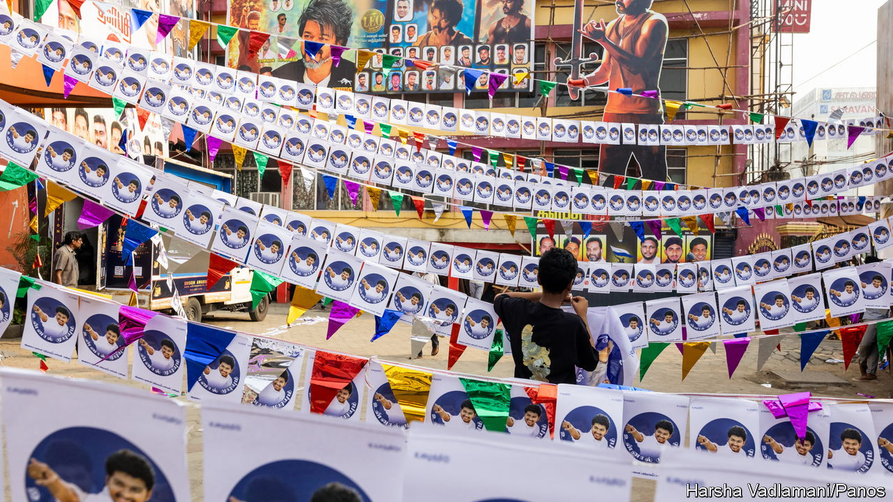
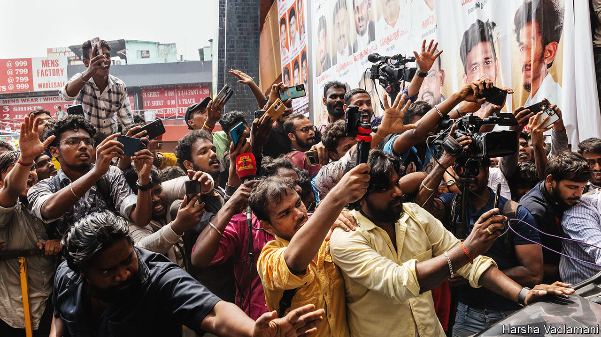
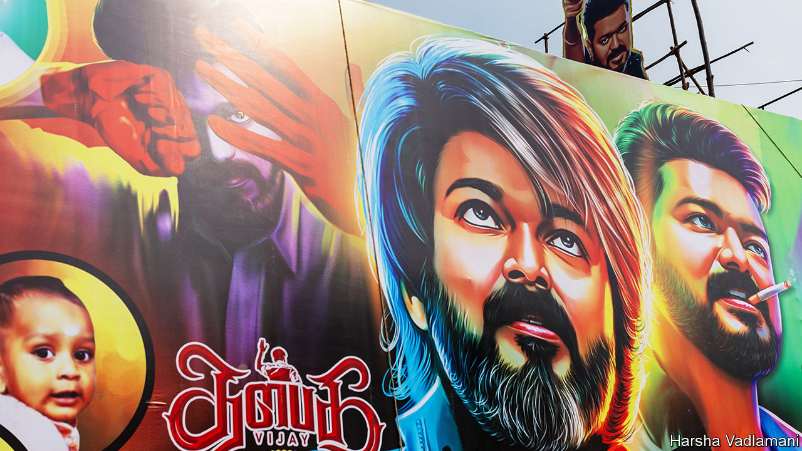
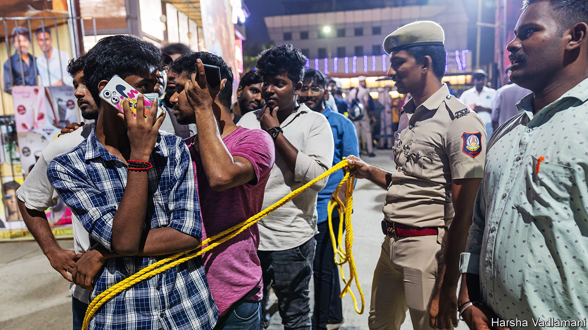

###### From star to power

# Why Tamil movie heroes become politicians 

##### Fan clubs can quickly become get-out-the-vote operations 

 

> Dec 20th 2023 

Around christmas in 1987, 30 people in the southern Indian state of Tamil Nadu killed themselves. Some swallowed poison, others set themselves on fire. All were distraught at the death of their hero, M.G. Ramachandran, aged 70. “MGR” had been the state’s chief minister for a decade. To his acolytes, he was , the revolutionary leader. 

That was not a title he earned from politics. Under his rule, living standards in Tamil Nadu barely improved. But in a previous role, he had protected women from predatory men, wrestled land from feudal landlords and delivered riches to the poor. He did all these things as the star of 136 films. That his noble deeds were scripted and fictitious never dimmed the passion of his millions of fans.

Since his demise, much has changed in Tamil Nadu. The state grew much richer after India’s economic liberalisation in the 1990s. Its 77m people are now among the best-educated in the country. But some things have stayed the same. Cinema is still a finishing school for politics.

Kollywood, the Tamil movie industry, named after Kodambakkam, an area in Chennai, the state capital, produces around 150 films a year. That is less than the 200 made by Bollywood, its Hindi rival. But in many ways movies matter more in Tamil Nadu. The state has 5% of India’s population but 12% of its screens. Ticket prices are capped, making them among the cheapest in India. And in all but five years since 1967, the state’s chief minister has had Kollywood roots. 


The incumbent, ominously named M.K. Stalin, dabbled in acting as a young man. His son and intended successor, Udhayanidhi Stalin, has produced and acted. His father, Muthuvel Karunanidhi, was a scriptwriter and the state’s longest-serving chief minister. Tamil Nadu’s second-longest-serving leader, Jayalalithaa, who died in 2016, was an actress. (Most Tamil thespians go by one name.) In the past 30 years four parties have been founded by actors, including Rajinikanth and Kamal Haasan, who first won fame in the 1980s. Vijay, a newer star, may soon plunge into politics. The leap from star to power is propelled by fans. 

A male Tamil idol typically gives larger-than-life performances in “masala” (mixed-genre) films, which feature action, comedy, romance, melodrama, recurring punchlines, and a hyper-masculine hero fighting injustice. Such a “mass hero” (ie, hero of the masses) can inspire intense devotion. 


Consider what happens before, during and after a big release. The hype starts months in advance, when the trailer is released. Hundreds, sometimes thousands, gather to watch that first snippet. The launch of the soundtrack triggers a similar celebration. The biggest party, though, is on the day of the first screening. 

Rohini Silver Screens, a theatre in Chennai, is specially designed to celebrate the “first-day-first-show”. Banners deck the theatre, featuring action shots of the hero and images of humble fans. In the final hours a gigantic cardboard cutout of the star makes an appearance. Amid a frenzy of fireworks, music and dancing, fans pray for box-office success by performing a , a Hindu ritual that involves pouring milk on the cardboard cutout, just as a priest would consecrate a temple idol. 

The hero’s first appearance triggers pandemonium. In his first scene in “Leo”, which premiered on October 19th, Vijay fights a hyena with his bare hands, in slow motion, to a pulsating score. Fans scream and throw confetti. They keep screaming, especially when the hero delivers punches or punchlines. 

 


 


 


Later, fans rewatch the movie in more serene settings. Hari Prasanna, a Rajinikanth fan, says he watched “Jailer”, released on August 9th, 25 times in 25 days. The film featured Rajinikanth as a retired cop who comes back to dismantle a notorious smuggling network, almost singlehandedly, and save his family. Mr Prasanna says he felt a “buzz” with every viewing. 

Tamil heroes are outrageously productive. Rajinikanth has been in 164 films in 48 years; Vijay has done 75 in 39. By comparison, Brad Pitt and Tom Cruise have acted in a mere 48 films each. Tamil scripts are packed with references to the star’s previous films, rewarding fans who have watched them often and attentively. 

Actors may rest between films, but a fan’s work is never done. They celebrate their hero’s birthday and the anniversaries of past releases. Fans of rival stars spar on social media, bigging up their own man’s box-office statistics and belittling the other guy’s. All heroes are treated with reverence. Your correspondent was gently rebuked for referring to Rajinikanth by his name, instead of  (respected leader). Every star has a sobriquet: Kamal Haasan is  (universal hero); Vijay is  (commander). 

Fans vouch for their hero’s humility, generosity and morals. Mr Prasanna was first drawn to Rajinikanth because of his charismatic smile. “There was no looking back,” he recalls. After Mr Prasanna’s father died when he was child, the fan felt his connection with the actor deepen. “ has given me a lot of life lessons. Despite his stardom, he has always stayed the same,” he says. 

Even at a snazzy awards ceremony, Rajinikanth will sport a simple shirt and dhoti, says Prakash Bharat, another fan. He teaches people “how to conduct yourself in society”. Mr Bharat credits the star for his personal and professional growth. (He is an executive at a big software firm.) “Every time I buy a new house or a car, I go outside ’s house to say: ‘I am what I am because of you,’” he gushes. 


Such devotion can sound almost religious, notes Sara Dickey of Bowdoin College, who has studied Tamil fans. In Hinduism, the line between gods and humans is often blurry. And religious fervour spills into politics. Prashant, an odd-job man, says Vijay’s overcoming of setbacks during his film career shows he has the necessary fortitude. “Tamil Nadu needs a strong leader and that can only be ,” he says.

Prashant is part of the Vijay fan-club network, which he guesses has 1m members (no one knows the true figure). Serious fans often join a  (fan society), which can be an informal group (usually of men) from the same street or a big, well-organised outfit. By some estimates there are thousands of fan clubs. In a book on “the politics of fandom”, Roos Gerritsen, an anthropologist, describes how neighbourhood Rajinikanth fan clubs are overseen by “head fan clubs” at the district level. These head fan clubs report to the All India Rajinikanth Fan Club in Chennai. 

Joining a club and being associated with a star, even distantly, can make fans feel empowered, says Ms Gerritsen. When members’ photos appear next to the actor’s on a club banner, their status soars. Many fans also do charitable works, from blood-donation drives to flood relief, in the name of their hero. 

Loyal and energetic, fan clubs make ideal political vehicles. To create a political party in 2017, all Rajinikanth had to do was rebrand his fan club as Rajini’s People Party. Some fans hope that if their hero wins power, they will be rewarded with jobs in government, suggests Ms Gerritsen. This makes them press loudly for him to run for office. 

Tamil Nadu’s first fan club was formed in 1954 in homage to MGR, an emerging star at the time. Like many others in the nascent film industry, he was part of the Dravidian movement, which sought to tackle caste injustices and prevent the imposition of Hindi, northern India’s lingua franca, on the south. 

The Dravidian movement gave birth to a political party, the Dravidian Progressive Federation (DMK). Whereas the Congress party, the first rulers of the state (and post-colonial India itself), saw cinema as a source of moral corruption, the DMK embraced it. As a result, Tamil films in the 1950s and 60s were unashamedly political, anti-Brahmin and anti-Hindi. In 1967 the DMK, aided by MGR and his fans, booted Congress out of power in Tamil Nadu. It has struggled in the state ever since. 

Five years later MGR fell out with party leaders and broke away to form his own party, the All-India Anna Dravidian Progressive Federation. His fans followed him. The DMK, a party with cash, a resonant ideology and capable leaders, proved no match. The new party won the first elections it contested, in 1977. 

MGR’s electoral success was built on a carefully cultivated image, writes M.S.S. Pandian, a biographer. He always played a good guy with no vices. Not once in a film was he even seen drinking or smoking. In keeping with his on-screen persona as a champion of the poor, he started welfare programmes and plastered his photos on them. To hide his balding dome and drooping eyes, he wore a fur hat and sunglasses in public. 

Tamil cinema has evolved over the years, but one plotline endures: the action hero righting wrongs. Hit after hit has featured messages that could have come straight out of a political manifesto. In “Sivaji”, released in 2008, Rajinikanth roots out black money in the state, and then India. A decade later in “Kaala” he plays a morally scrupulous gangster who thwarts a corrupt politician’s plans to demolish a slum.

Still, emerging forces could erode the relationship between cinema and politics. Streaming offers a cheap alternative to the movies. The number of theatres in Tamil Nadu is falling. Iconic, gritty venues have been replaced by posh, sterile multiplexes, where the higher official ticket-price cap and costlier snacks deter working-class audiences.

The revolution will be filmed

Meanwhile messaging apps, such as WhatsApp and Telegram, make it so easy to share adoring messages about a star that some fans feel less urge to take part in rallies or grassroots events. Many people who attend first-night showings do so to observe the fanaticism, not partake in it, notes Nikilesh Surya, the owner of Rohini Silver Screens. 

Voters are changing, too. Many want more than a leader with a winning smile and dashing dance moves: they want better lives for themselves. Persuading them you can give them that is hard, if you are an actor with no political track record. When the star Kamal Haasan launched a party in 2018 that campaigned against corruption, he faced a snag. A lot of voters expect cash, says Parvatha, a party member. His party was routed in state elections in 2021. 

Fans of Vijay, who is about to enter politics, are undaunted. They say he will succeed because he is a bigger star with a huge fanbase. They have a point. In 2022 several Vijay fans stood in local elections across the state. They did so as independent candidates, but campaigned with the flag of the Vijay fan club. They won 115 of the 169 seats they contested. 

Udhayanidhi Stalin, the current chief minister’s son and heir apparent, must be hoping that his own career as a movie star, plus his father’s political machine, will be enough to see off the challenge. But that is uncertain. Though the DMK swept the last state election, it has been tarnished by corruption scandals. Vijay’s entry could grab a lot of votes, even if he doesn’t win. 

India’s ruling party, the BJP, would love to harness some Tamil glamour. It is weak in Tamil Nadu, so it has long courted Tamil actors such as Rajinikanth. For some reason, perhaps linked to its image as a party of the Hindi-speaking north, or its aggressive Hindu nationalism, it has not succeeded. 

Kollywood continues to churn out hits, and to export its formula. India’s biggest release in 2023, a rollicking Bollywood film called “Jawan”, was directed by a Tamilian and featured a typical Tamil masala plot. 

As long as people seek entertainment, cinema will thrive and so will superstars, says G. Dhananjayan, a Tamil producer. And in Tamil Nadu, as long as superstars have huge fan bases, they will want to enter politics. Their fans may no longer die for them but they will vote for them. ■


