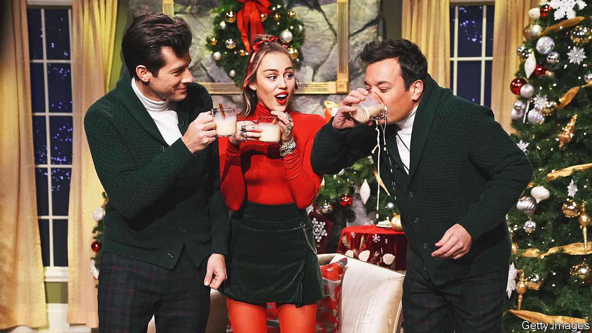

###### World in a dish

# For a Christmas drink, eggnog does not have a heartwarming history 

##### The creamy tipple inspired a riot in the 19th century 

 

> Dec 15th 2023 

TO THE CADETS at West Point, the prospect of eggnog without whisky was unconscionable. Flouting a ban on alcohol, a group took a boat across the Hudson river and procured gallons of grog. Around 90 cadets got so drunk that they spent Christmas morning smashing windows and flashing their weapons. Among the participants in the “Eggnog Riot” of 1826 was Jefferson Davis, who later became president of .

Eggnog is a sweet beverage with a serious edge. It is probably derived from —a concoction involving a combination of cream or milk, eggs, spices and ale or wine. Posset was believed to have medicinal properties: when  came down with a cold in the 1600s, his physician prescribed it.

The annual flu probably established the drink’s association with winter. But Christmas has also given eggnog a boost. The spices used—cinnamon, cloves and nutmeg—are present in other festive treats, such as gingerbread. For centuries cream and fresh eggs were harder to acquire in winter, so were viewed as luxuries. 

Britons brought the drink to America in the 18th century. Fortified wine, traditionally used to spike posset, was difficult to obtain, so Americans laced their version with bourbon, rum or whisky instead. Though eggnog is consumed in many English-speaking countries, Americans are the most keen on it. They consume around 15m gallons every year, the equivalent of one small cup per person. (Some “eggheads”, no doubt, guzzle more.)

Many countries have added their own twist. Germans make  with  Peruvians add pisco, a white brandy; South Africans opt for amarula, a liqueur. Eggnog has also been adapted for a health-conscious age. Vegans can forgo eggs and use almond, coconut or , which is less fatty; a single portion of the original can exceed 300 calories (admittedly a trifling sum compared with the roughly 6,000 calories the average Briton consumes on Christmas Day). 

Its creaminess is a reminder of the comforts of childhood, while the addition of booze is a grown-up pleasure. Unlike mulled wine, eggnog is often served chilled, so none of the alcohol evaporates. A recipe attributed to George Washington could take down an elephant: he called for adding brandy, rum, sherry and whisky. 

The stupefying effect of eggnog was known long before the riot that bears its name. In Shakespeare’s play, the murderous  drugs the servants’ posset in order to gain access to the king’s bedroom: “That which hath made them drunk hath made me bold.” 

Today the drink is associated with less serious crimes, namely tipsiness at holiday parties. A poem published in the  on Christmas Eve in 1817 evoked ancient Greek mythology to suggest that the drink turned respectable people into beasts: “When , the witch, caught Ulysses’s men/She gave each a dram that soon made him a hog/The identical mixture—’tis now as ’twas then/So attend to the moral, .” ■


